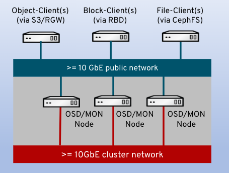
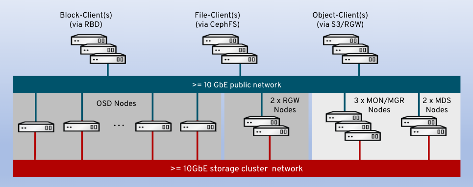

# Ceph Sizing Guidelines

## Minimum Hardware Architecture

* 3 Nodes (SSDs) or 4 Nodes (HDDs)
* RGW can be virtualized
* CephFS can be added by adding 2 nodes

[Support Configurations](https://access.redhat.com/articles/1548993)

## Individual Ceph Components

| Service | Cores | RAM | Notes |  
| --- | --- | --- | --- |  
| MON | 2 | 8 GiB | Min of 3; 5 > 750 OSDs |   
| MGR | 2 | 8 GiB | 1 MGR colocated with MON | 
| RGW | 2 | 8 GiB | Min 2 per Object Zone; 1/Failure Domain |
| MDS | 2 | 16 GiB | Min 2; 1/Failure Domain |
| NVMe OSD | 6 | 5 GiB/OSD | 8 GiB recommend; 2 OSD/NVMe | 
| SSD OSD | 2 | 5 GiB/OSD | 1 OSD/SSD | 
| HDD OSD | 1 | 5 GiB/OSD | 1 OSD/HDD | 
| Grafana | 2 | 8 GiB | |
| Prometheus | 2 | 8 GiB |  |

> NOTE: Cores are physical cores of a current IA64 CPU model > 2 GHz

### IOPS Optimized

NVMe:

| Component | Description |  
| --- | --- | 
| CPU | 6 cores per NVMe drive (2 OSDs per drive) | 
| RAM | 16 GiB baseline plus 8 GiB/OSD | 
| Disks | Mixed use or write intensive NVMe SSDs (DWPD >=3) | 
| Network | 25 GbE per 4 NVMe drives | 

SSD: 

| Component | Description |  
| --- | --- | 
| CPU | 2 cores/SSD drive | 
| RAM | 16 GiB baseline plus 8 GiB/OSD | 
| Disks | Mixed use or write intensive NVMe SSDs (DWPD >=3) | 
| Network | 25 GbE per 8 SSD drives | 

### Throughput Optimized

| Component | Description | 
| --- | --- | 
| CPU | 2 cores/HDD drive | 
| RAM | 16 GiB baseline plus 5 GiB/OSD | 
| Disks | Block 7200 RPM; rocksDB SSD/NVMe 4% of HDD size; 4-6:1 SAS/SATA SSD or 12-18:1 for NVMe  | 
| Network | 10 GbE per 12 HDD drives | 

### Cost and Capacity Optimized

| Component | Description | 
| --- | --- | 
| CPU | 1 cores/HDD drive | 
| RAM | 16 GiB baseline plus 5 GiB/OSD | 
| Disks | 7200 RPM Enterprise HDDs | 
| Network | 10 GbE per 12 SSD drives | 

