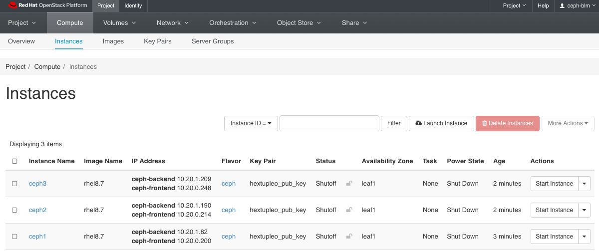

# Installation Instructions v6.x

## Introduction

## Goals:

* Enable field on Ceph v6.0
* Test basics features work (no regression)
* Test new selected set of features
* Optionally test tech preview features
* Report product and documentation bugs 
* Send valuable feedback to Ceph Product management and engineering teams at IBM
* Convert the work accomplished into lab training guides in order to enable more folks in the field
* Have fun with Ceph
* Get to work with and get to know each other.

## HextupleO

The lab access will be provided in the form of nested virtualization managed by RHOSP 17.1.  We have limited resources available, but there should be enough room for about 20 virtual environments.

Standard roles have been pre-defined, but since we are using OpenStack to manage it, we are capable of being flexible, with resizing flavors, snapshotting, adding more cinder volumes to ceph nodes or even adding more networks via either OpenStack CLI Horizon or Cloudforms.

| Role | vRAM | vCPU | vNIC | Disk |
|-----|-------|-----|-----|------|
| Ceph | 32G| 8 | <ul><li>1x pxe</li><li>1x ceph-frontend</li><li>1x ceph-backend</li> | <ul><li>64GB</li><li>100GB</li> |


## Building Your KNI Lab

### Default Configuration


1. To build your environment, please ensure you are connected to the NA-SSA VPN first.  
   
2. Access RHAAP via link - [NA-SSA Ansible Automation Platform](https://cloud-infra-tower.apps.ocp-bm.openinfra.lab/#/login).  

3. Select *Templates* in the left pane; click the rocket icon in the *Action* column to the right of *Deploy Ceph Storage Cluster*.  

4. Update the *project_name* and *project_password* parameters. The project name and password are used to access your environment via CLI and the Horizon GUI.  Choose a password you will remember.  

    

5. Wait the deployment to finish which can take up to ~10-15 minutes.  


### Customized Deployment  

1.  To build your environment, please ensure you are connected to NA-SSA VPN.  

2.  Access RHAAP via link - [NA-SSA Ansible Automation Platform](https://cloud-infra-tower.apps.ocp-bm.openinfra.lab/#/login).  

3. Go to *Templates* tab and hit the “rocket” icon next to - *Hextupleo - create  project*.  

4. Update the *Project Name* and *Password* fields. The project name and password are used to access your environment via CLI and the Horizon GUI.  Choose a password you will remember.  

5.  Go to *Templates* tab and hit the “rocket” icon next to - “Hextupleo - create networks”.  In hexo4 you are encouraged to experiment with different settings. However if you’d like to start with the known network configuration the default templates should be fine.  Update the project_name and project_password along with the networks to just include the ones below.  Click *Next*, verify the configuration and click *Launch*.  Monitor the progress of the job executing in the output. 

    ```
    external_network: vlan1117
    networks:  
      - { name: "ceph-frontend", cidr: "10.20.0.0/24", dhcp: "True", snat: "True", mtu: "8938" }  
      - { name: "ceph-backend", cidr: "10.20.1.0/24", dhcp: "True", snat: "True", mtu: "8938" }  
    ```  
      

6. Go to *Templates* tab and hit the “rocket” icon next to - “Hextupleo - create instances”.  Below is a good starting config with 3 ceph nodes.  Update the project_name and project_password along with the instances to just include the ones below.  Click *Next*, verify the configuration and click *Launch*.  Monitor the progress of the job executing in the output.  

    ```
    instances:  
      - { name: "ceph1", image: "rhel8.7", flavor: "ceph", ipmi: "False", extra_volume_size: "100", net_name1: "ceph-frontend", net_name2: "ceph-backend", net_name3: "", net_name4: "", net_name5: "", net_name6: "",  net_name7: "",net_name8: "" }  
      - { name: "ceph2", image: "rhel8.7", flavor: "ceph", ipmi: "False", extra_volume_size: "100", net_name1: "ceph-frontend", net_name2: "ceph-backend", net_name3: "", net_name4: "", net_name5: "", net_name6: "",  net_name7: "",net_name8: "" }  
      - { name: "ceph3", image: "rhel8.7", flavor: "ceph", ipmi: "False", extra_volume_size: "100", net_name1: "ceph-frontend", net_name2: "ceph-backend", net_name3: "", net_name4: "", net_name5: "", net_name6: "",  net_name7: "",net_name8: "" }  
    
    ```  


## Accessing Your Project in Horizon

### Horizon

1. Using the project name as the username and password that you specified when you launched your job, log into the Horizon Dashboard with this link:  

      [HextupleO Lab](https://hextupleo.openinfra.lab)  
        
2. Go to the *Compute->Instances* tab and make sure all of your requested nodes have been created.  Take note of the IP addresses for the VLAN1117 network.  You will use the 172.20.17.*X* addresses to access the servers.  

      

  
3. Start each instance; In the *Actions* colume, select *Start Instance* for each node in the cluster.  


4. Go to *Network->Network Topology* and get familiar with how the VMs are connected on the networks.  

    > INFO: We have created Tenant (overlay) networks to satisfy all the non-routable networks.   


To access your instance, ssh as the cloud-user using the VLAN IP addresses.  Make sure you are connected to the NA-SSA VPN.


## Ceph v6. Installation

The full Red Hat documentation for the Ceph installation is available [here](https://access.redhat.com/documentation/en-us/red_hat_ceph_storage/6/html-single/installation_guide/index#red-hat-ceph-storage_install).  The below precedures are for the OpenInfra Lab environment and have been scaled down to only include the required steps.  

### Prerequisites

* Red Hat Enterprise Linux 9.2 EUS or later.  
* Ansible 2.9 or later.  
* Valid Red Hat subsription with the appropriate entitlements.  
* Root-level access to all nodes.  
* An active Red Hat Network or service account to access the Red Hat Registry.  

> NOTE: Ensure that you are connected to the NA-SSA VPN


1. Login to ceph01.  Update the /etc/hosts files with the IP and names.

    > NOTE: Your IP address will be different.  

    ```
    ssh cloud-user@ceph01
    $ vi /etc/hosts
    127.0.0.1   localhost localhost.localdomain localhost4 localhost4.localdomain4
    ::1         localhost localhost.localdomain localhost6 localhost6.localdomain6

    172.20.17.40     ceph01 
    172.20.17.120    ceph02 
    172.20.17.191    ceph03 

    10.40.0.190      ceph01-stg
    10.40.0.125      ceph02-stg
    10.40.0.245      ceph03-stg
    ```

2. Grab the rhel9 repository file from the DNS Utility server

    ```
    $ sudo curl http://172.20.129.10/hextupleo-repo/rhel9.repo -o /etc/yum.repos.d/rhel8.repo
      % Total    % Received % Xferd  Average Speed   Time    Time     Time  Current
                                     Dload  Upload   Total   Spent    Left  Speed
    100  1379  100  1379    0     0   269k      0 --:--:-- --:--:-- --:--:--  448k
    [cloud-user@ceph1 ~]$ cat /etc/yum.repos.d/rhel9.repo
    [rhel-9-for-x86_64-highavailability-rpms]
    name=rhel-9-for-x86_64-highavailability-rpms
    baseurl=http://172.20.129.13/repos/rhel-9-for-x86_64-highavailability-rpms/
    enabled=1
    gpgcheck=0
    ...
    [rhceph-6-tools-for-rhel-9-x86_64-rpms]
    name=rhceph-6-tools-for-rhel-9-x86_64-rpms
    baseurl=http://172.20.129.13/repos/rhceph-6-tools-for-rhel-9-x86_64-rpms/
    enabled=1
    gpgcheck=0
    ```

3. Update all packages using dnf on all servers.

    ```
    $ cat /etc/redhat-release 
    Red Hat Enterprise Linux release 9.1 (Plow)
    $ sudo dnf update -y
    ...
    Installed:
    ansible-collection-ansible-posix-1.2.0-1.3.el9ost.noarch                  ansible-collection-community-general-4.0.0-1.1.el9ost.noarch                 
    ansible-core-2.14.2-5.el9_2.x86_64                                        cephadm-ansible-2.15.0-1.el9cp.noarch                                        
    git-core-2.39.3-1.el9_2.x86_64                                            libnsl2-2.0.0-1.el9.x86_64                                                   
    mpdecimal-2.5.1-3.el9.x86_64                                              python3.11-3.11.2-2.el9_2.1.x86_64                                           
    python3.11-cffi-1.15.1-1.el9.x86_64                                       python3.11-cryptography-37.0.2-5.el9.x86_64                                  
    python3.11-libs-3.11.2-2.el9_2.1.x86_64                                   python3.11-pip-wheel-22.3.1-2.el9.noarch                                     
    python3.11-ply-3.11-1.el9.noarch                                          python3.11-pycparser-2.20-1.el9.noarch                                       
    python3.11-pyyaml-6.0-1.el9.x86_64                                        python3.11-setuptools-wheel-65.5.1-2.el9.noarch                              
    python3.11-six-1.16.0-1.el9.noarch                                        sshpass-1.09-4.el9.x86_64                                                    

    Complete!    ...
    $ sudo reboot
    Connection to 172.20.17.117 closed by remote host.
    Connection to 172.20.17.117 closed.
    ```

    > NOTE: Don't forget to do all servers in the cluster.  

4.  Generate the ssh key files for the root user on ceph01.  Update the authorized_keys file on all nodes and append the contents of the id_rsa.pub file.  

5.  Install the cephadm-ansible package on ceph01 (or the first node in the cluster).  

    ```
    $ sudo dnf install -y cephadm-ansible
    ...
    Installed:
      ansible-2.9.27-1.el8ae.noarch                    cephadm-ansible-1.8.0-1.el8cp.noarch                    python3-jmespath-0.9.0-11.el8.noarch                    sshpass-1.09-4.el8.x86_64                   

    Complete!
    ```

6.  Create the inventory hosts and registry-login.json files on ceph01.  Change the permissions on the registry-login.json file.

    ```
    $ cd /usr/share/cephadm-ansible 
    $ vi hosts
    ceph1
    ceph2
    ceph3

    [admin]
    ceph1
    $ sudo mkdir /root/ceph
    $ sudo vi /root/ceph/registry.json
    {
     "url":"registry.redhat.io",
     "username":"myuser1",
     "password":"mypassword1"
    }
    $ sudo chmod 600 registry.json     
    ```

    > NOTE: The user name is the user name that you use to login to registry.redhat.io.  This is used to download the ceph containers.


## Installation

1.  Run the Ceph ansible preflight playbook.  

    ```
    # sudo -i
    # ansible-playbook -i hosts cephadm-preflight.yml --extra-vars "ceph_origin=custom" -e "custom_repo_url=http://172.20.129.13/repos/rhceph-6-tools-for-rhel-9-x86_64-rpms/"
    ```

    > NOTE: Use the custom_repo_url when for a disconnected installation.

2. Create the bootstrap configuration file on ceph01 (or first node in the cluster).

    ```
    service_type: host
    addr: ceph01
    hostname: ceph01
    ---
    service_type: host
    addr: ceph02
    hostname: ceph02
    ---
    service_type: host
    addr: ceph03
    hostname: ceph03
    ---
    service_type: host
    addr: ceph04
    hostname: ceph04
    ---
    service_type: mon
    placement:
      host_pattern: "ceph0[1-3]"
    ---
    service_type: osd
    service_id: initial_osds
    placement:
      host_pattern: "ceph0[1-3]"
    data_devices:
      paths:
       - /dev/vdb
    ```

3.  Run the cephadm bootstrap command.  

    ```
    # cephadm bootstrap --mon-ip 10.40.0.193 --apply-spec /root/ceph/initial-config.yaml --initial-dashboard-password changeme  --registry-json /root/ceph/registry-login.json --cluster-network 10.20.1.0/24
    ```


4.  Once the bootstrap is complete, check the status of the cluster with the `ceph status` command.  

5.  If firewalld is enabled, ensure the following ports are opened on all nodes that run the `MON` and/or `OSD` service:  

    MON:

    ```
    # firewall-cmd --zone-public --add-port=6789/tcp
    # firewall-cmd --zone-public --add-port=6789/tcp --permanent
    ```
    
    Or use the service name:  

    ```
    # firewall-cmd --zone-public --add-service=ceph-mon
    # firewall-cmd --zone-public --add-service=ceph-mon --permanent
    ```
    
    OSD:
  
    ```
    # firewall-cmd --zone-public --add-port=6800-7300/tcp
    # firewall-cmd --zone-public --add-port=6800-7300/tcp --permanent
    ```
    
    Or use the service name:  

    ```
    # firewall-cmd --zone-[public|cluster] --add-service=ceph
    # firewall-cmd --zone-[public|cluster] --add-service=ceph --permanent
    ```
    
6. Ensure the MTU size is set to 9000 on the network interfaces.

    ```
    # nmcli conn modify 'eth0' 802-3-ethernet.mtu 9000
    # nmcli conn down 'eth0'
    # nmcli conn up 'eth0'
    # ip link show 'eth0
    ```
    
7. Set the labels for the servers.

   ```
   # ceph orch host ls
   HOST           ADDR         LABELS                  STATUS  
   cephstorage01  172.20.0.11  _admin mon mgr grafana          
   cephstorage02  172.20.0.12  mon mgr rgw _admin              
   cephstorage03  172.20.0.13  mon mgr rgw                     
   cephstorage04  172.20.0.14  mon mgr rgw                     
   cephstorage05  172.20.0.15                                  
   cephstorage06  172.20.0.16                                  
   6 hosts in cluster

   # ceph orch host label add cephstorage01 mgr
   ```

   > Note: Labels can be mon, mgr, rgw, admin, or whatever you choose.


## Appendix  

### Export Service Specification  

```
ceph orch ls --service_type type --service_name name --export
```

### Create floating IP address  

```
[stack@bgp-undercloud ~] openstack floating ip create --subnet 372459e8-25f9-4885-b71a-6889ffff02bf --project ceph-blm 18743df0-57aa-4571-9d62-439e0570b059
```
