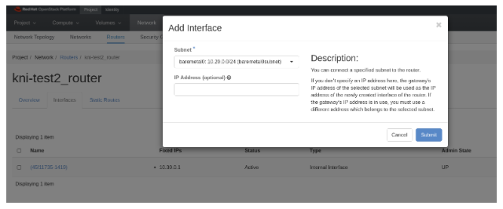

# Ceph v5.x Installation Instructions

## Introduction

## Goals:

* Enable field on Ceph v5.0
* Test basics features work (no regression)
* Test new selected set of features
* Optionally test tech preview features
* Report product and documentation bugs 
* Send valuable feedback to Ceph Product management and engineering teams at IBM
* Convert the work accomplished into lab training guides in order to enable more folks in the field
* Have fun with Ceph
* Get to work with and get to know each other.

## HextupleO

The lab access will be provided in the form of nested virtualization managed by RHOSP 16.1.  We have limited resources available, but there should be enough room for about 20 virtual environments.

Standard roles have been pre-defined, but since we are using OpenStack to manage it, we are capable of being flexible, with resizing flavors, snapshotting, adding more cinder volumes to ceph nodes or even adding more networks via either OpenStack CLI Horizon or Cloudforms.

| Role | vRAM | vCPU | vNIC | Disk |
|-----|-------|-----|-----|------|
| Ceph | 32G| 8 | <ul><li>1x pxe</li><li>1x ceph-frontend</li><li>1x ceph-backend</li> | <ul><li>64GB</li><li>100GB</li> |


## Building Your KNI Lab

### Default Configuration

    > NOTE: I need to make the template to build a default environment including the project, networks, and instances.  Use the Customized Configuration for now.

1. To build your environment, please ensure you are connected to the NA-SSA VPN first.
   
2. Access RHAAP via link - [NA-SSA Ansible Automation Platform](https://cloud-infra-tower.apps.ocp-bm.openinfra.lab/#/login).

3. Select *Templates* in the left pane; click the rocket icon in the Action column to the right of *Deploy Ceph Environment*

4. Update the *Project Name* and *Password* fields. The project name and password are used to access your environment via CLI and the Horizon GUI.  Choose a password you will remember.

    

5. Wait the deployment to finish which can take ~10-15 minutes.


### Customized Deployment  

1.  To build your environment, please ensure you are connected to NA-SSA VPN.  

2.  Access RHAAP via link - [NA-SSA Ansible Automation Platform](https://cloud-infra-tower.apps.ocp-bm.openinfra.lab/#/login).  

3. Go to *Templates* tab and hit the “rocket” icon next to - *Hextupleo - create  project*.  

4. Update the *Project Name* and *Password* fields. The project name and password are used to access your environment via CLI and the Horizon GUI.  Choose a password you will remember.  

5.  Go to *Templates* tab and hit the “rocket” icon next to - “Hextupleo - create networks”.  In hexo4 you are encouraged to experiment with different settings. However if you’d like to start with the known network configuration the default templates should be fine.  Update the project_name and project_password along with the networks to just include the ones below.  Click *Next*, verify the configuration and click *Launch*.  Monitor the progress of the job executing in the output. 

    ```
    external_network: vlan1117
    networks:  
      - { name: "ceph-frontend", cidr: "10.20.0.0/24", dhcp: "True", snat: "True", mtu: "8938" }  
      - { name: "ceph-backend", cidr: "10.20.1.0/24", dhcp: "True", snat: "True", mtu: "8938" }  
    ```  
      

6. Go to *Templates* tab and hit the “rocket” icon next to - “Hextupleo - create instances”.  Below is a good starting config with 3 ceph nodes.  Update the project_name and project_password along with the instances to just include the ones below.  Click *Next*, verify the configuration and click *Launch*.  Monitor the progress of the job executing in the output.  

    ```
    instances:  
      - { name: "ceph1", image: "rhel8.7", flavor: "ceph", ipmi: "False", extra_volume_size: "100", net_name1: "ceph-frontend", net_name2: "ceph-backend", net_name3: "", net_name4: "", net_name5: "", net_name6: "",  net_name7: "",net_name8: "" }  
      - { name: "ceph2", image: "rhel8.7", flavor: "ceph", ipmi: "False", extra_volume_size: "100", net_name1: "ceph-frontend", net_name2: "ceph-backend", net_name3: "", net_name4: "", net_name5: "", net_name6: "",  net_name7: "",net_name8: "" }  
      - { name: "ceph3", image: "rhel8.7", flavor: "ceph", ipmi: "False", extra_volume_size: "100", net_name1: "ceph-frontend", net_name2: "ceph-backend", net_name3: "", net_name4: "", net_name5: "", net_name6: "",  net_name7: "",net_name8: "" }  
    
    ```  


## Accessing Your Project in Horizon

### Horizon

1. Using the project name as the username and password that you specified when you launched your job, log into the Horizon Dashboard with this link: 

      [HextupleO Lab](https://hextupleo.openinfra.lab) 
        
2. Go to the *Compute->Instances* tab and make sure all of your requested nodes have been created.  Take note of the IP addresses for the ceph-frontend network.  You will use the 172.20.17.X addresses to access the servers.  


    

  
3. Go to *Network->Network Topology* and get familiar with how the VMs are connected on the networks.  

    > INFO: We have created Tenant (overlay) networks to satisfy all the non-routable networks.    

  
4. Go to *Routers*, select the existing router (projectName_router); click the *Interfaces* tab and then click the *Add Interface* icon on the right.   Add the ceph-frontend interface in the Subnet dropdown.  Click *Submit*.  

    
  
5. To access your instance, ssh as the cloud-user.  Make sure you are connected to the NA-SSA VPN.


## Ceph v5. Installation

The full Red Hat documentation for the Ceph installation is available [here](https://access.redhat.com/documentation/en-us/red_hat_ceph_storage/5/html/installation_guide/red-hat-ceph-storage_install).  The below precedures are for the OpenInfra Lab environment and have been scaled down to only include the required steps.  

### Prerequisites

* Red Hat Enterprise Linux 8.4 EUS or later.  
* Ansible 2.9 or later.  
* Valid Red Hat subsription with the appropriate entitlements.  
* Root-level access to all nodes.  
* An active Red Hat Network or service account to access the Red Hat Registry.  


