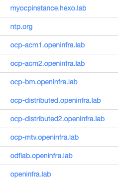
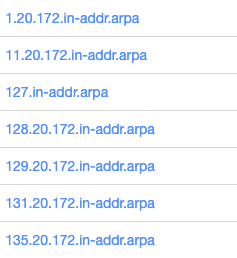
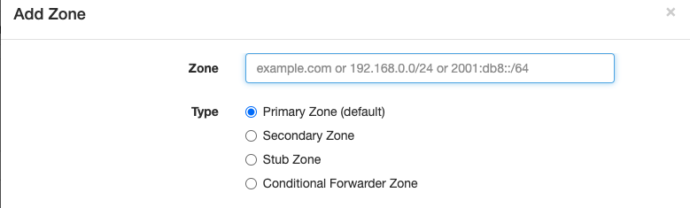
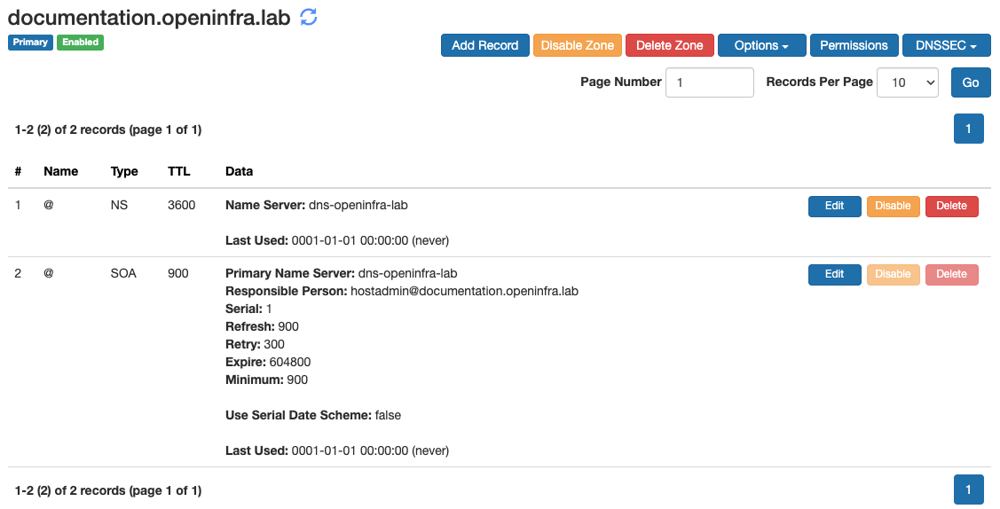
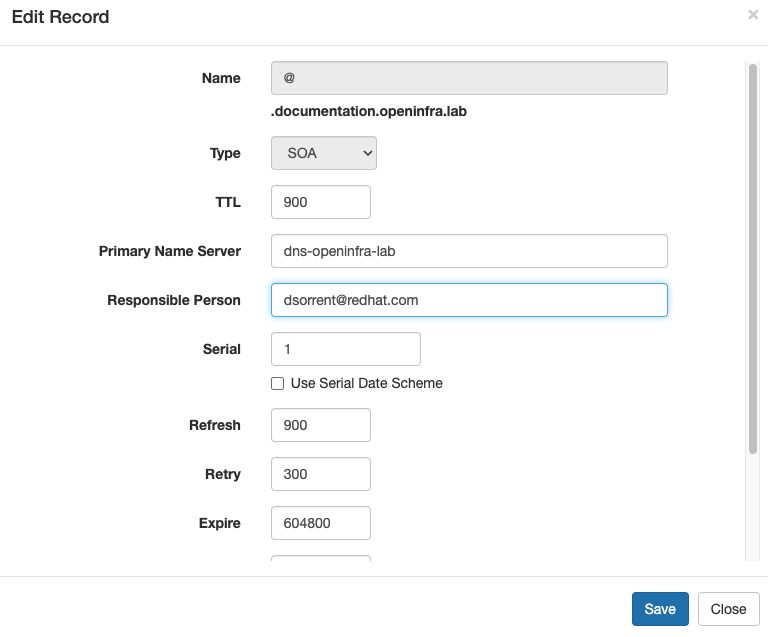
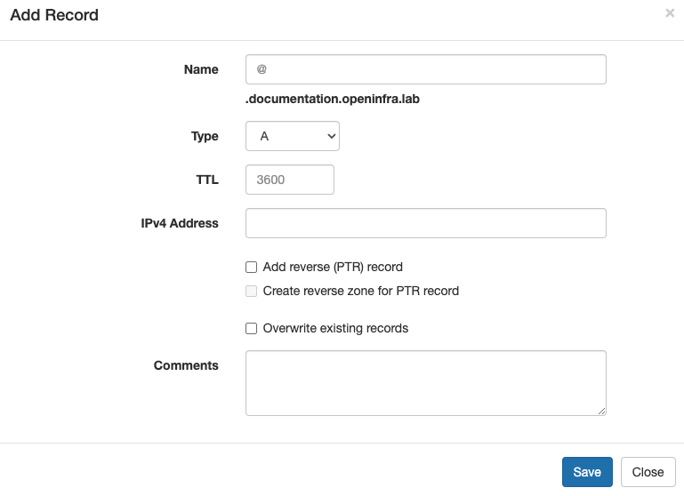
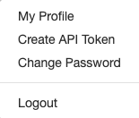
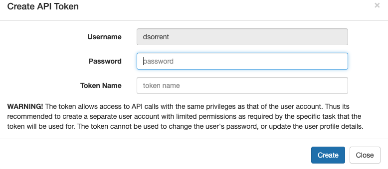

# DNS Server

## Overview
The lab DNS server is a pod on the OCP Baremetal Cluster in the openinfra project running a Technitium DNS Server.  The management login to the server is here:

[http://172.20.129.10:5380](http://172.20.129.10:5380)

Upon logging in, you will see a Dashboard which will give you a high level overview of the DNS Server usage:


The hope is that we can then utilize the data here to then be able to clean up unused DNS entries as projects grow stagnant as it will be easy to determine the last usage of a DNS record.

## Overview of DNS Terms

This section is going to cover some DNS basics for those who may not be familiar with DNS.

### DNS Zones

Zones are how a DNS Server organizes records.  When looking at the zones in the DNS server, you will see them named in one of two ways:

**Using a Domain Name**

Examples:



These are as you would expect, the domain name **openinfra.lab** contains all DNS entries that look like **<something>.openinfra.lab**.  The <something> may or may not contain a dot notation indicating a sub-domain:

- www.openinfral.lab
- servera.openinfra.lab
- partA.partB.openinfra.lab <- partB is the sub-domain of openinfra.lab

Typically within a DNS server, zones are used to delegate control over who can manage what domains.  For our purposes, this is not needed since our whole team is administrators within the lab.  Therefore, we are opting to use zones as an organization methodology and giving each subdomain its own zone.  This is why you see **ocp-bm.openinfra.lab** in the list.  The entries in there, such as **api.ocp-bm.openinfra.lab** could technically be in the **openinfra.lab** zone, but we opted to keep them separate for logical organization purposes.

**Using an Inverse Netmask**

Examples:



These are used to store reverse lookup records.  The naming convention is the reverse order of the network CIDR, dropping any zeroes in the netmask. For example, the first one listed stores reverse lookup records for IP addresses 172.20.1.0/24.  

**Record Types**

Each zone is comprised of different record types. Below is a table with the most common record types at the top (==highlighted==) and the least common ones at the bottom of the record types you may need to create.


| Record Type | Description |
| ----------- | ----------- |
| ==SOA== | There can be only one Start of Authority (SOA) record for a zone. The SOA record contains settings that are required by secondary name servers or recursive resolvers to know the minimum TTL for caching non existent records. This is created for you by default when you create a zone, however you should edit this and set your e-mail address as the point of contact for the zone you create. |
| ==NS== | Name Server (NS) records tell other DNS resolvers the domain names of the authoritative DNS Servers that are hosting the current zone. This is created for you by default when you create a zone. |
| ==PTR== | Pointer records allow you to map a domain name to an IP address to allow performing reverse lookups i.e. finding domain name associated with an IP address. A PTR record for localhost is created for you by default when you create a reverse lookup zone |
| ==A== | Address record allows you to assign an IPv4 address to your domain or sub domain. This is the type of record you will be creating most often. |
| ==CNAME== | Canonical name records allow you to point your domain or sub domain to another domain name. This is what is commonly referred to as an alias. |
| ==AAAA== | This address record allows you to assign an IPv6 address to your domain or sub domain. |
| FWD | The FWD record allows you to specify the forwarder server address to be used in conditional forwarder zones. |
| SRV | Service records allow certain applications to discover where a service is hosted. |
| TXT | Text records allow specifying any text data. These records are commonly used for domain name verification process and for Sender Policy Framework (SPF) record to prevent your domain being misused for email spam. |
| CAA | Certification Authority Authorization (CAA) record allows you to specify which Certificate Authority is allowed to issue SSL/TLS certificates for your domain name to prevent misuse. |
| ANAME | This record allows you to have a CNAME like facility at the zone's apex. It can also be used for a sub domain. The DNS Server resolves the provided domain name in the record and returns A or AAAA response as per the QTYPE. |
| MX | Mail Exchange (MX) records allow you specify email servers so that you can receive email for your domain. |
| APP | The APP record allows you to specify which DNS App should be used to process the request.|


## Creating and Managing DNS in the Lab

### Standards

We are trying to standardize on the DNS naming convention utilized in the lab and how the DNS Server is configured. At a high level:

- Each domain and/or sub-domain shall have its own Zone associated with it in the DNS server.
- When creating a new Zone, edit the SOA record and change the Responsible Person entry to be your Red Hat email address.
- Members wishing to create DNS records for their own projects/demos should utilize their kerberos username as a sub-domain when creating the Zone.  Example: phalmos.openinfra.lab, cjanisze.openinfra.lab.
- On EVERY record you create in the DNS server, you should add your name to the COMMENT field in the event someone has a question on the entry/device it points to.
- Only create reverse pointer records for entries which are going to be permanent/long lived.  Nothing is worse than having a DNS entry point to an IP and then having the IP - point to an incorrect DNS entry.

### Zones

The primary DNS Zone in the server is the **openinfra.lab** zone.

When you need to create a new zone, go to the Zones tab and click Add Zone.  You will be prompted to name the zone:



For the zone name, add the fully qualified DNS entry for the zone, select Primary Zone and click Add. If you ever need to also include reverse lookups, you should never really have to create the Reverse Lookup Zone manually, as you can have the DNS server create that zone for you when you create the A records in your zone. 

Upon creation, the server will automatically create the NS and SOA records for you:



Before you create anything in this zone, edit the SOA record and change the Responsible Party to your Red Hat email address:



### Records

To add records to a Zone, click on the Zone name to show the Zone.  Click Add Record button and you will be prompted to create the record:



For each of the fields:


| Field | Setting |
| ----- | ------- |
| Name | This is the part of the DNS name which goes before the zone name.  For example, setting this to api will create a DNS entry for api.documentation.openinfra.lab.  Likewise, to create a wildcard entry, you can set this to *.apps which will create a wildcard DNS entry of *.apps.documentation.openinfra.lab. |
| Type | Typically this will be A for ipv4 and AAAA for ipv6.  For a complete list of DNS Record Types see the Record Types table in the previous section of this documentation. |
| TTL | You can leave this as is and it will default to 3600 |
| IPv4 Address | Obviously enter the IP address here. |
| Comments | Enter your name. |


Check off the `Add reverse (PTR) record` if you require reverse lookups for your entry.  You may also need to check off `Create reverse zone for PTR record` if the reverse zone does not exist.  If it does not exist, an error will be thrown that it can’t find the zone and then you will need to check this box off.  I didn’t create this software, so don’t ask me why it does not just create it.

Click Save and that is it.

## DNS Server Creation

This section documents how the DNS Server was created in the environment for historic purposes.

### Service Account

The DNS server needs to be able to listen on privileged ports and therefore needs to execute in a security context that allows this.  To enable this, we create a Service Account called **dns-openinfra-sa** and add the privileged Security Context Constraints (SCC) to the service account:

```
oc create sa dns-openinfra-sa
oc adm policy add-scc-to-user -z dns-openinfra-sa privileged
```

This service account is referenced when we do the deployment of the DNS application.

### Storage

We create a Persistent Volume Claim for the application to store the configuration data:

```
cat <<EOF>pvc.yaml
kind: PersistentVolumeClaim
apiVersion: v1
metadata:
  name: dns-pod-technitium-config
  namespace: openinfra
spec:
  accessModes:
    - ReadWriteOnce
  resources:
    requests:
      storage: 10Gi
  storageClassName: ocs-storagecluster-ceph-rbd
  volumeMode: Filesystem
EOF
oc apply -f ./pvc.yaml
```

This is then used by the deployment of the DNS application.

### Network

In order to maintain consistency with what we have been using and not have to make major changes to already deployed infrastructure, we needed the DNS server to be attached to VLAN1101 and serve DNS on 172.20.129.10.  To do this, we created a Network Attachment Definition (NAD):

```
cat <<EOF >nad.yaml
apiVersion: k8s.cni.cncf.io/v1
kind: NetworkAttachmentDefinition
metadata:
  name: dns-openinfra-lab-nad
  namespace: openinfra
spec:
  config: ‘{
    "name": "dns-openinfra-lab",
    "type": "bridge",
    "cniVersion": "0.3.1",
    "bridge": "br1", "vlan": 1101, "isGateway": false, "ipam": {  "type":
    "static", "addresses": [{ "address": "172.20.129.10/24" }],  "routes": [{
    "dst": "172.20.0.0/16", "gw": "172.20.129.1" }] } }
EOF
oc apply -f ./nad.yaml
```

This NAD is referenced when we do the deployment of the DNS application.

### Application Deployment

This may or may not be the best way to deploy this application, but it worked for me.  I deployed it manually using the GUI and then extracted the YAML, made changes to it to get it to work.

```
cat <<EOF>dns.yaml
apiVersion: apps/v1
kind: Deployment
metadata:
  annotations:
    alpha.image.policy.openshift.io/resolve-names: '*'
    app.openshift.io/route-disabled: "false"
    deployment.kubernetes.io/revision: "1"
    image.openshift.io/triggers: '[{"from":{"kind":"ImageStreamTag","name":"dns-openinfra-lab:latest","namespace":"openinfra"},"fieldPath":"spec.template.spec.containers[?(@.name==\"dns-openinfra-lab\")].image","pause":"false"}]'
  labels:
    app: dns-openinfra-lab
    app.kubernetes.io/component: dns-openinfra-lab
    app.kubernetes.io/instance: dns-openinfra-lab
    app.kubernetes.io/name: dns-openinfra-lab
    app.kubernetes.io/part-of: dns-openinfra-lab-app
    app.openshift.io/runtime-namespace: openinfra
  name: dns-openinfra-lab
  namespace: openinfra
spec:
  progressDeadlineSeconds: 600
  replicas: 1
  revisionHistoryLimit: 10
  selector:
    matchLabels:
      app: dns-openinfra-lab
  strategy:
    rollingUpdate:
      maxSurge: 25%
      maxUnavailable: 25%
    type: RollingUpdate
  template:
    metadata:
      annotations:
        k8s.v1.cni.cncf.io/networks: dns-openinfra-lab-nad
      labels:
        app: dns-openinfra-lab
        deploymentconfig: dns-openinfra-lab
    spec:
      serviceAccountName: dns-openinfra-sa
      containers:
      - image: docker.io/technitium/dns-server
        imagePullPolicy: Always
        name: dns-openinfra-lab
        securityContext: { "privileged": true }
        ports:
        - containerPort: 443
          protocol: TCP
        - containerPort: 443
          protocol: UDP
        - containerPort: 53
          protocol: TCP
        - containerPort: 53
          protocol: UDP
        - containerPort: 53443
          protocol: TCP
        - containerPort: 5380
          protocol: TCP
        - containerPort: 67
          protocol: UDP
        - containerPort: 80
          protocol: TCP
        - containerPort: 8053
          protocol: TCP
        - containerPort: 853
          protocol: TCP
        - containerPort: 853
          protocol: UDP
        resources: {}
        terminationMessagePath: /dev/termination-log
        terminationMessagePolicy: File
        volumeMounts:
        - mountPath: /etc/dns
          name: dns-openinfra-lab-config
      dnsPolicy: ClusterFirst
      restartPolicy: Always
      schedulerName: default-scheduler
      terminationGracePeriodSeconds: 30
      volumes:
      - name: dns-openinfra-lab-config
        persistentVolumeClaim:
          claimName: dns-pod-technitium-config
EOF
oc apply -f dns.yaml
```

## Appendix

### Official Documentation Links

[User Guide/Help Topics](https://go.technitium.com/?id=25)
[HTTP API Documentation](https://github.com/TechnitiumSoftware/DnsServer/blob/master/APIDOCS.md)

### Script Examples

You can use tools such as curl to automate actions with the DNS server.  

**Creating API Token**

To use scripts, you will need an API Token.  Login to the DNS Server, click the drop down next to your name in the top title bar and select Create API Token:



**DO NOT DO THIS AS THE ADMIN USER! USE YOUR OWN ACCOUNT TO CREATE THIS TOKEN!**

You will then be prompted to create the token:



Enter your login password to the server and enter a name you can use to identify the token.  Click Create.

==**YOU MUST COPY THE TOKEN DISPLAYED. YOU WILL NEVER SEE THIS TOKEN AGAIN. IF YOU DO NOT COPY IT AND STORE IT SOME PLACE SAFE AND FORGET IT, YOU WILL NEED TO CREATE A NEW TOKEN.**==

You can use this token as the TOKEN variable in the example scripts.

**Adding Records**

Here’s a short example of how one could easily add records to the DNS server:

Pre-requisites:

- Create an API Token
- Create a Zone for the records

```
#!/bin/bash

# User and server details
SERVER="http://172.20.129.10:5380"
DOMAIN="imm.openinfra.lab"
TOKEN="xXxXxXxXxXxXxXxXxXxXxXxXxXxXxX"
CREATE_REVERSE=”true”
DNS_ENTRIES=dns_entries.txt

cat <<EOF>${DNS_ENTRIES}
server1.example.com 192.168.0.1
server2.example.com 192.168.0.2
server3.example.com 192.168.0.3
EOF

egrep -v '^#' ${DNS_ENTRIES} | while read LINE
do
  NAME=$(echo ${LINE} | awk '{print $1}')
  IP=$(echo ${LINE} | awk '{print $2}')
  FQDN="${NAME}.${DOMAIN}"
  if [[ "${CREATE_REVERSE}" == "true" ]]
  then
    curl --request POST --data 'package=unlimited' "${SERVER}/api/zones/records/add?token=${TOKEN}&domain=${FQDN}&type=A&ipAddress=${IP}&ptr=true"
  else
    curl --request POST --data 'package=unlimited' "${SERVER}/api/zones/records/add?token=${TOKEN}&domain=${FQDN}&type=A&ipAddress=${IP}”
  fi
done

Searching for Inactive DNS Records
This script can be used to generate a CSV of inactive A records which have not been accessed since a specific date:

#!/bin/bash

# Return all A records that have no activity since this date
INACTIVE_DATE="2021-01-01T00:00:00"

# User and server details
DNS_SERVER="172.20.129.10"
DNS_SERVER_ADMIN="http://${DNS_SERVER}:5380"
DNS_TOKEN="xXxXxXxXxXxXxXxXxXxXxXxXxXxXxX"

WORK_DIR=$(mktemp -d -t $(basename $0).XXXXXX)

for ZONE in $(curl --request POST --data 'package=unlimited' "${DNS_SERVER_ADMIN}/api/zones/list?token=${DNS_TOKEN}" 2>/dev/null | jq ".response.zones[].name" | sed 's/"//g')
do
  mkdir -p ${WORK_DIR}/zones/${ZONE}
  curl --request POST --data 'package=unlimited' "${DNS_SERVER_ADMIN}/api/zones/records/get?token=${DNS_TOKEN}&zone=${ZONE}&domain=${ZONE}&listZone=true" 2>/dev/null | jq ".response.records[] | select (.type==\"A\" and .lastUsedOn<\"${INACTIVE_DATE}\")" >${WORK_DIR}/zones/${ZONE}/unused_records.txt 2>/dev/null
  if [[ ! -s ${WORK_DIR}/zones/${ZONE}/unused_records.txt ]]
  then
    rm -rf ${WORK_DIR}/zones/${ZONE}
  fi
done

cat /dev/null>dns_unused_entries.csv
echo "ZONE,FQDN,IP,COMMENT,LAST USED ON" | tee -a dns_unused_entries.csv
for ZONE in $(ls ${WORK_DIR}/zones)
do
  for FQDN in $(cat ${WORK_DIR}/zones/${ZONE}/unused_records.txt | jq '.name' | sed 's/"//g')
  do
    COMMENT=$(cat ${WORK_DIR}/zones/${ZONE}/unused_records.txt | jq ". | select (.name==\"${FQDN}\")" | jq .comments | sed 's/"//g')
    IP=$(cat ${WORK_DIR}/zones/${ZONE}/unused_records.txt | jq ". | select (.name==\"${FQDN}\")" | jq .rData.ipAddress | sed 's/"//g')
    LAST_USED_ON=$(cat ${WORK_DIR}/zones/${ZONE}/unused_records.txt | jq ". | select (.name==\"${FQDN}\")" | jq .lastUsedOn | sed 's/"//g')
    echo "${ZONE},${FQDN},${IP},${COMMENT},${LAST_USED_ON}" | tee -a dns_unused_entries.csv
  done
done
rm -rf ${WORK_DIR}
exit 0
```