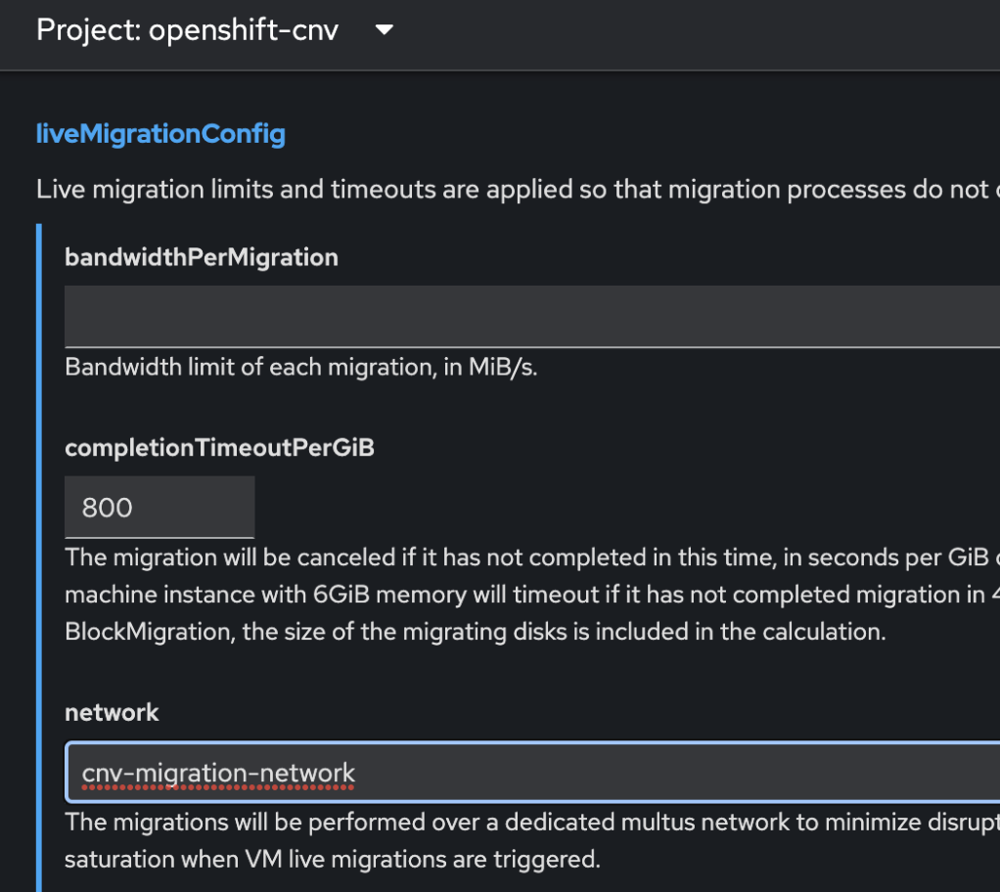

# Configure Dedicated Live Migration Network

## [Official Documentation](https://docs.openshift.com/container-platform/4.14/virt/live_migration/virt-about-live-migration.html)

The official documentation basically just links to a description of the `Cluster Settings` where you can set the Live Migration Network.

## Process

First, you need to create a Network Attachment Definition (NAD) for the Live Migration Network.  Here is an example that creates a network called `cnv-migration-network` and excludes some IP addresses that already exist:

```
export KUBECONFIG=~/ocp-trial/kubeconfig
cat << EOF > create_cnv_migration_nad.yaml
apiVersion: "k8s.cni.cncf.io/v1"
kind: NetworkAttachmentDefinition
metadata:
  name: cnv-migration-network
  namespace: openshift-cnv
spec:
  config: '{
    "cniVersion": "0.3.1",
    "type": "macvlan",
    "master": "bond1",
    "mode": "bridge",
    "ipam": {
          "type": "whereabouts",
          "range": "192.168.31.0/24",
          "exclude": [
               "192.168.31.222/32",
               "192.168.31.223/32",
               "192.168.31.224/32",
               "192.168.31.225/32",
               "192.168.31.226/32",
               "192.168.31.227/32"
            ]
    }
  }'
EOF
oc create -f ./create_cnv_migration_nad.yaml
```

Next, you need to configure the hyperconverged deployment to use the migration network. If you have not already created the HyperConverged deployment, you can set this in the GUI when you're creating the object:

{width=60%}

If you have already created the HyperConverged object, you will need to edit it and add the `network:` line identifying the Network Attachment Definition to use for the migration network. as shown below:

`oc edit hyperconverged kubevirt-hyperconverged -n openshift-cnv`

Example:

```hl_lines="7"
spec:  
  certConfig:  
    ca:  
  …  
  liveMigrationConfig:  
    completionTimeoutPerGiB: 800  
    network: cnv-migration-network  
    parallelMigrationsPerCluster: 5  
    parallelOutboundMigrationsPerNode: 2  
    progressTimeout: 150  
```
