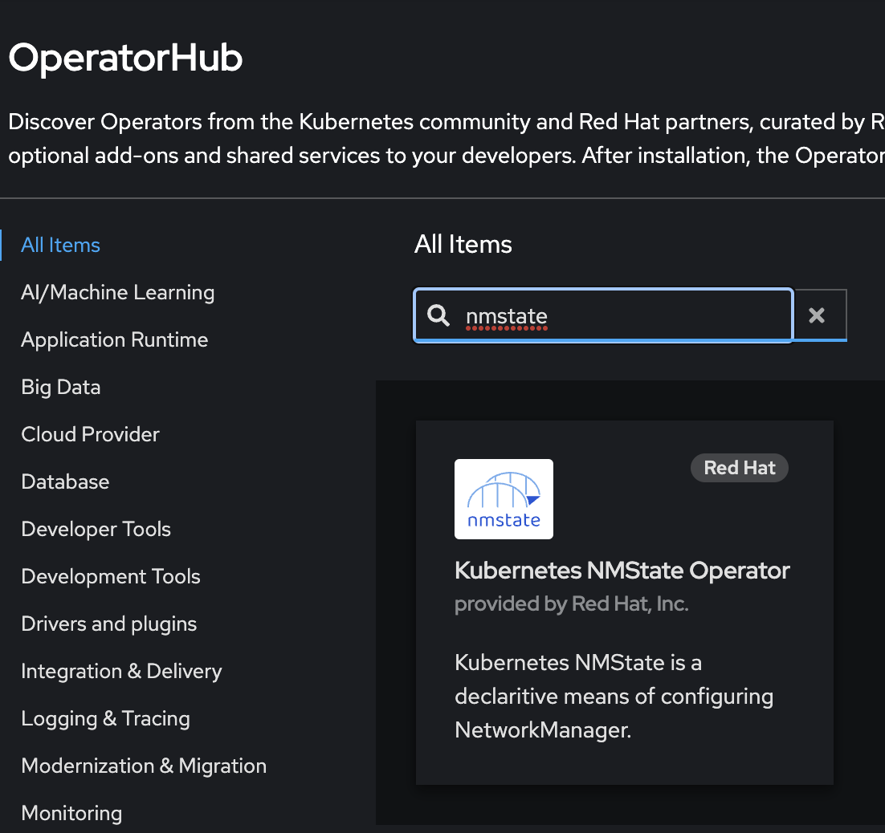
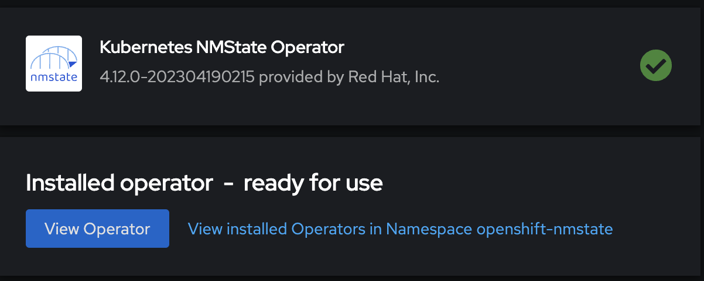
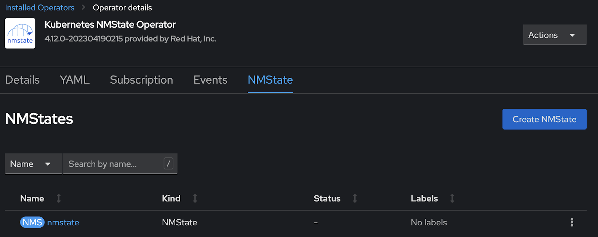

# Install NMState Operator

Login to the cluster UI at:

https://console-openshift-console.<OCP Cluster Name\>.<Domain Name\>/

On the left go to `Operators -> OperatorHub`

Search for **nmstate**



Click on the **Kubernetes NMState Operator**, click `Install`, accept the defaults and click `Install` again.

In a couple of minutes, it will be installed:



Click `View Operator`, go to the **NMState tab**, click `Create NMState`.

Accept the defaults and click `Create`.



Doing this will create the **NodeNetwork\*** Custom Resource Definitions required to be able to work with the underlying network configuration in CoreOS on the Openshift Nodes.

**Create bond and associated bridge**

Once the NMState Operator is installed, we can use this to create additional bonds/bridges within the cluster. Some uses for these are:

- Virtualization Migration Network
- Virtualization Data Network
- Management Network for ODF

Here are some example yaml files which can be used to create tese bonds and bridges.

**bond4**

```
export KUBECONFIG=~/ocp-trial/kubeconfig
cat << EOF > ocpv-network.yaml
apiVersion: nmstate.io/v1
kind: NodeNetworkConfigurationPolicy
metadata:
  name: ocpv-network
spec:
  desiredState:
    interfaces:
    - name: bond4
      type: bond
      state: up
      mtu: 9000
      ipv4:
        enabled: false
      link-aggregation:
        mode: 802.3ad
        port:
        - enp55s1f8
        - enp55s1f9
EOF
oc create -f ./ocpv-network.yaml
```

**br-bond4**

```
export KUBECONFIG=~/ocp-trial/kubeconfig
cat << EOF > ocpv-bridge.yaml
apiVersion: nmstate.io/v1
kind: NodeNetworkConfigurationPolicy
metadata:
  name: ocpv-bridge
spec:
  desiredState:
    interfaces:
    - name: br-bond4
      description: Linux bridge with bond4 as a port
      type: linux-bridge
      state: up
      mtu: 9000
      ipv4:
        enabled: false
        dhcp: false
      bridge:
        options:
          stp:
            enabled: false
        port:
        - name: bond4
EOF
oc create -f ./ocpv-bridge.yaml
```