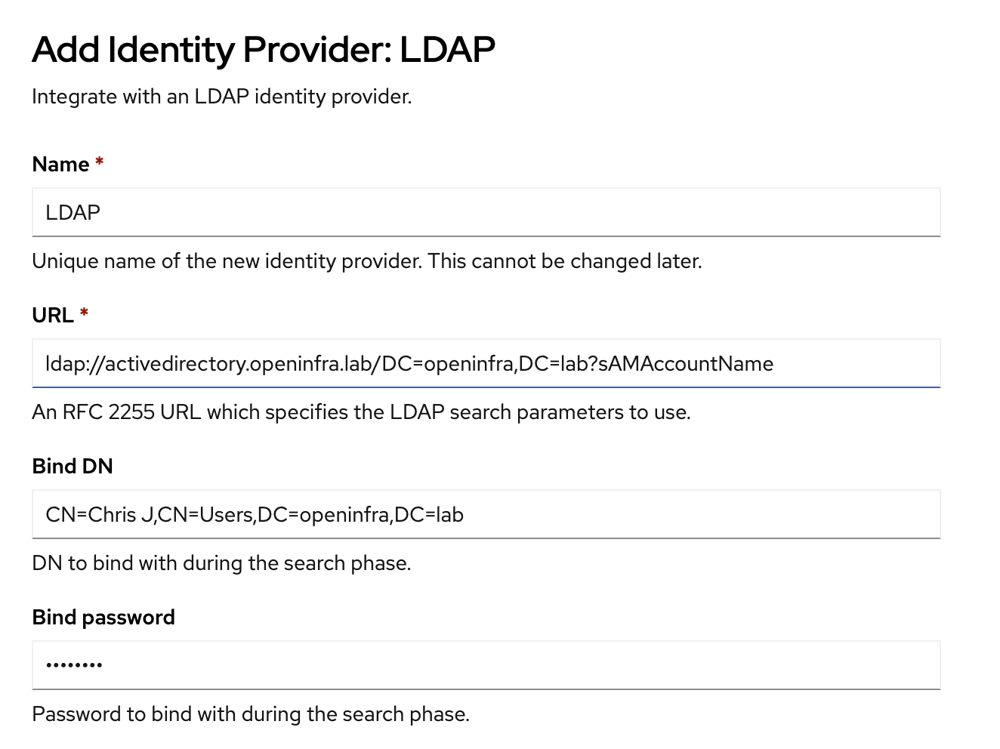

# Integrate with LDAP/AD

## Enable LDAP

In the GUI, navigate to Administration, Cluster Settings.  Search or scroll down to Oauth, click the link.  On the OAuth details page, scroll to the bottom and click the Add button, select LDAP.

Update the fields appropriately.  

* *Name* field will be used to display the user's idenity on the login screen.
* *URL* field must include the domain the and field to search for when the user logs in.
* *BindDN* is the DN from AD that is used for lookups
* *Bind* password is the password for the BindDN user.



Scroll down to the Attributes section.  Update the *Preferred username* to the user friendly name defined in AD.
> NOTE:  For our environment this is the **sAMAccountName** but can vary for other customer environments.

Scroll down to the *CA file*.  If using TSL/ldaps, include the CA Cert used by the AD server.  You can get this using the openssl command.  

```hl_lines="17-21"
% openssl s_client -showcerts -connect activedirectory.openinfra.lab:636
CONNECTED(00000005)
depth=0 CN = activedirectory.openinfra.lab
verify error:num=20:unable to get local issuer certificate
verify return:1
depth=0 CN = activedirectory.openinfra.lab
verify error:num=21:unable to verify the first certificate
verify return:1
depth=0 CN = activedirectory.openinfra.lab
verify return:1
---
Certificate chain
 0 s:CN = activedirectory.openinfra.lab
   i:DC = lab, DC = openinfra, CN = openinfra-ACTIVEDIRECTORY-CA
   a:PKEY: rsaEncryption, 2048 (bit); sigalg: RSA-SHA256
   v:NotBefore: Apr 16 00:29:00 2024 GMT; NotAfter: Apr 16 00:29:00 2025 GMT
-----BEGIN CERTIFICATE-----
MIIGgTCCBWmgAwIBAgITUwAAAALFqNGtH01IBQAAAAAAAjANBgkqhkiG9w0BAQsF
...
HX4mEB0+2Km5JOexCcM2zhY0+UHBtt/hfP25mSsbfk2UnIkgjw==
-----END CERTIFICATE-----
---
Server certificate
subject=CN = activedirectory.openinfra.lab
issuer=DC = lab, DC = openinfra, CN = openinfra-ACTIVEDIRECTORY-CA
---
...
```

Click the *Add* icon.  This will create a *Secret* called ldap-bind-password-*xxxxx* and a *ConfigMap* called 
ldap-ca-*xxxxx* in the *openshift-config* namespace and the *LDAP Identity provider* OAuth CRD.

## LDAP Sync

Create the ldapsync-config.yaml file
```
kind: LDAPSyncConfig
apiVersion: v1
url: ldaps://activedirectory.openinfra.lab
bindDN: 'CN=Chris J,CN=Users,DC=openinfra,DC=lab'
bindPassword: 
  file: '/etc/secrets/bindPassword'
insecure: false
ca: ad-crt.crt
groupUIDNameMapping:
  "CN=admins,CN=Users,DC=openinfra,DC=lab": server-admin
  "CN=redhat,CN=Users,DC=openinfra,DC=lab": redhat-users
augmentedActiveDirectory:
    groupsQuery:
        derefAliases: never
        pageSize: 0
    groupUIDAttribute: dn
    groupNameAttributes: [ cn ]
    usersQuery:
        baseDN: "DC=openinfra,DC=lab"
        scope: sub
        derefAliases: never
        filter: (objectclass=person)
        pageSize: 0
    userNameAttributes: [ sAMAccountName ]
    groupMembershipAttributes: [ memberOf ]
```
> NOTE: The groupUIDNameMapping: parameter is the mappying of groups in AD to the groups that either exist or should be created in OpenShift.  These names must be lowercase and conform to Kubernetes naming standards.

To only import specific groups, create a whitelist.txt file that contains the CNs of the groups to import.

```
$ cat whitelist.txt
CN=admins,CN=Users,DC=openinfra,DC=lab
CN=redhat,CN=Users,DC=openinfra,DC=lab
```

Sync the groups:
```
oc adm groups sync --sync-config=ldapsync-config.yaml --whitelist=whitelist.txt --confirm
```
> NOTE: Leave off the --confirm if you want to run a dry-run.

To add cluster-admin role to the new server-admin group:
```
oc adm policy add-cluster-role-to-group cluster-admin *server-admin*
```

> NOTE: By default users that are authenticated will be in the group *system:authenticated:oauth* which is attached to the *self-provisioner* cluster role binding.  Meaning they are allowed to create projects.

