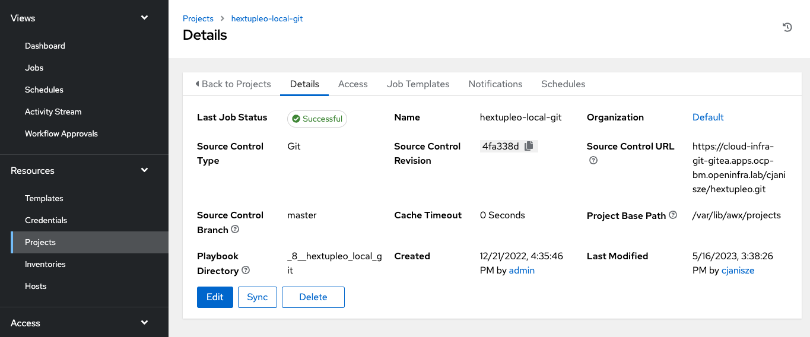

# Ansible Tower 

To sync any changes from the cloud-infra-git-gitea.apps.ocp-bm.openinfra.lab hextupleo repo, access AAP, expand Resources, and select Projects.

Click on the hextupleo-local-git project followed by the Sync icon.  

