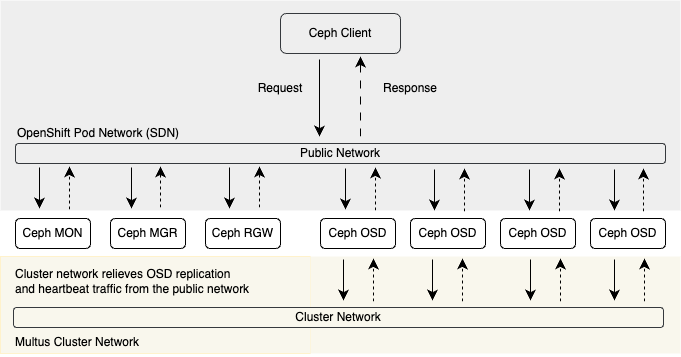

# Multus

Multus is an advanced OpenShift feature with broad capabilities  
Multus is not SDN  
Multus is not in the network data path  
Multus exposes Linux network interfaces directly into Ceph pods  

* Improved latency  
* Improved bandwidth  
* Improved security  



## Planning

Homeogeneous network interfaces across all nodes  

* All storage and worker nodes need public newtork interfaces (if applicable)  
* Only nodes hosting ODF need the cluster network interfaces (if applicable)  

Network Diagrams should include:  

* Node types  
* Interfaces with host-level IDs, speeds, bond info  
* Pod Network  
* ODF Public Network  
* ODF Cluster Network  
* CIDRs  
* Interfaces  
* Switches  
* VLANs  


## Configuring Multus

Define a Multus Network using a Newtork Attachment Definition (NAD)

```hl_lines="4 11 15"
apiVersion: k8s.cni.cncf.io/v1
kind: NetworkAttachmentDefinition
metadata:
  name: odf-cluster    
  namespace: openshift-storage
spec:
  config: |
    {
       "cniVersion": "0.3.1",  
       "type": "macvlan",
       "master": "eth1",   
       "mode": "bridge",
       "ipam": {
          "type": "whereabouts",
          "range": "192.168.10.0/24"   
       }
    }
```

* namespace can be default (unspecified) or openshift-storage
* type - macvlan (recommended) or ipvlan
* master - parent interface or interface/bond on host
* ipam - IP Address Management; *whereabouts*, uses OCP/Kubernetes leases, or *dhcp*
* range - CIDR, unique for each network

  > NOTE: If there is a DNCP server, ensure Multus won't give out the same range so that multiple MAC addresses on the network can't have the same IP.


Driver Types:  

  * macvlan  
      * each connection gets a sub-interface of the parent interface with its own MAC addr  
      * each interface is isolated from the host network  
      * uses less CPU and privdes better throughput than LINUX bridge or ipvlan  
      * almost always want bridge mode  
      * near-host performance when NIC supports virtual ports/VLANs in hardware  
  * ipvlan  
      * each connection gets its own IP address and shares the same MAC addr  
      * L2 mode is analogous to macvlan bridge mode  
      * L3 mode is analogous to a router existing on the parent interface  
      * L3 mode is useful for BGP, otherwise use macvlan for reduced CPU and better throughput  
      * if NIC doesn't support VLANs in hardware, might be better than macvlan (but unlikely)  


## Pre-flight Check

[ODF Multus Validation Tool](https://access.redhat.com/articles/7014721)

  * Run in OCP admin shell *before* ODF is installed
  * Checks basic Multus network connectivity
  * On failure, suggests known issues/items to check for troubleshooting
  * Make sure to download latest version
  * Will be part of ODF official release in the future

  ```
  ./rook multus validation run --public-newtork odf-publid --namespace openshift-storage
  ```

## Installing ODF

  When installing ODF Operator, on the *Security and network* screen, select the NAD definition created for Multus for the Public Network Interface or the Cluster Network Interface (or both).

## Troubleshooting

  * If pods aren't starting
    * problem with NAD definition
    * `oc pod describe` usually contains the error as an even
    * NIC may not support enough virtual ports/VLANs for the additional MAC addresses
  * If pods are starting but not communicating
      * Network design/configuration may contain errors
      * Newtork switch may be blocking sub-interface MAC addresses/IPs
      * Switch firewalling
      * System or NAD LINCU networking configuration may be blocking traffic
      * SOS report will have good info to look at next.
          * `ip_netns_exec_*_address_*` and `ip_netns_exec_*_route_*` from container namespace
    
    > NOTE: Some NICs support a limited number of virtual ports/VLANs (64 per physical) via hardware/driver.  Also, switches with port security can block unknown MAC addresses, they must support promiscuous (promisc) traffic.


