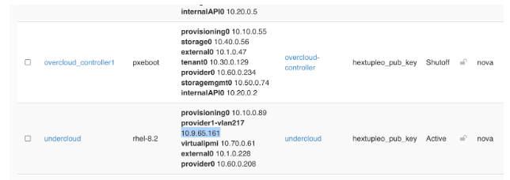
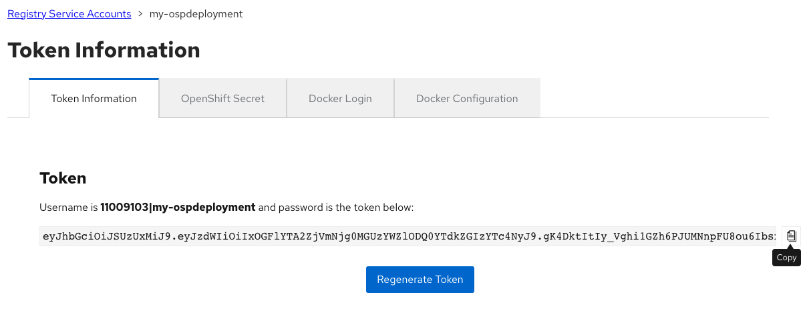

# OSP 16.2 Installation Instructions

## Introduction

## Goals:

* Enable field on OSP 16.2
* Test basics features work (no regression)
* Test new selected set of features
* Optionally test tech preview features
* Report product and documentation bugs 
* Send valuable feedback to OSP Product management and engineering teams
* Convert the work accomplished into lab training guides in order to enable more folks in the field
* Have fun with OSP and director 
* Get to work with and get to know each other.

## HextupleO

The lab access will be provided in the form of nested virtualization managed by RHOSP 16.1.  We have limited resources available, but there should be enough room for about 20 virtual environments.

Standard roles have been pre-defined, but since we are using OpenStack to manage it, we are capable of being flexible, with resizing flavors, snapshotting, adding more cinder volumes to ceph nodes or even adding more networks via either OpenStack CLI Horizon or Cloudforms.

| Role | vRAM | vCPU | vNIC | Disk |
|-----|-------|-----|-----|------|
| Undercloud | 16G| 4 | <ul><li>1x pxe</li><li>1x external</li> | 100GB |
| Controller | 12GB | 2 | <ul><li>1x pxe</li><li>1x internal api</li><li>1x tenant</li><li>1x storage</li><li>1x storagemgmt</li><li>1x external</li> | 60 GB |
| Compute | 4GB | 4 | <ul><li>1x pxe</li><li>1x internal api</li><li>1x tenant</li><li>1x storage</li> | 60GB |
| Ceph | 4GB | 2 | <ul><li>1x pxe</li><li>1x storage</li><li>1x storagemgmt</li><li>1x storage</li> | <ul><li>50GB OSD</li><li>100GB (osd)</li> |
| HCI (optional) | 8GB | 4 | <ul><li>1x pxe</li><li>1x internal api</li><li>1x tenant</li><li>1x storage</li><li>1x storagemgmt</li> | <ul><li>60GB OSD</li><li>100GB (osd)</li> |
| Custom (optional) |   |  |  |  |


## Building your HextupleO Lab:

HextupleO is an upstream project built with ansible playbooks talking directly to OpenStack APIs via python-shade libraries. It also nicely integrates with Ansible Automation Platform for ease of deployment and manageability (you can learn more about it [here](https://github.com/OOsemka/hextupleo)).

### Default Deployment

1. To build your environment, please ensure you are connected to NA-SSA VPN.  

2. Access RHAAP via this link: [Ansible Automation Platform](https://cloud-infra-tower.apps.ocp-bm.openinfra.lab/#/login)  

3. Go to *Templates* tab and hit the “rocket” icon next to *Deploy OpenStack Environment*. 

4. Provide a unique *project_name* and *password*. The project name and password are used to access your environment via CLI and the Horizon GUI.  Choose a password you will remember.  

5. Wait for the deployment to finish.  You can monitor via the Jobs Output screen or you can monitor each individual job by selecting Jobs from the left pane and selecting the appropriate jobs.  There are four jobs, create project, create networks, create instances, and configure OSP undercloud.


### Customized Deployment

1. To build your environment, please ensure you are connected to NA-SSA VPN.  

2. Access RHAAP via this link: [Ansible Automation Platform](https://cloud-infra-tower.apps.ocp-bm.openinfra.lab/#/login)  

3. Go to Templates Tab and hit the “rocket” icon next to - “Hextupleol - create  project”, after you hit “Next”, you will get a survey prompting for user and password

4. Set user/project and password and submit the job. The user name/project name and password are used to access your environment via CLI and the Horizon GUI.  Choose a password you will remember.  

5. Go to *Templates* tab and hit the “rocket” icon next to *Hextupleo - create networks*.  In hexo4 you are encouraged to experiment with different settings. However if you’d like to start with the known network configuration the default templates should be fine.  

    ```
    networks:  
      - { name: "external0", cidr: "10.1.0.0/24", dhcp: "False", snat: "False", mtu: "8938" }  
      - { name: "provisioning0", cidr: "10.10.0.0/24", dhcp: "False", snat: "False", mtu: "8938" }  
      - { name: "internalAPI0", cidr: "10.20.0.0/24", dhcp: "False", snat: "False", mtu: "8938" }  
      - { name: "tenant0", cidr: "10.30.0.0/24", dhcp: "False", snat: "False", mtu: "8938" }  
      - { name: "storage0", cidr: "10.40.0.0/24", dhcp: "False", snat: "False", mtu: "8938" }  
      - { name: "storagemgmt0", cidr: "10.50.0.0/24", dhcp: "False", snat: "False", mtu: "8938" }  
      - { name: "provider0", cidr: "10.60.0.0/24", dhcp: "False", snat: "False", mtu: "8938" }  
      - { name: "virtualipmi", cidr: "10.70.0.0/24", dhcp: "True", snat: "True", mtu: "8938" }  
    ```

6. Set user/project and password and submit the job.  The user name/project name and password are used to access your environment via CLI and the Horizon GUI.  Choose a password you will remember.  

7. Go to *Templates* tab and hit the “rocket” icon next to *Hextupleo - create instances*.  Below is a good starting config with controllers, 2 compute, and 3 Ceph nodes.  
    
    ```  
    instances:  
      - { name: "undercloud", image: "rhel-8.2", flavor: "undercloud", ipmi: "False", extra_volume_size: "0", net_name1: "provider1-vlan217, net_name2: "provisioning0, net_name3: "external0", net_name4: "provider0", net_name5: "virtualipmi", net_name6: "", net_name7: "", net_name8: "" }  
      - { name: "overcloud_controller1", image: "pxeboot", flavor: "overcloud-controller", ipmi: "True", extra_volume_size: "0", net_name1: "provisioning0, net_name2: "external0, net_name3: "internalAPI0", net_name4: "tenant0", net_name5: "storage0", net_name6: "storagemgmt", net_name7: "provider0", net_name8: "" }  
      - { name: "overcloud_controller2", image: "pxeboot", flavor: "overcloud-controller", ipmi: "True", extra_volume_size: "0", net_name1: "provisioning0, net_name2: "external0, net_name3: "internalAPI0", net_name4: "tenant0", net_name5: "storage0", net_name6: "storagemgmt", net_name7: "provider0", net_name8: "" }  
      - { name: "overcloud_controller3", image: "pxeboot", flavor: "overcloud-controller", ipmi: "True", extra_volume_size: "0", net_name1: "provisioning0, net_name2: "external0, net_name3: "internalAPI0", net_name4: "tenant0", net_name5: "storage0", net_name6: "storagemgmt", net_name7: "provider0", net_name8: "" }  
      - { name: "overcloud_compute1", image: "pxeboot", flavor: "overcloud-compute", ipmi: "True", extra_volume_size: "0", net_name1: "provisioning0, net_name2: "interalAPI0, net_name3: "tenant0", net_name4: "storage0", net_name5: "provider0", net_name6: "", net_name7: "", net_name8: "" }  
      - { name: "overcloud_compute2", image: "pxeboot", flavor: "overcloud-compute", ipmi: "True", extra_volume_size: "0", net_name1: "provisioning0, net_name2: "interalAPI0, net_name3: "tenant0", net_name4: "storage0", net_name5: "provider0", net_name6: "", net_name7: "", net_name8: "" }  
      - { name: "overcloud_ceph1", image: "pxeboot", flavor: "overcloud-ceph", ipmi: "True", extra_volume_size: "100", net_name1: "provisioning0, net_name2: "storage0, net_name3: "storagemgmt0", net_name4: "", net_name5: "", net_name6: "", net_name7: "", net_name8: "" }  
      - { name: "overcloud_ceph2", image: "pxeboot", flavor: "overcloud-ceph", ipmi: "True", extra_volume_size: "100", net_name1: "provisioning0, net_name2: "storage0, net_name3: "storagemgmt0", net_name4: "", net_name5: "", net_name6: "", net_name7: "", net_name8: "" }  
      - { name: "overcloud_ceph3", image: "pxeboot", flavor: "overcloud-ceph", ipmi: "True", extra_volume_size: "100", net_name1: "provisioning0, net_name2: "storage0, net_name3: "storagemgmt0", net_name4: "", net_name5: "", net_name6: "", net_name7: "", net_name8: "" }  
    ``` 


8. Set user/project and password and submit the job.  The user name/project name and password are used to access your environment via CLI and the Horizon GUI.  Choose a password you will remember.  

9. Finally, go to *Templates* tab and hit the “rocket” icon next to *Hextupleo - configure OSP undercloud*.  

10.  Follow the survey and submit the job.

11. At the end you will be getting a screen similar to this:

   

You can ssh to this IP as the user *stack* using the password you set in the playbook.


## Accessing Your Project in Horizon

This is accessing the Openstack that your environment is deployed to.

### Horizon

1. Using the project name as the username and password that you specified when you launched your job, log into the Horizon Dashboard with this link: 

    [Horizon Login](https://172.20.11.50/dashboard/auth/login/)

    > NOTE: You must be connected to the NA-SSA VPN

2. Go to the *Compute->Instances* tab and make sure all of your requested nodes have been created.  

3. Scroll down to the bottom of the list and note the Undercloud Public IP address that is associated with a provider vlan. You will use that IP to access your undercloud node. This should match the above output from the Ansible job.  You can SSH to this IP as the *stack* user using the password you provided in the playbook.  

    

4. Go to *Network->Network Topology* and get familiar with how the VMs are connected. 

>  NOTE: We have created Tenant (over GENEVE/VXLAN) networks to satisfy all the non-routable networks. Only External Network is connected to one of the provider routable networks and accessible from outside of your deployed environment.

   

#### Undercloud

1. Access undercloud via ssh using stack@*ip-learned-from-horizon*  / password specified in Tower.  

2. You can now start deploying OSP16.2 based on standard instructions (or whatever version you have staged).  See below notes for helpful information in the deployment process.


    > NOTE: 
    Repos:  Even though you could register to your CDN and start using your own repos, there are local synced repos that are available over LAN. This should be much quicker to download from. Simply grap the osp repo file from here:

    > [stack@undercloud ~]$ sudo curl http://172.20.129.11/osp16.2.repo -o /etc/yum.repos.d/osp16.2.repo

    > ~/GoodieBag/deploy.sh - pre-configured deploy script that can be used as a template.

    > ~/templates - Directory that has multiple templates that have been pre-configured for making the vanilla deployment easier to perform.
    Undercloud.conf - sample undercloud.conf file with pre-configured known working settings like IP pools, interface settings, and more.  The egrep command is used to remove blank and comment lines.

    ```
    [stack@undercloud ~]$ egrep -v '(^$|^#)' undercloud.conf
    [DEFAULT]
    certificate_generation_ca = local
    clean_nodes = true
    container_images_file = /home/stack/templates/containers-prepare-parameter.yaml
    generate_service_certificate = true
    hieradata_override = /home/stack/templates/undercloud_hiera.yaml
    local_interface = eth1
    local_ip = 10.10.0.10/24
    local_mtu = 8946
    local_subnet = ctlplane-subnet
    overcloud_domain_name = hextupleo.lab
    subnets = ctlplane-subnet
    undercloud_admin_host = 10.10.0.11
    undercloud_debug = false
    undercloud_hostname = osp-blm-undercloud.hextupleo.lab
    undercloud_nameservers = 172.20.129.10
    undercloud_ntp_servers = 172.20.129.10
    undercloud_public_host = 10.1.0.11
    [ctlplane-subnet]
    cidr = 10.10.0.0/24
    dhcp_end = 10.10.0.149
    dhcp_start =  10.10.0.100
    dns_nameservers = 10.10.0.10
    gateway = 10.10.0.10
    inspection_iprange = 10.10.0.200,10.10.0.249
    masquerade = true
    masquerade_network = 10.10.0.0/16
    [stack@undercloud ~]$  
    ```

    
## Deploy Vanilla OSP 16.2

Even though you don’t have to follow this guide and just jump right into hacking, It is highly encouraged for everyone to get at least one vanilla deployment done to get themselves familiar with the process.


Steps below are going to be very similar if not mostly identical to [Red Hat official documentation](https://access.redhat.com/documentation/en-us/red_hat_openstack_platform/16.2/html/director_installation_and_usage/index).
Please review the official documentation for accuracy and open any Bugzilla’s against it!

### Undercloud Installation

1. Log into the undercloud VM as the *stack* user using the IP address that was obtained during the VM deployments in Horizon.

    > NOTE: You must be connected to the NA-SSA VPN to access the environment.

2. Complete the RHEL upgrade requirements.

    > Make sure you grabbed the repo configuration from the DNS server.
    > [stack@undercloud ~]$ sudo curl http://172.20.129.11/osp16.2.repo -o /etc/yum.repos.d/osp16.2.repo


    ```
    [stack@undercloud ~]$ sudo dnf module reset container-tools
    [stack@undercloud ~]$ sudo dnf module enable -y container-tools:3.0
    [stack@undercloud ~]$ sudo yum update -y
    [stack@undercloud ~]$ sudo reboot 
    ```
3. Install the TripleO Director, Ceph Ansible, tmux (optional) packages, and prepare the container images.

    ```
    [stack@undercloud ~]$ sudo yum install -y python3-tripleoclient ceph-ansible tmux
    [stack@undercloud ~]$ openstack tripleo container image prepare default --local-push-destination --output-env-file ~/templates/containers-prepare-parameter.yaml
    # Generated with the following on 2023-03-22T16:49:09.066277
    #
    #   openstack tripleo container image prepare default --local-push-destination --output-env-file /home/stack/templates/containers-prepare-parameter.yaml
    #

    parameter_defaults:
      ContainerImagePrepare:
      - push_destination: true
        set:
          ceph_alertmanager_image: ose-prometheus-alertmanager
          ceph_alertmanager_namespace: registry.redhat.io/openshift4
          ceph_alertmanager_tag: v4.6
          ceph_grafana_image: rhceph-4-dashboard-rhel8
          ceph_grafana_namespace: registry.redhat.io/rhceph
          ceph_grafana_tag: 4
          ceph_image: rhceph-4-rhel8
          ceph_namespace: registry.redhat.io/rhceph
          ceph_node_exporter_image: ose-prometheus-node-exporter
          ceph_node_exporter_namespace: registry.redhat.io/openshift4
          ceph_node_exporter_tag: v4.6
          ceph_prometheus_image: ose-prometheus
          ceph_prometheus_namespace: registry.redhat.io/openshift4
          ceph_prometheus_tag: v4.6
          ceph_tag: latest
          name_prefix: openstack-
          name_suffix: ''
          namespace: registry.redhat.io/rhosp-rhel8
          neutron_driver: ovn
          rhel_containers: false
          tag: '16.2'
        tag_from_label: '{version}-{release}'
    Output env file exists, moving it to backup.
    ```

4.  Starting with OSP15, Red Hat is moving to the Container Registry that requires an active Red Hat account.  In order to continue the installation, you need to include your credentials into the *container-prepare-parameter.yaml* file.  Service credentials can be created for the deployment using the [Customer Portal Terms-Based-Registry](https://access.redhat.com/terms-based-registry) site.

    Click the *New Service Account* icon in the upper right corner.  Enter a name for the service account and a description.  Click the *Create* icon.

    

    Click the *Copy* icon on the far right to copy the new token to your local clipboard.

    


5. Update the containers-prepare-parameter.yaml file with the new service account name and token.  Open the file and jump to the bottom.  Add the highlighted lines and paste the user name and token generated from Step 4.  The *ContainerImageRegistryCredentials* space aligns with the *ContainerImagePrepare* line at the top of the file.

    ``` hl_lines="7 8 9 10 11 12 13"
    [stack@undercloud ~]$ vi templates/containers-prepare-parameter.yaml
    # Generated with the following on 2023-03-08T09:20:45.446840
    #
    #   openstack tripleo container image prepare default --local-push-destination --output-env-file /home/stack/templates/containers-prepare-parameter.yaml
    #
    ...
      ContainerImageRegistryCredentials:
        registry.redhat.io:
          11009103|my-ospdeployment: eyJhbGciOiJSUzUxMiJ9.eyJzdWIiOiIxOGFlYTA2ZjVmNjg0MGUzYWZlODQ0YTdkZGIzYTc4N
          ...
          j1ivaZNDw-u8lwRCVtj7ZnQ
    ```


6. Update the undercloud.conf file if necessary.  This should not be required, but feel free to review and understand the parameters.

7. Install the undercloud.

    ```
    [stack@undercloud ~]$ openstack undercloud install
    undercloud_admin_host or undercloud_public_host is not in the same cidr as local_ip.
    Config option undercloud_public_host "10.1.0.11" not in defined CIDR "10.10.0.0/24"
    Running: sudo --preserve-env openstack tripleo deploy --standalone --standalone-role Undercloud --stack undercloud --local-domain=hextupleo.lab --local-ip=10.10.0.10/24 --templates=/usr/share/openstack-tripleo-heat-templates/ --networks-file=network_data_undercloud.yaml --heat-native -e /usr/share/openstack-tripleo-heat-templates/environments/undercloud.yaml -e /usr/share/openstack-tripleo-heat-templates/environments/use-dns-for-vips.yaml -e /usr/share/openstack-tripleo-heat-templates/environments/podman.yaml -e /home/stack/templates/containers-prepare-parameter.yaml -e /usr/share/openstack-tripleo-heat-templates/environments/services/masquerade-networks.yaml -e /usr/share/openstack-tripleo-heat-templates/environments/services/ironic.yaml -e /usr/share/openstack-tripleo-heat-templates/environments/services/ironic-inspector.yaml -e /usr/share/openstack-tripleo-heat-templates/environments/services/mistral.yaml -e /usr/share/openstack-tripleo-heat-templates/environments/services/zaqar-swift-backend.yaml -e /usr/share/openstack-tripleo-heat-templates/environments/disable-telemetry.yaml -e /usr/share/openstack-tripleo-heat-templates/environments/services/tempest.yaml -e /usr/share/openstack-tripleo-heat-templates/environments/public-tls-undercloud.yaml --public-virtual-ip 10.1.0.11 --control-virtual-ip 10.10.0.11 -e /usr/share/openstack-tripleo-heat-templates/environments/ssl/tls-endpoints-public-ip.yaml -e /usr/share/openstack-tripleo-heat-templates/environments/services/undercloud-haproxy.yaml -e /usr/share/openstack-tripleo-heat-templates/environments/services/undercloud-keepalived.yaml --deployment-user stack --output-dir=/home/stack --cleanup -e /home/stack/tripleo-config-generated-env-files/undercloud_parameters.yaml --hieradata-override=/home/stack/templates/undercloud_hiera.yaml -e /usr/share/openstack-tripleo-heat-templates/environments/tripleo-validations.yaml --log-file=install-undercloud.log -e /usr/share/openstack-tripleo-heat-templates/undercloud-stack-vstate-dropin.yaml
    The heat stack undercloud action is CREATE
    2023-04-10 13:54:09.767 11371 INFO migrate.versioning.api [-] 70 -> 71... 
    2023-04-10 13:54:09.804 11371 INFO migrate.versioning.api [-] done
    ...

    ```

8. Once the installation is complete, verify the containers are up and source the stackrc file to set the environment for the undercloud environment.

    ```
    [stack@undercloud ~]$ sudo podman ps
    [stack@undercloud ~]$ source ~/stackrc
    (undercloud) [stack@undercloud ~]$ 
    ```

9. Obtain the images for the overcloud nodes.

    ```
    (undercloud) [stack@undercloud ~]$ sudo dnf -y install rhosp-director-images rhosp-director-images-ipa-x86_64
    ```

10. Extract the tar balls for the overcloud and ironic images.

    ```
    (undercloud) [stack@undercloud ~]$ cd ~/images
    (undercloud) [stack@undercloud ~]$ tar -xvf /usr/share/rhosp-director-images/overcloud-full-latest-16.2.tar
    (undercloud) [stack@undercloud ~]$ tar -xvf /usr/share/rhosp-director-images/ironic-python-agent-latest-16.2.tar
    ```

11. The root password can be changed in the overcloud image using the procedures below.  This is optional and is not required.

    ```
    (undercloud) [stack@undercloud ~]$ export LIBGUESTFS_BACKEND=direct
    (undercloud) [stack@undercloud ~]$ virt-customize -a overcloud-full.qcow2 --root-password password:changeme
    ```

    > NOTE: the libguestfs-tools package may need to be installed: 
    >       sudo dnf install -y libguestfs-tools

12.  Upload the overcloud images and verify they are available to the undercloud.

    ```
    (undercloud) [stack@undercloud ~]$ openstack overcloud image upload --image-path /home/stack/images
    (undercloud) [stack@undercloud ~]$ openstack image list
    +--------------------------------------+------------------------+--------+
    | ID                                   | Name                   | Status |
    +--------------------------------------+------------------------+--------+
    | f3e73e81-acca-45d7-a848-7d6de40933ed | overcloud-full         | active |
    | f8162188-4ec9-4312-9519-2e6421bd52a8 | overcloud-full-initrd  | active |
    | da2195d1-d75f-4134-b906-1302ff9943af | overcloud-full-vmlinuz | active |
    +--------------------------------------+------------------------+--------+
    ```

13. Verify the DNS server has been set for the cltplane subnet.

    ``` hl_lines="9"
    (undercloud) [stack@undercloud ~]$ openstack subnet show ctlplane-subnet
    +-------------------+---------------------------------------------------------------------------------------------------------------------------------------------------------+
    | Field             | Value                                                                                                                                                   |
    +-------------------+---------------------------------------------------------------------------------------------------------------------------------------------------------+
    | allocation_pools  | 10.10.0.100-10.10.0.149                                                                                                                                 |
    | cidr              | 10.10.0.0/24                                                                                                                                            |
    | created_at        | 2023-03-08T15:07:54Z                                                                                                                                    |
    | description       |                                                                                                                                                         |
    | dns_nameservers   | 10.10.0.10                                                                                                                                              |
    | enable_dhcp       | True                                                                                                                                                    |
    | gateway_ip        | 10.10.0.10                                                                                                                                              |
    | host_routes       |                                                                                                                                                         |
    | id                | 2096d5b9-7516-4146-ae4b-919a73f82a8f                                                                                                                    |
    | ip_version        | 4                                                                                                                                                       |
    | ipv6_address_mode | None                                                                                                                                                    |
    | ipv6_ra_mode      | None                                                                                                                                                    |
    | location          | cloud='', project.domain_id=, project.domain_name='Default', project.id='cd6a92e810154ab882d290a70e8c6afc', project.name='admin', region_name='', zone= |
    | name              | ctlplane-subnet                                                                                                                                         |
    | network_id        | 316ccfd5-f1b3-455c-9856-cbbed5b65ba7                                                                                                                    |
    | prefix_length     | None                                                                                                                                                    |
    | project_id        | cd6a92e810154ab882d290a70e8c6afc                                                                                                                        |
    | revision_number   | 0                                                                                                                                                       |
    | segment_id        | None                                                                                                                                                    |
    | service_types     |                                                                                                                                                         |
    | subnetpool_id     | None                                                                                                                                                    |
    | tags              |                                                                                                                                                         |
    | updated_at        | 2023-03-08T15:07:54Z                                                                                                                                    |
    +-------------------+---------------------------------------------------------------------------------------------------------------------------------------------------------+
    ```


### Overcloud Installation

The first step in deploying the overcloud is to generate the instackenv.yaml file.  Once this is complete, the file needs to be updated with the IP addresses of the VMs that were deployed by HextupleO.

1. Generate the instackenv.yaml file using the ansible-playbook.  Once the file is generated, source the *projectName*rc file for the overcloud environment.  This will allow you to get the list of servers and their IP addresses.

    ```
    (undercloud) [stack@undercloud ~]$ cd ~/GoodieBag
    (undercloud) [stack@undercloud ~]$ ansible-playbook generate_instackenv.yml
    (undercloud) [stack@undercloud ~]$ source *projectName*rc
    (myproject) [stack@undercloud ~]$ openstack server list --insecure | awk '/ipmi_/ { print $4 "    " $8 }'
    ipmi_overcloud_ceph3    virtualipmi=10.70.0.240
    ipmi_overcloud_ceph2    virtualipmi=10.70.0.236
    ipmi_overcloud_ceph1    virtualipmi=10.70.0.24
    ipmi_overcloud_compute2    virtualipmi=10.70.0.11
    ipmi_overcloud_compute1    virtualipmi=10.70.0.22
    ipmi_overcloud_controller3    virtualipmi=10.70.0.70
    ipmi_overcloud_controller2    virtualipmi=10.70.0.233
    ipmi_overcloud_controller1    virtualipmi=10.70.0.227
    ```

2. Update the instackenv.yaml file with the IP addresses.  You can do this manually, or you can use this code:

    ```
    openstack server list --insecure | awk '/ipmi_/ {print $4 "    " $8}' > /tmp/ipmi_addresses.txt
    cp ~/GoodieBag/instackenv.yaml ~/
    sed -i '/pm_addr/d' ~/instackenv.yaml
    for NODE in $(grep 'name: ' ~/instackenv.yaml | awk '{print $NF}' | sed 's/"//g')
    do
      IP=$(egrep ${NODE} /tmp/ipmi_addresses.txt | awk -F= '{print $NF}')
      sed -i "/name: \"${NODE}\"/a \    pm_addr: \"${IP}\"" ~/instackenv.yaml
    done
    ```

    > NOTE: Make sure you view the ~/instackenv.yaml file to ensure it is correct before continuing with the installation.

3. Register the nodes for the overcloud.  Make sure you source the stackrc file for the undercloud environment.  Once the import is complete, list the baremetal nodes and ensure all information is correct for the deployment.  All nodes will be in a *power off* or *manageable* state.

    ```
    (undercloud) [stack@undercloud ~]$ source ~/stackrc
    (undercloud) [stack@undercloud ~]$ openstack overcloud node import ~/instackenv.yaml
    (undercloud) [stack@undercloud ~]$ openstack baremetal node list
    +--------------------------------------+-----------------------+--------------------------------------+-------------+--------------------+-------------+
    | UUID                                 | Name                  | Instance UUID                        | Power State | Provisioning State | Maintenance |
    +--------------------------------------+-----------------------+--------------------------------------+-------------+--------------------+-------------+
    | 3a55f42d-b2d7-47f8-99b1-5e086f780896 | overcloud_ceph3       | 59118ee3-785a-45ef-bef7-8ce4739e34f6 | power off    | manageable             | False       |
    | beb33a36-ace6-497a-9178-154c37de2a71 | overcloud_ceph2       | 55eefb7f-e5ad-4987-89ae-fe9ee2fb10dd | power off    | manageable             | False       |
    | 9410122d-88d6-48fd-acbc-492b33ccdd12 | overcloud_ceph1       | de0b39b9-b69e-4316-a2b7-743fa95acb65 | power off    | manageable             | False       |
    | 19677fb9-b855-410f-be3e-c433a0cfb5af | overcloud_compute2    | 5c61b62a-5324-4c20-9dc0-e3cfa866ffbb | power off    | manageable             | False       |
    | f0e0ef33-2d4b-47e5-bb06-37b5eb3e4263 | overcloud_compute1    | d9bc6142-5780-45a2-899e-e5dc9d806ab9 | power off    | manageable             | False       |
    | c5063619-334b-4336-8985-9ce4865a378e | overcloud_controller3 | 2bb2ca3e-819a-46ce-aa6e-7a4d900875e3 | power off    | manageable             | False       |
    | ad1f539c-2897-4143-9281-44911fe71843 | overcloud_controller2 | 5a55912a-9c7c-4e35-bde2-c582bbfa1c28 | power off    | manageable             | False       |
    | 19367e0f-45ac-4242-b867-423e5a81727e | overcloud_controller1 | 7f573f3c-8389-4973-aba7-99f055071632 | power off    | manageable             | False       |
    +--------------------------------------+-----------------------+--------------------------------------+-------------+--------------------+-------------+
    ```
    > NOTE: Continue to monitor until the nodes are all in an *manageable* state.

4. Run the introspect to assign the profiles and configure the nodes successfully.  After all nodes are in an *available* state, verify the proper profiles were assigned.  

    ```
    (undercloud) [stack@undercloud ~]$ openstack overcloud node introspect --all-manageable --provide
    (undercloud) [stack@undercloud ~]$ openstack overcloud profiles list
    +--------------------------------------+-----------------------+-----------------+-----------------+-------------------+
    | Node UUID                            | Node Name             | Provision State | Current Profile | Possible Profiles |
    +--------------------------------------+-----------------------+-----------------+-----------------+-------------------+
    | 3a55f42d-b2d7-47f8-99b1-5e086f780896 | overcloud_ceph3       | active          | ceph-storage    |                   |
    | beb33a36-ace6-497a-9178-154c37de2a71 | overcloud_ceph2       | active          | ceph-storage    |                   |
    | 9410122d-88d6-48fd-acbc-492b33ccdd12 | overcloud_ceph1       | active          | ceph-storage    |                   |
    | 19677fb9-b855-410f-be3e-c433a0cfb5af | overcloud_compute2    | active          | compute         |                   |
    | f0e0ef33-2d4b-47e5-bb06-37b5eb3e4263 | overcloud_compute1    | active          | compute         |                   |
    | c5063619-334b-4336-8985-9ce4865a378e | overcloud_controller3 | active          | control         |                   |
    | ad1f539c-2897-4143-9281-44911fe71843 | overcloud_controller2 | active          | control         |                   |
    | 19367e0f-45ac-4242-b867-423e5a81727e | overcloud_controller1 | active          | control         |                   |
    +--------------------------------------+-----------------------+-----------------+-----------------+-------------------+
    ```
  
5. The undercloud public endpoints have been most likely encrypted with self-signed certificates.  Make sure to inject the cert into the deployment of the overcloud.  Copy the inject-trust-anchor-hiera.yaml file to the templates directory, copy the cert from the cm-local-ca.pem file and paste into the new file in the templates directory.  
  
    ```
    (undercloud) [stack@undercloud ~]$ cp /usr/share/openstack-tripleo-heat-templates/environments/ssl/inject-trust-anchor-hiera.yaml ~/templates
    (undercloud) [stack@undercloud ~]$ cat /etc/pki/ca-trust/source/anchors/cm-local-ca.pem
    Bag Attributes
        localKeyID: 39 D8 6C E9 C8 7F 65 01 20 80 25 09 E7 A4 41 EB 5D 5E 4E E9 
        friendlyName: Local Signing Authority
    subject=CN = Local Signing Authority, CN = b902a9d8-63a94f21-baaa93cc-f6428d97

    issuer=CN = Local Signing Authority, CN = b902a9d8-63a94f21-baaa93cc-f6428d97

    -----BEGIN CERTIFICATE-----
    MIIDjjCCAnagAwIBAgIRALkCqdhjqU8huqqTzPZCjZcwDQYJKoZIhvcNAQELBQAw
    ...
    LO+VuPv5BpVomVIT3w0cRbmzSNbUcRaX7QmcgyCxHl6FTWZllNsYYvHD6riNwWu+
    faM=
    -----END CERTIFICATE-----
    (undercloud) [stack@undercloud ~]$ vi ~/templates/inject-trust-anchor-hiera.yaml
    # *******************************************************************
    # This file was created automatically by the sample environment
    # generator. Developers should use `tox -e genconfig` to update it.
    # Users are recommended to make changes to a copy of the file instead
    # of the original, if any customizations are needed.
    # *******************************************************************
    # title: Inject SSL Trust Anchor on Overcloud Nodes
    # description: |
    #   When using an SSL certificate signed by a CA that is not in the default
    #   list of CAs, this environment allows adding a custom CA certificate to
    #   the overcloud nodes.
    parameter_defaults:
      # Map containing the CA certs and information needed for deploying them.
      # Type: json
      CAMap:
        undercloud:
          content: |
            -----BEGIN CERTIFICATE-----
            MIIDjjCCAnagAwIBAgIRALkCqdhjqU8huqqTzPZCjZcwDQYJKoZIhvcNAQELBQAw
            ...
            LO+VuPv5BpVomVIT3w0cRbmzSNbUcRaX7QmcgyCxHl6FTWZllNsYYvHD6riNwWu+
            faM=
            -----END CERTIFICATE-----
    ```

    > NOTE: Make sure that you line up the indentation for the certificate data.  It must be indented two spaces under the *content* tag.  

  
6. Copy the deploy.sh template from the GoodieBag directory to the stack user's home directory.  Edit the /home/stack/deploy.sh file and add the inject-trust-anchor-hiera.yaml file.  Ensure you have an understanding of each of the yaml files included.  
  
    > NOTE: If you want to deploy the Ceph Dashboard on the external network, you need to deploy it at the time of the initial overcloud deployment.  Create the ~/templates/ceph-dashboard-network-override.yaml file and include it in the ~/deploy.sh script.

    ```
    (undercloud) [stack@blm-ospinstall-undercloud ~]$ vi templates/ceph-dashboard-newtork-override.yaml
    parameter_defaults:
      ServiceNetworkMap: 
        CephDashboardNetwork: external
    :wq
    ```

    > NOTE: If you are going to enable the RGW service in Ceph, make sure to include the *ceph-rgw.yaml* file in the initial deployment.  

    ``` hl_lines="14 15 16 19"
    (undercloud) [stack@undercloud ~]$ cat deploy.sh
    #!/bin/bash
    #############################
    # This is not fully dynamic file and it might have not been populated with all right information. This is a template. You might still want to verify this is what you want before executing it
    ##############################
    source ~/stackrc
    cd ~/
    time openstack overcloud deploy --templates --stack myproject \
         -n templates/network_data.yaml \
         -e templates/node-info.yaml \
         -e templates/storage-environment.yaml \
         -e templates/ceph-custom-config.yaml \
         -e /usr/share/openstack-tripleo-heat-templates/environments/ceph-ansible/ceph-ansible.yaml \
         -e /usr/share/openstack-tripleo-heat-templates/environments/ceph-ansible/ceph-rgw.yaml \
         -e /usr/share/openstack-tripleo-heat-templates/environments/ceph-ansible/ceph-dashboard.yaml \
         -e templates/ceph-dashboard-network-override.yaml \
         -e templates/network-environment.yaml \
         -e /usr/share/openstack-tripleo-heat-templates/environments/network-isolation.yaml \
         -e templates/inject-trust-anchor-hiera.yaml \
         -e templates/host-memory.yaml \
         -e templates/containers-prepare-parameter.yaml \
         -e templates/ceph_dashboard_network_override.yaml \
         --log-file myproject_deployment.log \
         --ntp-server 10.10.0.10
    ```
  

7. In HextupleO 4, we are relying on the undercloud to provide NTP services.  By default, OSP v16 doesn't allow time sync from it's chrony service.  As a workaround, execute the following which opens the port via iptables and then allows a sync via chrony.  Restart the chrony service once complete.

    ```
    (undercloud) [stack@undercloud ~]$ sudo iptables -I INPUT -m state --state NEW -m udp -p udp --dport 123 -j ACCEPT
    (undercloud) [stack@undercloud ~]$ echo "echo allow 0.0.0.0/0 >> /etc/chrony.conf" | sudo /bin/bash
    (undercloud) [stack@undercloud ~]$ cat /etc/chrony.conf
    # Do not manually edit this file.
    # Managed by ansible-role-chrony
    server 172.20.129.10 iburst minpoll 6 maxpoll 10
    bindcmdaddress 127.0.0.1
    bindcmdaddress ::1
    allow 10.10.0.0/24
    driftfile /var/lib/chrony/drift
    logdir /var/log/chrony
    rtcsync
    makestep 1.0 3 
    allow 0.0.0.0/0
    (undercloud) [stack@undercloud ~]$ sudo systemctl restart chronyd
    ```

8. Execute the deploy.sh script to deploy the overcloud.  This takes a very long time to deploy so make sure you run the script in a tmux session.

    ```
    (undercloud) [stack@undercloud ~]$ tmux  
    (undercloud) [stack@undercloud ~]$ cd   
    (undercloud) [stack@undercloud ~]$ ./deploy.sh 
    ...
    PLAY RECAP *********************************************************************
    myproject-cephstorage-0 : ok=294  changed=149  unreachable=0    failed=0    skipped=153  rescued=0    ignored=0   
    myproject-cephstorage-1 : ok=291  changed=149  unreachable=0    failed=0    skipped=153  rescued=0    ignored=0   
    myproject-cephstorage-2 : ok=291  changed=149  unreachable=0    failed=0    skipped=153  rescued=0    ignored=0   
    myproject-controller-0 : ok=380  changed=217  unreachable=0    failed=0    skipped=193  rescued=0    ignored=0   
    myproject-controller-1 : ok=378  changed=211  unreachable=0    failed=0    skipped=195  rescued=0    ignored=0   
    myproject-controller-2 : ok=378  changed=211  unreachable=0    failed=0    skipped=195  rescued=0    ignored=0   
    myproject-novacompute-0 : ok=333  changed=177  unreachable=0    failed=0    skipped=179  rescued=0    ignored=0   
    myproject-novacompute-1 : ok=333  changed=177  unreachable=0    failed=0    skipped=179  rescued=0    ignored=0    
    undercloud                 : ok=172  changed=56   unreachable=0    failed=0    skipped=44   rescued=0    ignored=2   

    2023-03-27 16:11:25.971578 | ~~~~~~~~~~~~~~~~~~~~~~~~~~~~~~~~~~ Summary Information ~~~~~~~~~~~~~~~~~~~~~~~~~~~~~~~~~~
    2023-03-27 16:11:25.971826 | ~~~~~~~~~~~~~~~~~~~~~~~~~~~~~~~~ Total Tasks: 2517       ~~~~~~~~~~~~~~~~~~~~~~~~~~~~~~~~
    2023-03-27 16:11:25.972000 | ~~~~~~~~~~~~~~~~~~~~~~~~~~~~~ Elapsed Time: 1:22:22.733271 ~~~~~~~~~~~~~~~~~~~~~~~~~~~~~~
    2023-03-27 16:11:25.972191 |                                 UUID |       Info |       Host |   Task Name |   Run Time
    2023-03-27 16:11:25.972394 | fa163e91-32a1-f7b4-b63f-000000007b9f |    SUMMARY | myproject-controller-0 | Wait for containers to start for step 3 using paunch | 1087.73s
    2023-03-27 16:11:25.972600 | fa163e91-32a1-f7b4-b63f-00000000707e |    SUMMARY | undercloud | tripleo-ceph-run-ansible : run ceph-ansible | 479.52s
    2023-03-27 16:11:25.972762 | fa163e91-32a1-f7b4-b63f-000000006641 |    SUMMARY | myproject-controller-2 | Wait for container-puppet tasks (generate config) to finish | 390.19s
    2023-03-27 16:11:25.972917 | fa163e91-32a1-f7b4-b63f-00000000660c |    SUMMARY | myproject-controller-1 | Wait for container-puppet tasks (generate config) to finish | 390.03s
    2023-03-27 16:11:25.973060 | fa163e91-32a1-f7b4-b63f-00000000667b |    SUMMARY | myproject-controller-0 | Wait for container-puppet tasks (generate config) to finish | 379.89s
    2023-03-27 16:11:25.973195 | fa163e91-32a1-f7b4-b63f-000000007235 |    SUMMARY | myproject-controller-0 | tripleo_ha_wrapper : Run init bundle puppet on the host for haproxy | 250.51s
    2023-03-27 16:11:25.973368 | fa163e91-32a1-f7b4-b63f-0000000076d6 |    SUMMARY | myproject-controller-0 | Wait for containers to start for step 2 using paunch | 215.77s
    2023-03-27 16:11:25.973582 | fa163e91-32a1-f7b4-b63f-000000007609 |    SUMMARY | myproject-controller-1 | Wait for containers to start for step 2 using paunch | 195.36s
    2023-03-27 16:11:25.973734 | fa163e91-32a1-f7b4-b63f-00000000763f |    SUMMARY | myproject-controller-2 | Wait for containers to start for step 2 using paunch | 195.29s
    2023-03-27 16:11:25.973875 | fa163e91-32a1-f7b4-b63f-00000000659a |    SUMMARY | myproject-controller-0 | Wait for puppet host configuration to finish | 154.03s
    2023-03-27 16:11:25.974022 | fa163e91-32a1-f7b4-b63f-000000007803 |    SUMMARY | myproject-controller-0 | tripleo_ha_wrapper : Run init bundle puppet on the host for ovn_dbs | 150.17s
    2023-03-27 16:11:25.974162 | fa163e91-32a1-f7b4-b63f-000000006516 |    SUMMARY | myproject-controller-1 | Wait for puppet host configuration to finish | 143.97s
    2023-03-27 16:11:25.974322 | fa163e91-32a1-f7b4-b63f-00000000655d |    SUMMARY | myproject-controller-2 | Wait for puppet host configuration to finish | 143.71s
    2023-03-27 16:11:25.974517 | fa163e91-32a1-f7b4-b63f-000000007268 |    SUMMARY | myproject-controller-0 | tripleo_ha_wrapper : Run init bundle puppet on the host for redis | 125.43s
    2023-03-27 16:11:25.974698 | fa163e91-32a1-f7b4-b63f-000000007245 |    SUMMARY | myproject-controller-0 | tripleo_ha_wrapper : Run init bundle puppet on the host for mysql | 125.22s
    2023-03-27 16:11:25.974839 | fa163e91-32a1-f7b4-b63f-000000007b1a |    SUMMARY | myproject-controller-1 | Wait for containers to start for step 3 using paunch | 124.18s
    2023-03-27 16:11:25.974974 | fa163e91-32a1-f7b4-b63f-000000007b50 |    SUMMARY | myproject-controller-2 | Wait for containers to start for step 3 using paunch | 123.86s
    2023-03-27 16:11:25.975119 | fa163e91-32a1-f7b4-b63f-000000007258 |    SUMMARY | myproject-controller-0 | tripleo_ha_wrapper : Run init bundle puppet on the host for oslo_messaging_rpc | 123.83s
    2023-03-27 16:11:25.975276 | fa163e91-32a1-f7b4-b63f-000000008a1e |    SUMMARY | myproject-controller-0 | Wait for puppet host configuration to finish | 123.51s
    2023-03-27 16:11:25.975468 | fa163e91-32a1-f7b4-b63f-000000008e17 |    SUMMARY | myproject-controller-0 | tripleo_ha_wrapper : Run init bundle puppet on the host for cinder_volume | 122.44s
    2023-03-27 16:11:25.975619 | ~~~~~~~~~~~~~~~~~~~~~~~~~~~~~~~~ End Summary Information ~~~~~~~~~~~~~~~~~~~~~~~~~~~~~~~~
    Ansible passed.Overcloud configuration completed.
    Overcloud Endpoint: http://10.1.0.99:5000
    Overcloud Horizon Dashboard URL: http://10.1.0.99:80/dashboard
    Overcloud rc file: /home/stack/myprojectrc
    Overcloud Deployed without error

    real    101m32.022s
    user    0m13.412s
    sys     0m1.491s
    ```

    > NOTE: In a separate session, you can monitor the deployment with the openstack commands.  

    > (undercloud) [stack@undercloud ~]$ openstack server list  
    > (undercloud) [stack@undercloud ~]$ openstack baremetal node list  


### Post Deployment Validations

1. Check the health of the cluster and the avialability zones.  Source the \<projectName\>rc file first.

    ```
    (myproject) [stack@myproject-undercloud ~]$ source myprojectrc
    (myproject) [stack@myproject-undercloud ~]$ openstack service list
    +----------------------------------+-----------+----------------+
    | ID                               | Name      | Type           |
    +----------------------------------+-----------+----------------+
    | 2cf5a8efe59e429f913ed11f0fe29d58 | glance    | image          |
    | 3a3aaac39577402ca2d91ae8ca70f359 | heat      | orchestration  |
    | 5879421c8cda4f2fa1b98a1ff159b10a | placement | placement      |
    | 9ce51c3e27f9448182a52c733a4cda2d | cinderv3  | volumev3       |
    | a3ddde9d1c0b48c19bf9005680716d38 | keystone  | identity       |
    | b22f9ce59c404fdbab27dd9fdd819149 | swift     | object-store   |
    | bed225f252b74b6d96dcb23249d20da0 | heat-cfn  | cloudformation |
    | e3c472eb17f545ebb7278bbcf475f322 | nova      | compute        |
    | e460149135bd4f2dabe03d8a8f3eedc1 | cinderv2  | volumev2       |
    | e7c30296b07f4147bb843723d10a7859 | neutron   | network        |
    +----------------------------------+-----------+----------------+
    ```

    ```
    (myproject) [stack@myproject-undercloud ~]$ openstack network agent list
    +--------------------------------------+------------------------------+------------------------------------------+-------------------+-------+-------+----------------+
    | ID                                   | Agent Type                   | Host                                     | Availability Zone | Alive | State | Binary         |
    +--------------------------------------+------------------------------+------------------------------------------+-------------------+-------+-------+----------------+
    | 9e202644-48b9-4d40-a484-4ad6420bc752 | OVN Controller agent         | myproject-novacompute-0.localdomain |                   | :-)   | UP    | ovn-controller |
    | a43a0c19-669b-40d0-84d4-48ad9d5f514e | OVN Controller Gateway agent | myproject-controller-2.localdomain  |                   | :-)   | UP    | ovn-controller |
    | f26f3981-1e67-4063-b1ce-848deff49d18 | OVN Controller Gateway agent | myproject-controller-0.localdomain  |                   | :-)   | UP    | ovn-controller |
    | e1538367-7b98-49a0-a9cb-98273b01938a | OVN Controller agent         | myproject-novacompute-1.localdomain |                   | :-)   | UP    | ovn-controller |
    | bf65bc54-80d5-4614-b28c-9b42aaf08bc5 | OVN Controller Gateway agent | myproject-controller-1.localdomain  |                   | :-)   | UP    | ovn-controller |
    +--------------------------------------+------------------------------+------------------------------------------+-------------------+-------+-------+----------------+
    ```

2.  Create an image with central and remote/dcn Glance service.

    ```
    (myproject) [stack@myproject-undercloud ~]$ curl http://10.9.71.7/cirros-0.4.0-x86_64-disk.img -o ~/cirros-0.4.0-x86_64-disk.img  
    (myproject) [stack@myproject-undercloud ~]$ qemu-img convert -f qcow2 -O raw cirros-0.4.0-x86_64-disk.img cirros-0.4.0-x86_64-disk.raw  
    (myproject) [stack@myproject-undercloud ~]$ glance image-create --disk-format raw --container-format bare --name cirros --file cirros-0.4.0-x86_64-disk.raw --visibility public  
    ```

### Ceph Alias

There isn't a Ceph client installed (i.e. ceph-common) on the controller nodes.  To access the Ceph cluster, all commands are run in the ceph-mon containers.  To make for less typing, I like to set up an alias for ceph on the controller nodes.

```hl_lines="10 11"
[heat-admin@osp-blm-controller-0 ~]$ vi .bash_profile
# .bash_profile

# Get the aliases and functions
if [ -f ~/.bashrc ]; then
	. ~/.bashrc
fi

# User specific environment and startup programs
hn=$(hostname)
alias ceph="sudo podman exec ceph-mon-$hn ceph"
```
> NOTE: Don't forget to update the `.bash_profile` on controller-[12] nodes.


### Installation of Ceph Dashboard

The Ceph dashboard is disabled by default but can easily be enabled in the overcloud using Director.  Full documentation can be found [here](https://access.redhat.com/documentation/en-us/red_hat_openstack_platform/16.2/html/deploying_an_overcloud_with_containerized_red_hat_ceph/adding-ceph-dashboard).

> NOTE: If deploying the Ceph Dashboard on the *external* network or any network other than the provisioning or ctlplane networks, it must be deployed at initial deployment of the OSP overcloud.  This is due to Puppet and HAProxy.  

For quick reference, follow these procedures:

1. Source the stackrc file; reivew the templates/containers-prepare-parameter.yaml file.  This was generated in the overcloud deployment procedures and includes the containers required for Ceph and the dashboard.

    ```
    [stack@blm-ospinstall-undercloud ~]$ source ./stackrc
    (undercloud) [stack@blm-ospinstall-undercloud ~]$ cat templates/containers-prepare-parameter.yaml
    # Generated with the following on 2023-03-22T16:49:09.066277
    #
    #   openstack tripleo container image prepare default --local-push-destination --output-env-file /home/stack/templates/containers-prepare-parameter.yaml
    #

    parameter_defaults:
      ContainerImagePrepare:
      - push_destination: true
        set:
          ceph_alertmanager_image: ose-prometheus-alertmanager
          ceph_alertmanager_namespace: registry.redhat.io/openshift4
          ceph_alertmanager_tag: v4.6
          ceph_grafana_image: rhceph-4-dashboard-rhel8
          ceph_grafana_namespace: registry.redhat.io/rhceph
          ceph_grafana_tag: 4
          ceph_image: rhceph-4-rhel8
          ceph_namespace: registry.redhat.io/rhceph
          ceph_node_exporter_image: ose-prometheus-node-exporter
          ceph_node_exporter_namespace: registry.redhat.io/openshift4
          ceph_node_exporter_tag: v4.6
          ceph_prometheus_image: ose-prometheus
          ceph_prometheus_namespace: registry.redhat.io/openshift4
          ceph_prometheus_tag: v4.6
          ceph_tag: latest
          name_prefix: openstack-
          name_suffix: ''
          namespace: registry.redhat.io/rhosp-rhel8
          neutron_driver: ovn
          rhel_containers: false
          tag: '16.2'
        tag_from_label: '{version}-{release}'
      ContainerImageRegistryCredentials:
        registry.redhat.io:
          11009103|my-ospdeployment: eyJhbGciOiJSUzUxMiJ9.eyJzdWIiOiIxOGFlYTA2ZjVmNjg0MGUzYWZlODQ0YTdkZGIzYTc4NyJ9.
          ...
          edIJ9DVJCI8MzWcouwKXIfGiMzjbj1ivaZNDw-u8lwRCVtj7ZnQ
    ```

2. The Ceph dashboard network is set by default to the provisioning network.  If you want to access through the ctlplane network, create an environment file and set the CephDashboardNetwork parameter to ctlplane.  Include this file in the deploy.sh script.

    ``` hl_lines="20 21"
    (undercloud) [stack@blm-ospinstall-undercloud ~]$ vi templates/ceph-dashboard-newtork-override.yaml
    parameter_defaults:
      CephDashboardNetwork: ctlplane
    :wq
    (undercloud) [stack@blm-ospinstall-undercloud ~]$ vi deploy.sh
    #!/bin/bash
    #############################
    # This is not fully dynamic file and it might have not been populated with all right information. This is a template. You might still want to verify this is what you want before executing it
    ##############################

    source ~/stackrc
    cd ~/
    time openstack overcloud deploy --templates --stack blm-ospinstall \
         -n templates/network_data.yaml \
         -e templates/node-info.yaml \
         -e templates/storage-environment.yaml \
         -e templates/ceph-custom-config.yaml \
         -e /usr/share/openstack-tripleo-heat-templates/environments/ceph-ansible/ceph-ansible.yaml \
         -e /usr/share/openstack-tripleo-heat-templates/environments/ceph-ansible/ceph-rgw.yaml \
         -e /usr/share/openstack-tripleo-heat-templates/environments/ceph-ansible/ceph-dashboard.yaml \
         -e templates/ceph-dashboard-network-override.yaml \
         -e templates/network-environment.yaml \
         -e /usr/share/openstack-tripleo-heat-templates/environments/network-isolation.yaml \
         -e templates/inject-trust-anchor-hiera.yaml \
         -e templates/host-memory.yaml \
         -e templates/containers-prepare-parameter.yaml \
         --log-file blm-ospinstall_deployment.log \
         --ntp-server 10.10.0.10
    ```

3. Run the deploy.sh script to install the dashboard stack.  This will deploy grafana, prometheus, alertmanager, and the node-exporter containers on the same nodes as the manager containers.

    ```
    (undercloud) [stack@undercloud ~]$ ./deploy.sh
    ...
    Ansible passed.Overcloud configuration completed.
    The output file /home/stack/overcloud-deploy/myproject/myproject-deployment_status.yaml will be overriden
    Overcloud Endpoint: http://10.1.0.99:5000
    Overcloud Horizon Dashboard URL: http://10.1.0.99:80/dashboard
    Overcloud rc file: /home/stack/myprojectrc
    Overcloud Deployed without error

    real	92m45.065s
    user	 0m12.506s
    sys	      0m1.494s
    ```

### Accessing the Ceph Dashboard

The dashboard is read only by default.  You can change the permissions, see the [full documentation](https://access.redhat.com/documentation/en-us/red_hat_openstack_platform/16.2/html/deploying_an_overcloud_with_containerized_red_hat_ceph/adding-ceph-dashboard#proc_changing-the-default-permissions) for the procedures keeping in mind that changes made could be overwritten by the Director.

1. The VIP address and the Ceph admin credentials are contained within the all.yml file on the Undercloud Director.
  
    ```
    (undercloud) [stack@undercloud ~]$ sudo grep -e dashboard_admin_password -e dashboard_frontend_vip /var/lib/mistral/myproject/ceph-ansible/group_vars/all.yml
    dashboard_admin_password: ********************
    dashboard_frontend_vip: 10.10.0.137
    (undercloud) [stack@undercloud ~]$ 
    ```  
    > NOTE: If the Dashboard was deployed on the external network, the dashboard_frontend_vip will still contain an IP from the ctlplane network.  To get the external network IP address and view the HAProxy configuration, login to a control node and execute the following:

    ``` hl_lines="3"
    $ sudo grep -A13 dashboard /var/lib/config-data/puppet-generated/haproxy/etc/haproxy/haproxy.cfg 
    listen ceph_dashboard
    bind 10.1.0.95:8444 transparent
    mode http
    balance source
    http-check expect rstatus 2[0-9][0-9]
    http-request set-header X-Forwarded-Proto https if { ssl_fc }
    http-request set-header X-Forwarded-Proto http if !{ ssl_fc }
    http-request set-header X-Forwarded-Port %[dst_port]
    option httpchk HEAD /
    option httplog
    option forwardfor
    server osp-blm-controller-0.storage.localdomain 10.40.0.108:8444 check fall 5 inter 2000 rise 2
    server osp-blm-controller-1.storage.localdomain 10.40.0.178:8444 check fall 5 inter 2000 rise 2
    server osp-blm-controller-2.storage.localdomain 10.40.0.160:8444 check fall 5 inter 2000 rise 2
    ```
2. If the VIP is on a private network, open a sshuttle VPN connection using the undercloud director.  

    > NOTE: In Hextupleo, the external network still requires the use of sshuttle.

    ```
    bmclaren@bmclaren-mac ~ % sshuttle -r stack@blm-ospinstall 10.10.0.0/24
    [local sudo] Password: 
    stack@blm-ospinstall's password: 
    c : Connected to server.
     s: warning: closed channel 1 got cmd=TCP_DATA len=432
    ```


3. In your favorite browswer, access the dashboard at the VIP on port 8444.  

   

> NOTE: An error indicating you don't have permission to view this page will display, just click the *Go to Dashboard* icon.  
   


## Appendix

### OSP and Ceph Alignment

| RH-OSP | Director | External | 
|-----|-------|-----|
| OPS 10 | Ceph 2.x | Ceph 2.x or 3.x |
| OPS 13 | Ceph 3.x | Ceph 3.x or 4.x |
| OPS 16.1 | Ceph 4.x | Ceph 4.x or 5.x (16.1.8) |
| OPS 16.2 | Ceph 4.x | Ceph 4.x or 5.x (16.2.1) |
| OPS 17.0 | Ceph 5.2+ | Ceph 5.2 or TBD |
| OSP 17.1 (when released)| Ceph 6 | Ceph 5.2 or 6 | 


### OpenStack Resource and Event List

```
watch -n 30 "openstack stack event list blm-ospinstall --nested-depth 5 | grep -v COMPLETE|  tail -n 10; openstack stack resource list blm-ospinstall -n 5 | grep -v COMPLETE | tail -n 10"

2023-03-27 18:46:26Z [blm-ospinstall.AllNodesDeploySteps.BootstrapServerId]: CREATE_IN_PROGRESS  state changed
2023-03-27 18:46:27Z [blm-ospinstall.AllNodesDeploySteps.ExternalPostDeployTasks]: CREATE_IN_PROGRESS  state changed
2023-03-27 18:46:28Z [blm-ospinstall.AllNodesDeploySteps.ExternalUpdateTasks]: CREATE_IN_PROGRESS  state changed
2023-03-27 18:46:29Z [blm-ospinstall.AllNodesDeploySteps.ControllerExtraConfigPost]: CREATE_IN_PROGRESS  state changed
2023-03-27 18:46:30Z [blm-ospinstall.AllNodesDeploySteps.CephStorageExtraConfigPost]: CREATE_IN_PROGRESS  state changed
2023-03-27 18:46:31Z [blm-ospinstall.AllNodesDeploySteps.ComputeExtraConfigPost]: CREATE_IN_PROGRESS  state changed
2023-03-27 18:46:32Z [blm-ospinstall.AllNodesDeploySteps.ExternalDeployTasks]: CREATE_IN_PROGRESS  state changed
2023-03-27 18:46:33Z [blm-ospinstall.AllNodesDeploySteps.ControllerPostConfig]: CREATE_IN_PROGRESS  state changed
2023-03-27 18:46:33Z [blm-ospinstall.AllNodesDeploySteps.CephStoragePostConfig]: CREATE_IN_PROGRESS  state changed
2023-03-27 18:46:33Z [blm-ospinstall.AllNodesDeploySteps.ComputePostConfig]: CREATE_IN_PROGRESS  state changed
+--------------------------------------------+-------------+-----------------------------------------
---------------------------------------------------------------------------------------------------------+-----------------+----------------------+-------------------------------------------------------------------------------------------------
--------------------------------------------------------+
| resource_name                              | physical_resource_id                                                                                                                                       | resource_type
                                                                                                         | resource_status | updated_time         | stack_name
                                                        |
```


## Logs

During the deployment, as the Ansible playbooks are executing, the output is written to the ansible.log under the mistral service.  The logs is located in /var/lib/mistral/*stackName*

```
tail -f ansible.log
2023-03-27 15:19:33,748 p=89502 u=mistral n=ansible | 2023-03-27 15:19:33.748105 | fa163e91-32a1-f7b4-b63f-000000007235 |         OK | Run init bundle puppet on the host for haproxy | blm-ospinstall-controller-1
2023-03-27 15:19:33,817 p=89502 u=mistral n=ansible | 2023-03-27 15:19:33.817014 | fa163e91-32a1-f7b4-b63f-000000007236 |       TASK | Run pacemaker restart if the config file for the service changed
2023-03-27 15:19:34,338 p=89502 u=mistral n=ansible | 2023-03-27 15:19:34.337763 | fa163e91-32a1-f7b4-b63f-000000007235 |         OK | Run init bundle puppet on the host for haproxy | blm-ospinstall-controller-2
2023-03-27 15:19:34,340 p=89502 u=mistral n=ansible | 2023-03-27 15:19:34.340029 | fa163e91-32a1-f7b4-b63f-000000007236 |    CHANGED | Run pacemaker restart if the config file for the service changed | blm-ospinstall-controller-1
2023-03-27 15:19:34,401 p=89502 u=mistral n=ansible | 2023-03-27 15:19:34.401495 | fa163e91-32a1-f7b4-b63f-000000007244 |       TASK | Gather variables for each operating system
2023-03-27 15:19:34,423 p=89502 u=mistral n=ansible | 2023-03-27 15:19:34.422923 | fa163e91-32a1-f7b4-b63f-000000007236 |       TASK | Run pacemaker restart if the config file for the service changed
2023-03-27 15:19:34,550 p=89502 u=mistral n=ansible | 2023-03-27 15:19:34.550269 | fa163e91-32a1-f7b4-b63f-000000007245 |       TASK | Run init bundle puppet on the host for mysql
2023-03-27 15:19:34,865 p=89502 u=mistral n=ansible | 2023-03-27 15:19:34.865084 | fa163e91-32a1-f7b4-b63f-000000007236 |    CHANGED | Run pacemaker restart if the config file for the service changed | blm-ospinstall-controller-2
2023-03-27 15:19:34,928 p=89502 u=mistral n=ansible | 2023-03-27 15:19:34.928633 | fa163e91-32a1-f7b4-b63f-000000007244 |       TASK | Gather variables for each operating system
2023-03-27 15:19:35,050 p=89502 u=mistral n=ansible | 2023-03-27 15:19:35.049924 | fa163e91-32a1-f7b4-b63f-000000007245 |       TASK | Run init bundle puppet on the host for mysql
...
```

### Ceph Network Interface Bonds

```
  OsNetConfigImpl:
    type: OS::Heat::SoftwareConfig
    properties:
      group: script
      config:
        str_replace:
          template:
            get_file: ../../scripts/run-os-net-config.sh
          params:
            $network_config:
              network_config:
              - type: interface
                name: nic1  <-- Change to the provisioning network NIC (i.e. eno01)
                mtu:
                  get_param: ControlPlaneMtu
                use_dhcp: false
                addresses:
                - ip_netmask:
                    list_join:
                    - /
                    - - get_param: ControlPlaneIp
                      - get_param: ControlPlaneSubnetCidr
                routes:
                  list_concat_unique:
                    - get_param: ControlPlaneStaticRoutes
                    - - default: true
                        next_hop:
                          get_param: ControlPlaneDefaultRoute
            
              - type: ovs_bridge
                name: br_bond0
                - type: linux_bond
                  name: bond0  <-- StorageMgmt Network
                  mtu:
                    get_attr: [MinViableMtuBondApi, value]
                  use_dhcp: false
                  bonding_options:
                    get_param: BondInterfaceOvsOptions
                  dns_servers:
                    get_param: DnsServers
                  domain:
                    get_param: DnsSearchDomains
                  members:
                    - type: interface
                      name: nic2   <-- Change this to the port for storage network (i.e. eno49)
                      mtu:
                        get_attr: [MinViableMtuBondApi, value]
                      primary: true
                    - type: interface
                      name: nic3   <-- Change this to the port for storage network (i.e. ens1f1)
                      mtu:
                        get_attr: [MinViableMtuBondApi, value]
                - type: vlan
                  device: bond0
                  mtu:
                    get_param: StorageMgmtMtu
                  vlan_id:
                    get_param: StorageMgmtNetworkVlanID
                  addresses:
                  - ip_netmask:
                      get_param: StorageMgmtIpSubnet
                  routes:
                    list_concat_unique:
                     - get_param: StorageMgmtInterfaceRoutes
              - type: ovs_bridge
                name: br_bond1
                - type: linux_bond
                  name: bond1    <--Storage Network
                  mtu:
                    get_attr: [MinViableMtuBondApi, value]
                  use_dhcp: false
                  bonding_options:  
                    get_param: BondInterfaceOvsOptions
                  dns_servers:
                    get_param: DnsServers
                  domain:
                    get_param: DnsSearchDomains
                  members:
                    - type: interface
                      name: nic4    <-- Change this to the port for storage network (i.e. eno50)
                      mtu:
                        get_attr: [MinViableMtuBondData, value]
                      primary: true
                    - type: interface
                      name: nic5    <-- Change this to the port for storage network (i.e. ens1f0)
                      mtu:
                        get_attr: [MinViableMtuBondData, value]
                - type: vlan
                  device: bond1
                  mtu:
                    get_param: StorageMgmtMtu
                  vlan_id:
                    get_param: StorageMgmtNetworkVlanID
                  addresses:
                  - ip_netmask:
                      get_param: StorageMgmtIpSubnet
                  routes:
                    list_concat_unique:
                     - get_param: StorageMgmtInterfaceRoutes
outputs:
  OS::stack_id:
    description: The OsNetConfigImpl resource.
    value:
      get_resource: OsNetConfigImpl
```

    ```
    #This file is an example of an environment file for defining the isolated
    #networks and related parameters.
    resource_registry:
      # Network Interface templates to use (these files must exist)
      OS::TripleO::Compute::Net::SoftwareConfig:
        ./nic-config/compute.yaml
      # if you are configuring HCI (Hyperconverged nodes) comment 2 lines above and uncomment 2 lines below
      #OS::TripleO::Compute::Net::SoftwareConfig:
      #  ./nic-config/compute-hci.yaml
      OS::TripleO::Controller::Net::SoftwareConfig:
        ./nic-config/controller.yaml
      OS::TripleO::CephStorage::Net::SoftwareConfig:
        ./nic-config/ceph-storage.yaml   <-- Update the reference the proper location of this file.

    ...
      DnsServers: ["172.20.129.10","8.8.8.8"]
      # List of Neutron network types for tenant networks (will be used in order)
      NeutronNetworkType: 'geneve,vlan'
      # The tunnel type for the tenant network (vxlan or gre). Set to '' to disable tunneling.
      NeutronTunnelTypes: 'geneve'
      # Neutron VLAN ranges per network, for example 'datacentre:1:499,tenant:500:1000':
      NeutronNetworkVLANRanges: 'datacentre:1:1000'
      #NeutronBridgeMappings: 'datacentre:br-bond0, tenant;br-tenant  <--Example update 
      NeutronBridgeMappings: 'datacentre:br-ex,provider:br-provider'
      NeutronFlatNetworks: 'datacentre,provider'
      # Customize bonding options, e.g. "mode=4 lacp_rate=1 updelay=1000 miimon=100"
      # for Linux bonds w/LACP, or "bond_mode=active-backup" for OVS active/backup.
      # BondInterfaceOvsOptions: "mode=802.3ad lacp_rate=fast updelay=1000 miimon=100 xmit_hash_policy=layer3+4   <--Example update 
      BondInterfaceOvsOptions: "bond_mode=active-backup"
      TimeZone: 'US/Eastern'
      NtpServer: 10.10.0.10    <-- Update with NTP servers is they are available outside the network, otherwise make sure the Chrony update is made.
      # TimeZone: "America/Chicago"  <-- Add the timezone


### Ceph Specific Info

```
tail -f /var/lib/mistral/blm-ospinstall/ceph-ansible/ceph_ansible_command.log
...
2023-03-27 15:18:02,889 p=683304 u=root n=ansible | INSTALLER STATUS ***************************************************************
2023-03-27 15:18:02,896 p=683304 u=root n=ansible | Install Ceph Monitor           : Complete (0:01:10)
2023-03-27 15:18:02,896 p=683304 u=root n=ansible | Install Ceph Manager           : Complete (0:01:03)
2023-03-27 15:18:02,896 p=683304 u=root n=ansible | Install Ceph OSD               : Complete (0:02:05)
2023-03-27 15:18:02,896 p=683304 u=root n=ansible | Install Ceph RGW               : Complete (0:00:33)
2023-03-27 15:18:02,896 p=683304 u=root n=ansible | Install Ceph Client            : Complete (0:00:27)
2023-03-27 15:18:02,897 p=683304 u=root n=ansible | Install Ceph Crash             : Complete (0:00:41)
2023-03-27 15:18:02,897 p=683304 u=root n=ansible | Monday 27 March 2023  15:18:02 -0400 (0:00:00.044)       0:07:56.045 ********** 
2023-03-27 15:18:02,897 p=683304 u=root n=ansible | =============================================================================== 
2023-03-27 15:18:02,900 p=683304 u=root n=ansible | ceph-container-common : pulling blm-ospinstall-undercloud.ctlplane.hextupleo.lab:8787/rhceph/rhceph-4-rhel8:latest image -- 27.71s
2023-03-27 15:18:02,900 p=683304 u=root n=ansible | ceph-mon : waiting for the monitor(s) to form the quorum... ------------ 17.18s
2023-03-27 15:18:02,900 p=683304 u=root n=ansible | ceph-mgr : create ceph mgr keyring(s) on a mon node -------------------- 12.77s
2023-03-27 15:18:02,900 p=683304 u=root n=ansible | ceph-handler : restart the ceph-crash service -------------------------- 12.47s
2023-03-27 15:18:02,900 p=683304 u=root n=ansible | ceph-osd : wait for all osd to be up ----------------------------------- 12.34s
2023-03-27 15:18:02,901 p=683304 u=root n=ansible | ceph-mon : fetch ceph initial keys ------------------------------------- 12.06s
2023-03-27 15:18:02,901 p=683304 u=root n=ansible | ceph-osd : generate keys ------------------------------------------------ 8.93s
2023-03-27 15:18:02,901 p=683304 u=root n=ansible | ceph-osd : use ceph-volume lvm batch to create bluestore osds ----------- 8.36s
2023-03-27 15:18:02,901 p=683304 u=root n=ansible | ceph-mgr : wait for all mgr to be up ------------------------------------ 7.46s
2023-03-27 15:18:02,901 p=683304 u=root n=ansible | ceph-osd : assign application to pool(s) -------------------------------- 7.25s
2023-03-27 15:18:02,901 p=683304 u=root n=ansible | ceph-osd : create openstack pool(s) ------------------------------------- 6.75s
2023-03-27 15:18:02,901 p=683304 u=root n=ansible | gather and delegate facts ----------------------------------------------- 5.94s
2023-03-27 15:18:02,901 p=683304 u=root n=ansible | ceph-osd : customize pool crush_rule ------------------------------------ 5.88s
2023-03-27 15:18:02,901 p=683304 u=root n=ansible | ceph-osd : customize pool min_size -------------------------------------- 5.78s
2023-03-27 15:18:02,901 p=683304 u=root n=ansible | ceph-osd : customize pool size ------------------------------------------ 5.78s
2023-03-27 15:18:02,901 p=683304 u=root n=ansible | ceph-osd : set pg_autoscale_mode value on pool(s) ----------------------- 5.69s
2023-03-27 15:18:02,902 p=683304 u=root n=ansible | ceph-crash : create client.crash keyring -------------------------------- 4.56s
2023-03-27 15:18:02,902 p=683304 u=root n=ansible | ceph-config : create ceph initial directories --------------------------- 4.27s
2023-03-27 15:18:02,902 p=683304 u=root n=ansible | ceph-config : create ceph initial directories --------------------------- 4.24s
2023-03-27 15:18:02,902 p=683304 u=root n=ansible | ceph-config : create ceph initial directories --------------------------- 4.01s
```


openstack stack resource list <stackName>
openstack stack event list <stackName> --nested-depth 5


openstack stack list
openstack stack event list <stackName>

openstack stack failures list <stackName>


openstack baremetal node set --property capabilities


Manually tagging nodes for the profile:
openstack baremetal node set --property capabilities='profile:control,boot_option:local' 1a4e30da-b6dc-499d-ba87-0bd8a3819bc0

openstack baremetal node set --property capabilities='profile:compute,boot_option:local' 484587b2-b3b3-40d5-925b-a26a2fa3036f

openstack baremetal node set --property capabilities='profile:ceph-storage,boot_option:local' d930e613-3e14-44b9-8240-4f3559801ea6


    


