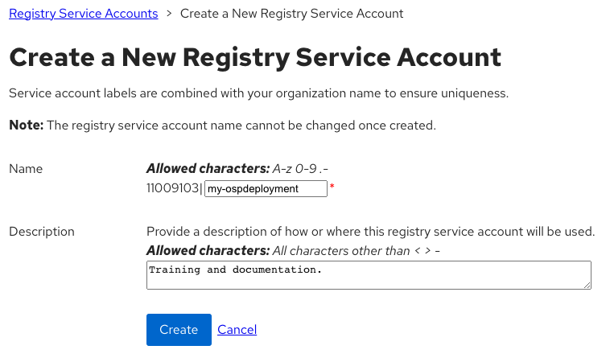

# OSP 16.2 Installation Instructions

## Introduction

## Goals:

* Enable field on OSP 16.2
* Test basics features work (no regression)
* Test new selected set of features
* Optionally test tech preview features
* Report product and documentation bugs 
* Send valuable feedback to OSP Product management and engineering teams
* Convert the work accomplished into lab training guides in order to enable more folks in the field
* Have fun with OSP and director 
* Get to work with and get to know each other.

## HextupleO

The lab access will be provided in the form of nested virtualization managed by RHOSP 16.1.  We have limited resources available, but there should be enough room for about 20 virtual environments.

Standard roles have been pre-defined, but since we are using OpenStack to manage it, we are capable of being flexible, with resizing flavors, snapshotting, adding more cinder volumes to ceph nodes or even adding more networks via either OpenStack CLI Horizon or Cloudforms.

| Role | vRAM | vCPU | vNIC | Disk |
|-----|-------|-----|-----|------|
| Undercloud | 16G| 4 | <ul><li>1x pxe</li><li>1x external</li> | 100GB |
| Controller | 12GB | 2 | <ul><li>1x pxe</li><li>1x internal api</li><li>1x tenant</li><li>1x storage</li><li>1x storagemgmt</li><li>1x external</li> | 60 GB |
| Compute | 4GB | 4 | <ul><li>1x pxe</li><li>1x internal api</li><li>1x tenant</li><li>1x storage</li> | 60GB |
| Ceph | 4GB | 2 | <ul><li>1x pxe</li><li>1x storage</li><li>1x storagemgmt</li><li>1x storage</li> | <ul><li>50GB OSD</li><li>100GB (osd)</li> |
| HCI (optional) | 8GB | 4 | <ul><li>1x pxe</li><li>1x internal api</li><li>1x tenant</li><li>1x storage</li><li>1x storagemgmt</li> | <ul><li>60GB OSD</li><li>100GB (osd)</li> |
| Custom (optional) |   |  |  |  |


## Building your HextupleO Lab:

HextupleO is an upstream project built with ansible playbooks talking directly to OpenStack APIs via python-shade libraries. It also nicely integrates with Ansible Automation Platform for ease of deployment and manageability (you can learn more about it [here](https://github.com/OOsemka/hextupleo)).

### Default Deployment

1. To build your environment, please ensure you are connected to NA-SSA VPN.  

2. Access RHAAP via this link: [Ansible Automation Platform](https://cloud-infra-tower.apps.ocp-bm.openinfra.lab/#/login)  

3. Go to *Templates* tab and hit the “rocket” icon next to *Deploy OpenStack Environment*. 

4. Provide a unique *project_name* and *password*. The project name and password are used to access your environment via CLI and the Horizon GUI.  Choose a password you will remember.  

5. Wait for the deployment to finish.  You can monitor via the Jobs Output screen or you can monitor each individual job by selecting Jobs from the left pane and selecting the appropriate jobs.  There are four jobs, create project, create networks, create instances, and configure OSP undercloud.


### Customized Deployment

1. To build your environment, please ensure you are connected to NA-SSA VPN.  

2. Access RHAAP via this link: [Ansible Automation Platform](https://cloud-infra-tower.apps.ocp-bm.openinfra.lab/#/login)  

3. Go to Templates Tab and hit the “rocket” icon next to - “Hextupleol - create  project”, after you hit “Next”, you will get a survey prompting for user and password

4. Set user/project and password and submit the job. The user name/project name and password are used to access your environment via CLI and the Horizon GUI.  Choose a password you will remember.  

5. Go to *Templates* tab and hit the “rocket” icon next to *Hextupleo - create networks*.  In hexo4 you are encouraged to experiment with different settings. However if you’d like to start with the known network configuration the default templates should be fine.  

    ```
    networks:  
      - { name: "external0", cidr: "10.1.0.0/24", dhcp: "False", snat: "False", mtu: "8938" }  
      - { name: "provisioning0", cidr: "10.10.0.0/24", dhcp: "False", snat: "False", mtu: "8938" }  
      - { name: "internalAPI0", cidr: "10.20.0.0/24", dhcp: "False", snat: "False", mtu: "8938" }  
      - { name: "tenant0", cidr: "10.30.0.0/24", dhcp: "False", snat: "False", mtu: "8938" }  
      - { name: "storage0", cidr: "10.40.0.0/24", dhcp: "False", snat: "False", mtu: "8938" }  
      - { name: "storagemgmt0", cidr: "10.50.0.0/24", dhcp: "False", snat: "False", mtu: "8938" }  
      - { name: "provider0", cidr: "10.60.0.0/24", dhcp: "False", snat: "False", mtu: "8938" }  
      - { name: "virtualipmi", cidr: "10.70.0.0/24", dhcp: "True", snat: "True", mtu: "8938" }  
    ```

6. Set user/project and password and submit the job.  The user name/project name and password are used to access your environment via CLI and the Horizon GUI.  Choose a password you will remember.  

7. Go to *Templates* tab and hit the “rocket” icon next to *Hextupleo - create instances*.  Below is a good starting config with controllers, 2 compute, and 3 Ceph nodes.  
    
    ```  
    instances:  
      - { name: "undercloud", image: "rhel-8.2", flavor: "undercloud", ipmi: "False", extra_volume_size: "0", net_name1: "provider1-vlan217, net_name2: "provisioning0, net_name3: "external0", net_name4: "provider0", net_name5: "virtualipmi", net_name6: "", net_name7: "", net_name8: "" }  
      - { name: "overcloud_controller1", image: "pxeboot", flavor: "overcloud-controller", ipmi: "True", extra_volume_size: "0", net_name1: "provisioning0, net_name2: "external0, net_name3: "internalAPI0", net_name4: "tenant0", net_name5: "storage0", net_name6: "storagemgmt", net_name7: "provider0", net_name8: "" }  
      - { name: "overcloud_controller2", image: "pxeboot", flavor: "overcloud-controller", ipmi: "True", extra_volume_size: "0", net_name1: "provisioning0, net_name2: "external0, net_name3: "internalAPI0", net_name4: "tenant0", net_name5: "storage0", net_name6: "storagemgmt", net_name7: "provider0", net_name8: "" }  
      - { name: "overcloud_controller3", image: "pxeboot", flavor: "overcloud-controller", ipmi: "True", extra_volume_size: "0", net_name1: "provisioning0, net_name2: "external0, net_name3: "internalAPI0", net_name4: "tenant0", net_name5: "storage0", net_name6: "storagemgmt", net_name7: "provider0", net_name8: "" }  
      - { name: "overcloud_compute1", image: "pxeboot", flavor: "overcloud-compute", ipmi: "True", extra_volume_size: "0", net_name1: "provisioning0, net_name2: "interalAPI0, net_name3: "tenant0", net_name4: "storage0", net_name5: "provider0", net_name6: "", net_name7: "", net_name8: "" }  
      - { name: "overcloud_compute2", image: "pxeboot", flavor: "overcloud-compute", ipmi: "True", extra_volume_size: "0", net_name1: "provisioning0, net_name2: "interalAPI0, net_name3: "tenant0", net_name4: "storage0", net_name5: "provider0", net_name6: "", net_name7: "", net_name8: "" }  
      - { name: "overcloud_ceph1", image: "pxeboot", flavor: "overcloud-ceph", ipmi: "True", extra_volume_size: "100", net_name1: "provisioning0, net_name2: "storage0, net_name3: "storagemgmt0", net_name4: "", net_name5: "", net_name6: "", net_name7: "", net_name8: "" }  
      - { name: "overcloud_ceph2", image: "pxeboot", flavor: "overcloud-ceph", ipmi: "True", extra_volume_size: "100", net_name1: "provisioning0, net_name2: "storage0, net_name3: "storagemgmt0", net_name4: "", net_name5: "", net_name6: "", net_name7: "", net_name8: "" }  
      - { name: "overcloud_ceph3", image: "pxeboot", flavor: "overcloud-ceph", ipmi: "True", extra_volume_size: "100", net_name1: "provisioning0, net_name2: "storage0, net_name3: "storagemgmt0", net_name4: "", net_name5: "", net_name6: "", net_name7: "", net_name8: "" }  
    ``` 


8. Set user/project and password and submit the job.  The user name/project name and password are used to access your environment via CLI and the Horizon GUI.  Choose a password you will remember.  

9. Finally, go to *Templates* tab and hit the “rocket” icon next to *Hextupleo - configure OSP undercloud*.  

10.  Follow the survey and submit the job.

11. At the end you will be getting a screen similar to this:

   

You can ssh to this IP as the user *stack* using the password you set in the playbook.


## Accessing Your Project in Horizon

This is accessing the Openstack that your environment is deployed to.

### Horizon

1. Using the project name as the username and password that you specified when you launched your job, log into the Horizon Dashboard with this link: 

    [Horizon Login](https://172.20.11.50/dashboard/auth/login/)

    > NOTE: You must be connected to the NA-SSA VPN

2. Go to the *Compute->Instances* tab and make sure all of your requested nodes have been created.  

3. Scroll down to the bottom of the list and note the Undercloud Public IP address that is associated with a provider vlan. You will use that IP to access your undercloud node. This should match the above output from the Ansible job.  You can SSH to this IP as the *stack* user using the password you provided in the playbook.  

    

4. Go to *Network->Network Topology* and get familiar with how the VMs are connected. 

>  NOTE: We have created Tenant (over GENEVE/VXLAN) networks to satisfy all the non-routable networks. Only External Network is connected to one of the provider routable networks and accessible from outside of your deployed environment.

   

#### Undercloud

1. Access undercloud via ssh using stack@<ip-learned-from-horizon>  / password specified in Tower.  

2. You can now start deploying OSP16.2 based on standard instructions (or whatever version you have staged).  See below notes for helpful information in the deployment process.


    > NOTE: 
    Repos:  Even though you could register to your CDN and start using your own repos, there are local synced repos that are available over LAN. This should be much quicker to download from. Simply grap the osp repo file from here:

    > [stack@undercloud ~]$ sudo curl http://172.20.129.11/osp16.2.repo -o /etc/yum.repos.d/osp16.2.repo

    > ~/GoodieBag/deploy.sh - pre-configured deploy script that can be used as a template.

    > ~/templates - Directory that has multiple templates that have been pre-configured for making the vanilla deployment easier to perform.
    Undercloud.conf - sample undercloud.conf file with pre-configured known working settings like IP pools, interface settings, and more.  The egrep command is used to remove blank and comment lines.

    ```
    [stack@undercloud ~]$ egrep -v '(^$|^#)' undercloud.conf
    [DEFAULT]  
    certificate_generation_ca = local  
    clean_nodes = true  
    container_images_file = /home/stack/templates/containers-prepare-parameter.yaml  
    generate_services_certificate = true  
    hieradata_override = /home/stack/templates/undercloud_hiera.yaml  
    local_interface = eth1  
    local_ip = 10.10.0.10/24  
    local_mtu = 8946  
    local_subnet = ctlplane-subnet  
    overcloud_domain_name = hextupleo.lab  
    subnets - ctlplane-subnet  
    undercloud_admin_host = 10.10.0.11  
    undercloud_debug = false  
    undercloud = hostname = osp-test-undercloud.hextupleo.lab  
    undercloud_nameservers = 10.9.71.7  
    undercloud_ntp_servers = 10.9.71.7  
    undercloud_public_host = 10.1.0.11  
    [ctlplane-subnet]  
    cidr = 10.10.0.0/24  
    dhcp_end = 10.10.0.149  
    dhcp_start = 10.10.0.100  
    dns_nameservers = 10.10.0.10  
    gateway = 10.10.0.10  
    inspection_iprange = 10.10.0.200,10.10.0.249  
    masquerade = true  
    masquerade_network = 10.10.0.0/16  
    [auth]  
    undercloud_admin_password = changeme  
    [stack@undercloud ~]$  
    ```

    
## Deploy Vanilla OSP 16.2

Even though you don’t have to follow this guide and just jump right into hacking, It is highly encouraged for everyone to get at least one vanilla deployment done to get themselves familiar with the process.


Steps below are going to be very similar if not mostly identical to [Red Hat official documentation](https://access.redhat.com/documentation/en-us/red_hat_openstack_platform/16.2/html/director_installation_and_usage/index).
Please review the official documentation for accuracy and open any Bugzilla’s against it!

### Undercloud Installation

1. Log into the undercloud VM as the *stack* user using the IP address that was obtained during the VM deployments in Horizon.

    > NOTE: You must be connected to the NA-SSA VPN to access the environment.

2. Complete the RHEL upgrade requirements.

    > Make sure you grabbed the repo configuration from the DNS server.
    > [stack@undercloud ~]$ sudo curl http://172.20.129.11/osp16.2.repo -o /etc/yum.repos.d/osp16.2.repo


    ```
    [stack@undercloud ~]$ sudo dnf module reset container-tools
    [stack@undercloud ~]$ sudo dnf module enable -y container-tools:3.0
    [stack@undercloud ~]$ sudo yum update -y
    [stack@undercloud ~]$ sudo reboot 
    ```
3. Install the TripleO Director and Ceph Ansible packages, and prepare the container images.

    ```
    [stack@undercloud ~]$ sudo yum install -y python3-tripleoclient ceph-ansible
    [stack@undercloud ~]$ openstack tripleo container image prepare default --local-push-destination --output-env-file ~/templates/containers-prepare-parameter.yaml
    # Generated with the following on 2023-03-22T16:49:09.066277
    #
    #   openstack tripleo container image prepare default --local-push-destination --output-env-file /home/stack/templates/containers-prepare-parameter.yaml
    #

    parameter_defaults:
      ContainerImagePrepare:
      - push_destination: true
        set:
          ceph_alertmanager_image: ose-prometheus-alertmanager
          ceph_alertmanager_namespace: registry.redhat.io/openshift4
          ceph_alertmanager_tag: v4.6
          ceph_grafana_image: rhceph-4-dashboard-rhel8
          ceph_grafana_namespace: registry.redhat.io/rhceph
          ceph_grafana_tag: 4
          ceph_image: rhceph-4-rhel8
          ceph_namespace: registry.redhat.io/rhceph
          ceph_node_exporter_image: ose-prometheus-node-exporter
          ceph_node_exporter_namespace: registry.redhat.io/openshift4
          ceph_node_exporter_tag: v4.6
          ceph_prometheus_image: ose-prometheus
          ceph_prometheus_namespace: registry.redhat.io/openshift4
          ceph_prometheus_tag: v4.6
          ceph_tag: latest
          name_prefix: openstack-
          name_suffix: ''
          namespace: registry.redhat.io/rhosp-rhel8
          neutron_driver: ovn
          rhel_containers: false
          tag: '16.2'
        tag_from_label: '{version}-{release}'
    Output env file exists, moving it to backup.
    ```

4.  Starting with OSP15, Red Hat is moving to the Container Registry that requires an active Red Hat account.  In order to continue the installation, you need to include your credentials into the *container-prepare-parameter.yaml* file.  Service credentials can be created for the deployment using the [Customer Portal Terms-Based-Registry](https://access.redhat.com/terms-based-registry) site.

    Click the *New Service Account* icon in the upper right corner.  Enter a name for the service account and a description.  Click the *Create* icon.

    

    Click the *Copy* icon on the far right to copy the new token to your local clipboard.

    


5. Update the containers-prepare-parameter.yaml file with the new service account name and token.  Open the file and jump to the bottom.  Add the highlighted lines and paste the user name and token generated from Step 4.  The *ContainerImageRegistryCredentials* space aligns with the *ContainerImagePrepare* line at the top of the file.

    ``` hl_lines="7 8 9 10 11 12 13"
    [stack@undercloud ~]$ vi templates/containers-prepare-parameter.yaml
    # Generated with the following on 2023-03-08T09:20:45.446840
    #
    #   openstack tripleo container image prepare default --local-push-destination --output-env-file /home/stack/templates/containers-prepare-parameter.yaml
    #
    ...
      ContainerImageRegistryCredentials:
        registry.redhat.io:
          11009103|my-ospdeployment: eyJhbGciOiJSUzUxMiJ9.eyJzdWIiOiIxOGFlYTA2ZjVmNjg0MGUzYWZlODQ0YTdkZGIzYTc4N
          ...
          j1ivaZNDw-u8lwRCVtj7ZnQ
    ```


6. Update the undercloud.conf file if necessary.  This should not be required, but feel free to review and understand the parameters.

7. Install the undercloud.

    ```
    [stack@undercloud ~]$ openstack undercloud install
    undercloud_admin_host or undercloud_public_host is not in the same cidr as local_ip.
    \
    ```

8. Once the installation is complete, verify the containers are up and source the stackrc file to set the environment for the undercloud environment.

    ```
    [stack@undercloud ~]$ sudo podman ps
    [stack@undercloud ~]$ source ~/stackrc
    (undercloud) [stack@undercloud ~]$ 
    ```

9. Obtain the images for the overcloud nodes.

    ```
    (undercloud) [stack@undercloud ~]$ sudo dnf -y install rhosp-director-images rhosp-director-images-ipa-x86_64
    ```

10. Extract the tar balls for the overcloud and ironic images.

    ```
    (undercloud) [stack@undercloud ~]$ cd ~/images
    (undercloud) [stack@undercloud ~]$ tar -xvf /usr/share/rhosp-director-images/overcloud-full-latest-16.2.tar
    (undercloud) [stack@undercloud ~]$ tar -xvf /usr/share/rhosp-director-images/ironic-python-agent-latest-16.2.tar
    ```

11. The root password can be changed in the overcloud image using the procedures below.  This is optional and is not required.

    ```
    (undercloud) [stack@undercloud ~]$ export LIBGUESTFS_BACKEND=direct
    (undercloud) [stack@undercloud ~]$ virt-customize -a overcloud-full.qcow2 --root-password password:changeme
    ```

    > NOTE: the libguestfs-tools package may need to be installed: 
    >       sudo dnf install -y libguestfs-tools

12.  Upload the overcloud images and verify they are available to the undercloud.

    ```
    (undercloud) [stack@undercloud ~]$ openstack overcloud image upload --image-path /home/stack/images
    (undercloud) [stack@undercloud ~]$ openstack image list
    +--------------------------------------+------------------------+--------+
    | ID                                   | Name                   | Status |
    +--------------------------------------+------------------------+--------+
    | f3e73e81-acca-45d7-a848-7d6de40933ed | overcloud-full         | active |
    | f8162188-4ec9-4312-9519-2e6421bd52a8 | overcloud-full-initrd  | active |
    | da2195d1-d75f-4134-b906-1302ff9943af | overcloud-full-vmlinuz | active |
    +--------------------------------------+------------------------+--------+
    ```

13. Verify the DNS server has been set for the cltplane subnet.

    ``` hl_lines="8"
    +-------------------+---------------------------------------------------------------------------------------------------------------------------------------------------------+
    | Field             | Value                                                                                                                                                   |
    +-------------------+---------------------------------------------------------------------------------------------------------------------------------------------------------+
    | allocation_pools  | 10.10.0.100-10.10.0.149                                                                                                                                 |
    | cidr              | 10.10.0.0/24                                                                                                                                            |
    | created_at        | 2023-03-08T15:07:54Z                                                                                                                                    |
    | description       |                                                                                                                                                         |
    | dns_nameservers   | 10.10.0.10                                                                                                                                              |
    | enable_dhcp       | True                                                                                                                                                    |
    | gateway_ip        | 10.10.0.10                                                                                                                                              |
    | host_routes       |                                                                                                                                                         |
    | id                | 2096d5b9-7516-4146-ae4b-919a73f82a8f                                                                                                                    |
    | ip_version        | 4                                                                                                                                                       |
    | ipv6_address_mode | None                                                                                                                                                    |
    | ipv6_ra_mode      | None                                                                                                                                                    |
    | location          | cloud='', project.domain_id=, project.domain_name='Default', project.id='cd6a92e810154ab882d290a70e8c6afc', project.name='admin', region_name='', zone= |
    | name              | ctlplane-subnet                                                                                                                                         |
    | network_id        | 316ccfd5-f1b3-455c-9856-cbbed5b65ba7                                                                                                                    |
    | prefix_length     | None                                                                                                                                                    |
    | project_id        | cd6a92e810154ab882d290a70e8c6afc                                                                                                                        |
    | revision_number   | 0                                                                                                                                                       |
    | segment_id        | None                                                                                                                                                    |
    | service_types     |                                                                                                                                                         |
    | subnetpool_id     | None                                                                                                                                                    |
    | tags              |                                                                                                                                                         |
    | updated_at        | 2023-03-08T15:07:54Z                                                                                                                                    |
    +-------------------+---------------------------------------------------------------------------------------------------------------------------------------------------------+
    ```


### Overcloud Installation

The first step in deploying the overcloud is to generate the instackenv.yaml file.  Once this is complete, the file needs to be updated with the IP addresses of the VMs that were deployed by HextupleO.

1. Generate the instackenv.yaml file using the ansible-playbook.  Once the file is generated, source the *projectName*rc file for the overcloud environment.  This will allow you to get the list of servers and their IP addresses.

    ```
    (undercloud) [stack@undercloud ~]$ cd ~/GoodieBag
    (undercloud) [stack@undercloud ~]$ ansible-playbook generate-instackenv.yml
    (undercloud) [stack@undercloud ~]$ source *projectName*rc
    (myproject) [stack@undercloud ~]$ openstack server list --insecure | awk '/ipmi_/ { print $4 "    " $8 }'
    ipmi_overcloud_ceph3    virtualipmi=10.70.0.240
    ipmi_overcloud_ceph2    virtualipmi=10.70.0.236
    ipmi_overcloud_ceph1    virtualipmi=10.70.0.24
    ipmi_overcloud_compute2    virtualipmi=10.70.0.11
    ipmi_overcloud_compute1    virtualipmi=10.70.0.22
    ipmi_overcloud_controller3    virtualipmi=10.70.0.70
    ipmi_overcloud_controller2    virtualipmi=10.70.0.233
    ipmi_overcloud_controller1    virtualipmi=10.70.0.227
    ```

2. Update the instackenv.yaml file with the IP addresses.  You can do this manually, or you can use this code:

    ```
    openstack server list --insecure | awk '/ipmi_/ {print $4 "    " $8}' > /tmp/ipmi_addreses.txt
    cp ~/GoodieBag/instackenv.yaml ~/
    sed -i '/pm_addr/d' ~/instackenv.yaml
    for NODE in $(grep 'name: ' ~/instackenv.yaml | awk '{print $NF}' | sed 's/"//g')
    do
      IP=$(egrep ${NODE} /tmp/ipmi_addresses.txt | awk -F= '{print $NF}')
      sed -i "/name: \"${NODE}\"/a \    pm_addr: \"${IP}\"" ~/instackenv.yaml
    done
    ```

    > NOTE: Make sure you view the ~/instackenv.yaml file to ensure it is correct before continueing with the installation.

3. Register the nodes for the overcloud.  Make sure you source the stackrc file for the undercloud environment.  Once the import is complete, list the baremetal nodes and ensure all information is correct for the deployment.  All nodes will be in a *power off* or *manageable* state.

    ```
    (undercloud) [stack@undercloud ~]$ source ~/stackrc
    (undercloud) [stack@undercloud ~]$ openstack overcloud node import ~/instackenv.yaml
    (undercloud) [stack@undercloud ~]$ openstack baremetal node list
    +--------------------------------------+-----------------------+--------------------------------------+-------------+--------------------+-------------+
    | UUID                                 | Name                  | Instance UUID                        | Power State | Provisioning State | Maintenance |
    +--------------------------------------+-----------------------+--------------------------------------+-------------+--------------------+-------------+
    | 3a55f42d-b2d7-47f8-99b1-5e086f780896 | overcloud_ceph3       | 59118ee3-785a-45ef-bef7-8ce4739e34f6 | power off    | manageable             | False       |
    | beb33a36-ace6-497a-9178-154c37de2a71 | overcloud_ceph2       | 55eefb7f-e5ad-4987-89ae-fe9ee2fb10dd | power off    | manageable             | False       |
    | 9410122d-88d6-48fd-acbc-492b33ccdd12 | overcloud_ceph1       | de0b39b9-b69e-4316-a2b7-743fa95acb65 | power off    | manageable             | False       |
    | 19677fb9-b855-410f-be3e-c433a0cfb5af | overcloud_compute2    | 5c61b62a-5324-4c20-9dc0-e3cfa866ffbb | power off    | manageable             | False       |
    | f0e0ef33-2d4b-47e5-bb06-37b5eb3e4263 | overcloud_compute1    | d9bc6142-5780-45a2-899e-e5dc9d806ab9 | power off    | manageable             | False       |
    | c5063619-334b-4336-8985-9ce4865a378e | overcloud_controller3 | 2bb2ca3e-819a-46ce-aa6e-7a4d900875e3 | power off    | manageable             | False       |
    | ad1f539c-2897-4143-9281-44911fe71843 | overcloud_controller2 | 5a55912a-9c7c-4e35-bde2-c582bbfa1c28 | power off    | manageable             | False       |
    | 19367e0f-45ac-4242-b867-423e5a81727e | overcloud_controller1 | 7f573f3c-8389-4973-aba7-99f055071632 | power off    | manageable             | False       |
    +--------------------------------------+-----------------------+--------------------------------------+-------------+--------------------+-------------+
    ```
    > Continue to monitor until the nodes are all in an *available* state.

4. After all nodes are in an *available* state, verify the proper profiles were assigned.

    ```
    +--------------------------------------+-----------------------+-----------------+-----------------+-------------------+
    | Node UUID                            | Node Name             | Provision State | Current Profile | Possible Profiles |
    +--------------------------------------+-----------------------+-----------------+-----------------+-------------------+
    | 3a55f42d-b2d7-47f8-99b1-5e086f780896 | overcloud_ceph3       | active          | ceph-storage    |                   |
    | beb33a36-ace6-497a-9178-154c37de2a71 | overcloud_ceph2       | active          | ceph-storage    |                   |
    | 9410122d-88d6-48fd-acbc-492b33ccdd12 | overcloud_ceph1       | active          | ceph-storage    |                   |
    | 19677fb9-b855-410f-be3e-c433a0cfb5af | overcloud_compute2    | active          | compute         |                   |
    | f0e0ef33-2d4b-47e5-bb06-37b5eb3e4263 | overcloud_compute1    | active          | compute         |                   |
    | c5063619-334b-4336-8985-9ce4865a378e | overcloud_controller3 | active          | control         |                   |
    | ad1f539c-2897-4143-9281-44911fe71843 | overcloud_controller2 | active          | control         |                   |
    | 19367e0f-45ac-4242-b867-423e5a81727e | overcloud_controller1 | active          | control         |                   |
    +--------------------------------------+-----------------------+-----------------+-----------------+-------------------+
    ```

5. The undercloud public endpoints have been most likely encrypted with self-signed certificates.  Make sure to inject the cert into the deployment of the overcloud.  Copy the inject-trust-anchor-hiera.yaml file to the templates directory, copy the cert from the cm-local-ca.pem file and paste into the new file in the templates directory.

    ```
    (undercloud) [stack@undercloud ~]$ cp /usr/share/openstack-tripleo-heat-templates/environments/ssl/inject-trust-anchor-hiera.yaml ~/templates
    (undercloud) [stack@undercloud ~]$ cat /etc/pki/ca-trust/source/anchors/cm-local-ca.pem
    Bag Attributes
        localKeyID: 39 D8 6C E9 C8 7F 65 01 20 80 25 09 E7 A4 41 EB 5D 5E 4E E9 
        friendlyName: Local Signing Authority
    subject=CN = Local Signing Authority, CN = b902a9d8-63a94f21-baaa93cc-f6428d97

    issuer=CN = Local Signing Authority, CN = b902a9d8-63a94f21-baaa93cc-f6428d97

    -----BEGIN CERTIFICATE-----
    MIIDjjCCAnagAwIBAgIRALkCqdhjqU8huqqTzPZCjZcwDQYJKoZIhvcNAQELBQAw
    ...
    LO+VuPv5BpVomVIT3w0cRbmzSNbUcRaX7QmcgyCxHl6FTWZllNsYYvHD6riNwWu+
    faM=
    -----END CERTIFICATE-----
    (undercloud) [stack@undercloud ~]$ vi ~/templates/inject-trust-anchor-hiera.yaml
    # *******************************************************************
    # This file was created automatically by the sample environment
    # generator. Developers should use `tox -e genconfig` to update it.
    # Users are recommended to make changes to a copy of the file instead
    # of the original, if any customizations are needed.
    # *******************************************************************
    # title: Inject SSL Trust Anchor on Overcloud Nodes
    # description: |
    #   When using an SSL certificate signed by a CA that is not in the default
    #   list of CAs, this environment allows adding a custom CA certificate to
    #   the overcloud nodes.
    parameter_defaults:
      # Map containing the CA certs and information needed for deploying them.
      # Type: json
      CAMap:
        undercloud:
          content: |
            -----BEGIN CERTIFICATE-----
            MIIDjjCCAnagAwIBAgIRALkCqdhjqU8huqqTzPZCjZcwDQYJKoZIhvcNAQELBQAw
            ...
            LO+VuPv5BpVomVIT3w0cRbmzSNbUcRaX7QmcgyCxHl6FTWZllNsYYvHD6riNwWu+
            faM=
            -----END CERTIFICATE-----
    ```


6. Copy the deploy.sh template from the GoodieBag directory to the stack user's home directory.  Edit the /home/stack/deploy.sh file and add the inject-trust-anchor-hiera.yaml file.  Ensure you have an understanding of each of the yaml files included.

    > NOTE: If you are going to enable the RGW service in Ceph, make sure to include the *ceph-rgw.yaml* file in the initial deployment.  

    ``` hl_lines="14 17"
    (undercloud) [stack@undercloud ~]$ cat deploy.sh
    #!/bin/bash
    #############################
    # This is not fully dynamic file and it might have not been populated with all right information. This is a template. You might still want to verify this is what you want before executing it
    ##############################
    source ~/stackrc
    cd ~/
    time openstack overcloud deploy --templates --stack blm-osp \
         -n templates/network_data.yaml \
         -e templates/node-info.yaml \
         -e templates/storage-environment.yaml \
         -e templates/ceph-custom-config.yaml \
         -e /usr/share/openstack-tripleo-heat-templates/environments/ceph-ansible/ceph-ansible.yaml \
         -e /usr/share/openstack-tripleo-heat-templates/environments/ceph-ansible/ceph-rgw.yaml \
         -e templates/network-environment.yaml \
         -e /usr/share/openstack-tripleo-heat-templates/environments/network-isolation.yaml \
         -e templates/inject-trust-anchor-hiera.yaml \
         -e templates/host-memory.yaml \
         -e templates/containers-prepare-parameter.yaml \
         -e /usr/share/openstack-tripleo-heat-templates/environments/ceph-ansible/ceph-dashboard.yaml \
         -e templates/ceph_dashboard_network_override.yaml \
         --log-file blm-osp_deployment.log \
         --ntp-server 10.10.0.10
    ```


7. In HextupleO 4, we are relying on the undercloud to provide NTP services.  By default, OSP v16 doesn't allow time sync from it's chrony service.  As a workaround, execute the following which opens the port via iptables and then allows a sync via chrony.  Restart the chrony service once complete.

    ```
    (undercloud) [stack@undercloud ~]$ sudo iptables -I INPUT -m state --state NEW -m udp -p udp --dport 123 -j ACCEPT
    (undercloud) [stack@undercloud ~]$ sudo echo allow 0.0.0.0/0 >> /etc/chrony.conf
    (undercloud) [stack@undercloud ~]$ cat /etc/chrony.conf
    # Do not manually edit this file.
    # Managed by ansible-role-chrony
    server 172.20.129.10 iburst minpoll 6 maxpoll 10
    bindcmdaddress 127.0.0.1
    bindcmdaddress ::1
    allow 10.10.0.0/24
    driftfile /var/lib/chrony/drift
    logdir /var/log/chrony
    rtcsync
    makestep 1.0 3 
    allow 0.0.0.0/0
    (undercloud) [stack@undercloud ~]$ sudo systemctl restart chronyd
    ```

8. Execute the deploy.sh script to deploy the overcloud.  This takes a very long time to deploy so make sure you run the script in a tmux session.

    ```
    (undercloud) [stack@undercloud ~]$ tmux  
    (undercloud) [stack@undercloud ~]$ cd   
    (undercloud) [stack@undercloud ~]$ ./deploy.sh  
    ```

    > NOTE: In a separate session, you can monitor the deployment with the openstack commands.  

    > (undercloud) [stack@undercloud ~]$ openstack server list  
    > (undercloud) [stack@undercloud ~]$ openstack baremetal node list  


   


    


