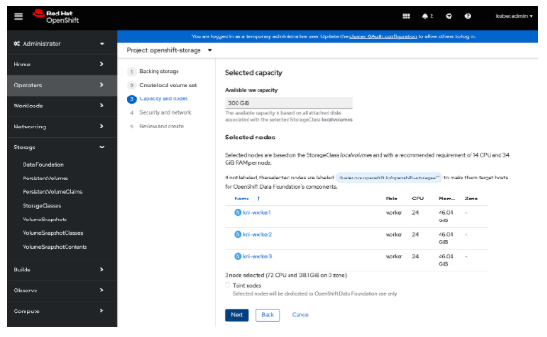

# OCP Baremetal IPI Installation

## Introduction

Goals:

-   Enable field on OpenShift Baremetal 4.12    
-   Test basics features work (no regression)
-   Test new selected set of features    
-   Optionally test tech preview features
-   Report product and documentation bugs     
-   Send valuable feedback to Product management and engineering teams
-   Convert the work accomplished into lab training guides in order to enable more folks in the field
-   Have fun with OpenShift Baremetal
-   Get to work with and get to know each other.


## Lab Access

### HextupleO

The lab access will be provided in the form of nested virtualization managed by RHOSP 17.

We have limited resources available, but there should be enough room for about 10 virtual environments.  

Standard roles have been pre-defined, but since we are using OpenStack to manage it, we are capable of being flexible, with resizing flavors, snap-shotting, adding more cinder volumes to OCS nodes or even adding more networks via either OpenStack CLI, Horizon, or Ansible Tower.

| Role | vRAM | vCPU | vNIC | Disk |
|-----|-------|-----|-----|------|
| Bootstrap | 20G| 6 | <ul><li>1x pxe</li><li>1x baremetal</li><li>1x virtual IPMI</li> | 100GB |
| Master | 16GB | 4 | <ul><li>1x pxe</li><li>1x baremetal</li><li>1x virtual IPMI</li> | 25 GB |
| Worker | 24GB | 12 | <ul><li>1x pxe</li><li>1x baremetal</li> | 50GB 100GB OSD |
| Custom (optional) |   |  |  |  |

## Building Your KNI Lab:

### Default Configuration

1. To build your environment, please ensure you are connected to the NA-SSA VPN first.
   
2. Access RHAAP via link - [NA-SSA Ansible Automation Platform](https://cloud-infra-tower.apps.ocp-bm.openinfra.lab/#/login).

3. Select *Templates* in the left pane; click the rocket icon in the Action column to the right of *Deploy OpenShift Baremetal Environment*

4. Update the *Project Name* and *Password* fields. The project name and password are used to access your environment via CLI and the Horizon GUI.  Choose a password you will remember.

    

5. The jobs can be monitored under *Jobs* in the left pane.  Additional jobs will be initiated to create the project, network, instances, and bare metal bootstrap.  Wait the deployment to finish which can take ~10-15 minutes.


### Customized Deployment  

1.  To build your environment, please ensure you are connected to NA-SSA VPN.  

2.  Access RHAAP via link - [NA-SSA Ansible Automation Platform](https://cloud-infra-tower.apps.ocp-bm.openinfra.lab/#/login).  

3. Go to *Templates* tab and hit the “rocket” icon next to - *Hextupleo - create  project*.  

4. Update the *Project Name* and *Password* fields. The project name and password are used to access your environment via CLI and the Horizon GUI.  Choose a password you will remember.  

    > NOTE:  Ensure the quota_vcpus value is set to at least 100 and the quota_ram value is set to at least 240000.  These the requirements needed to deploy an OCP cluster with ODF Essentials using the kni.worker.xlarge flavor.

    ```
    quota_vcpus: 100
    quota_ram: 240000
    quota_instances: 30
    quota_ports: 200
    ```

5.  Go to *Templates* tab and hit the “rocket” icon next to - “Hextupleo - create networks”.  In hexo4 you are encouraged to experiment with different settings. However if you’d like to start with the known network configuration the default templates should be fine.  

    ```
    "ext_network": "vlan1117",
    networks:
    - { name: "provisioning0", cidr: "10.10.0.0/24", dhcp: "False", snat: "False", mtu: "8938" }
    - { name: "baremetal0", cidr: "10.20.0.0/24", dhcp: "False", snat: "False", mtu: "8938" }
    - { name: "virtualipmi", cidr: "10.30.0.0/24", dhcp: "True", snat: "True", mtu: "8938" }
    ```  


6.  Set user/project and password using the same project and password used previously when creating the project.  Submit the job.  

7. Go to *Templates* tab and hit the “rocket” icon next to - “Hextupleo - create instances”.  Below is a good starting config with 3 controllers 2 computes and 3 ceph nodes.  

    > NOTE: Don't forget to include the az parameter!

     ```
     "az": "leaf1"
     ```

    With OCS (xlarge workers):  

    ```
    instances:
      - { name: "bootstrap", image: "rhel-8.2", flavor: "kni.bootstrap", ipmi: "False", extra_volume_size: "0", net_name1: "vlan1117", net_name2: "provisioning0", net_name3: "baremetal0", net_name4: "", net_name5: "", net_name6: "",  net_name7: "", net_name8: ""  }
      - { name: "kni-master1", image: "pxeboot", flavor: "kni.master", ipmi: "True", extra_volume_size: "0", net_name1: "provisioning0", net_name2: "baremetal0", net_name3: "", net_name4: "", net_name5: "", net_name6: "",  net_name7: "", net_name8: ""  }
      - { name: "kni-master2", image: "pxeboot", flavor: "kni.master", ipmi: "True", extra_volume_size: "0", net_name1: "provisioning0", net_name2: "baremetal0", net_name3: "", net_name4: "", net_name5: "", net_name6: "",  net_name7: "", net_name8: ""  }
      - { name: "kni-master3", image: "pxeboot", flavor: "kni.master", ipmi: "True", extra_volume_size: "0", net_name1: "provisioning0", net_name2: "baremetal0", net_name3: "", net_name4: "", net_name5: "", net_name6: "",  net_name7: "", net_name8: ""  }
      - { name: "kni-worker1", image: "pxeboot", flavor: "kni.worker.xlarge", ipmi: "True", extra_volume_size: "100", net_name1: "provisioning0", net_name2: "baremetal0", net_name3: "", net_name4: "", net_name5: "", net_name6: "",  net_name7: "", net_name8: ""  }
      - { name: "kni-worker2", image: "pxeboot", flavor: "kni.worker.xlarge", ipmi: "True", extra_volume_size: "100", net_name1: "provisioning0", net_name2: "baremetal0", net_name3: "", net_name4: "", net_name5: "", net_name6: "",  net_name7: "", net_name8: ""  }
      - { name: "kni-worker3", image: "pxeboot", flavor: "kni.worker.xlarge", ipmi: "True", extra_volume_size: "100", net_name1: "provisioning0", net_name2: "baremetal0", net_name3: "", net_name4: "", net_name5: "", net_name6: "",  net_name7: "", net_name8: ""  }
    ```

    Without ODF (normal workers):
    ```
    instances:
      - { name: "bootstrap", image: "rhel-8.2", flavor: "kni.bootstrap", ipmi: "False", extra_volume_size: "0", net_name1: "vlan1117", net_name2: "provisioning0", net_name3: "baremetal0", net_name4: "", net_name5: "", net_name6: "",  net_name7: "", net_name8: ""  }
      - { name: "kni-master1", image: "pxeboot", flavor: "kni.master", ipmi: "True", extra_volume_size: "0", net_name1: "provisioning0", net_name2: "baremetal0", net_name3: "", net_name4: "", net_name5: "", net_name6: "",  net_name7: "", net_name8: ""  }
      - { name: "kni-master2", image: "pxeboot", flavor: "kni.master", ipmi: "True", extra_volume_size: "0", net_name1: "provisioning0", net_name2: "baremetal0", net_name3: "", net_name4: "", net_name5: "", net_name6: "",  net_name7: "", net_name8: ""  }
      - { name: "kni-master3", image: "pxeboot", flavor: "kni.master", ipmi: "True", extra_volume_size: "0", net_name1: "provisioning0", net_name2: "baremetal0", net_name3: "", net_name4: "", net_name5: "", net_name6: "",  net_name7: "", net_name8: ""  }
      - { name: "kni-worker1", image: "pxeboot", flavor: "kni.worker", ipmi: "True", extra_volume_size: "100", net_name1: "provisioning0", net_name2: "baremetal0", net_name3: "", net_name4: "", net_name5: "", net_name6: "",  net_name7: "", net_name8: ""  }
      - { name: "kni-worker2", image: "pxeboot", flavor: "kni.worker", ipmi: "True", extra_volume_size: "100", net_name1: "provisioning0", net_name2: "baremetal0", net_name3: "", net_name4: "", net_name5: "", net_name6: "",  net_name7: "", net_name8: ""  }
      - { name: "kni-worker3", image: "pxeboot", flavor: "kni.worker", ipmi: "True", extra_volume_size: "100", net_name1: "provisioning0", net_name2: "baremetal0", net_name3: "", net_name4: "", net_name5: "", net_name6: "",  net_name7: "", net_name8: ""  }

    ```

8.  Set user/project and password and submit the job using the same project and password used previously when creating the project.  Submit the job. 
  
9.  Finally, go to *Templates* tab and hit the “rocket” icon next to - *HextupleO - configure OCP BM Bootstrap*

10.  Follow the survey and submit the job

11.  At the end you will be getting a screen similar to this one:


You can ssh to this IP as the user kni using the password you set in the playbook.

## Accessing Your Project in Horizon

### Horizon

1. Using the project name as the username and password that you specified when you launched your job, log into the Horizon Dashboard with this link: 

      [HextupleO Lab](https://hextupleo.openinfra.lab) 
        
2. Go to the *Compute->Instances* tab and make sure all of your requested nodes have been created.

3. Scroll down to the bottom of the list and note the Undercloud Public IP address. You will use that IP to access your undercloud node. This will match the above output from the Ansible job (even though it does not in this document).  You can SSH to this IP as kni using the password you provided in the playbook.  

    

  
4. Go to *Network->Network Topology* and get familiar with how the VMs are connected on the networks.  

    > INFO: We have created Tenant (overlay) networks to satisfy all the non-routable networks.    


5. Go to *Routers*, select the existing router (projectName_router); click the *Interfaces* tab and then click the *Add Interface* icon on the right.   Add the *baremetal0* interface in the Subnet dropdown.  Click *Submit*.  

    
  
### Bootstrap

1.  Access the bootstrap server via ssh as the `kni` user using the IP address obtained in step 3 of the *Accessing Your Project’s OpenStack Environment* section above and the password specified in Tower when deploying the KNI environment.

2.  You can now start deploying Openshift Baremetal (KNI) based on the standard instructions below or feel free to deploy using any other documented process.  

    > INFO:
    > Repos  
    > Even though you could register to your CDN and start using your own repos, there are local synced repos that are available over LAN. This should be much quicker to download from. Simply grap the rhel8.repo file from here:
    >
    >[kni@bootstrap ~]$ sudo curl http://172.20.129.19/hextupleo-repo/rhel8.repo -o /etc/yum.repos.d/rhel8.repo
    >


## Deploying Vanilla Openshift Baremetal  

Even though you don’t have to follow this guide and just jump right into hacking, we highly encourage everyone to get at least one vanilla deployment done and get familiar with the process.

Steps below are going to be very similar if not mostly identical to Red Hat official documentation found [here](https://docs.openshift.com/container-platform/4.12/installing/installing_bare_metal_ipi/ipi-install-overview.html).  Please also review the official documentation for accuracy and open any Bugzilla’s against it.

## Bootstrap Configuration

1. Log into Bootstrap VM.  

    ```
    ssh kni@<bootstrapInstance>  / password specified in Tower
    ```

2. Update all packages on the system.  

    ```
    [kni@bootstrap ~]$ sudo dnf update -y
    ...
    Complete!
    [kni@bootstrap ~]$ sudo reboot
    ```

3. Install the KNI Packages.  

    ```
    [kni@bootstrap ~]$ sudo dnf install -y libvirt qemu-kvm mkisofs python3-devel jq ipmitool
    ```
  
4. Modify the user to add the libvirt group to the newly created kni user.  

    ```
    [kni@bootstrap ~]$ sudo usermod --append --groups libvirt kni
    ```
    > NOTE: If you receive the error `DB version too old [0.21], expected [0.23] for domain implicit_files!` stop sssd with the `systemctl stop sssd` command, remove the cache files in */var/lib/sss/db* directory, and restart sssd with the `systemctl start sssd` command


5. Start and enable libvirtd; verify the daemon started successfully.

    ```
    [kni@bootstrap ~]$ sudo systemctl enable libvirtd --now
    [kni@bootstrap ~]$ systemctl status libvirtd
    ● libvirtd.service - Virtualization daemon
       Loaded: loaded (/usr/lib/systemd/system/libvirtd.service; enabled; vendor preset: enabled)
       Active: active (running) since Thu 2023-02-16 10:07:21 EST; 1s ago
         Docs: man:libvirtd(8)
               https://libvirt.org
     Main PID: 7506 (libvirtd)
        Tasks: 21 (limit: 32768)
       Memory: 18.1M
       CGroup: /system.slice/libvirtd.service
           ├─7407 /usr/sbin/dnsmasq --conf-file=/var/lib/libvirt/dnsmasq/default.conf --leasefile-ro --dhcp-script=/usr/libexec/libvirt_leaseshelper
           ├─7408 /usr/sbin/dnsmasq --conf-file=/var/lib/libvirt/dnsmasq/default.conf --leasefile-ro --dhcp-script=/usr/libexec/libvirt_leaseshelper
           └─7506 /usr/sbin/libvirtd --timeout 120
    ```
  
6. Create the default storage pool and start it.

    ```
    [kni@bootstrap ~]$ sudo virsh pool-define-as --name default --type dir --target /var/lib/libvirt/images
    Pool default defined
        
    [kni@bootstrap ~]$ sudo virsh pool-start default 
    Pool default started

    [kni@bootstrap ~]$ sudo virsh pool-autostart default
    Pool default marked as autostarted
    ```

7. Set up networking using the reconfig-net.sh script in the ~/GoodieBag directory.  Once the connections are reconfigured, the script will display the final configuration.  The output should look similar to what is displayed below.  The script will also add the baremetal subnet to the external router if it was not completed in the *Accessing Your Project’s OpenStack Environment* section in the Horizon GUI.  

    ```
    [kni@bootstrap ~]$ cd GoodieBag
    [kni@bootstrap GoodieBag]$ ./reconfig-net.sh -h
    Script to reconfigure the eth1 and eth2 interfaces on bootstrap server in OpenStack for Openshift deployments.
    Usage: reconfig-net.sh [-a|--all|interfaceName]
    If -a or --all is passed, eth1 and eth2 will both be reconfigured as provisioning and baremetal bridge interfaces.
    If -r or --router is passed, interface reconfiguration is skipped and router configuration will complete.


    [kni@bootstrap ~]$ sudo ./reconfig-net.sh -a
    Connection 'System eth1' successfully deactivated (D-Bus active path: /org/freedesktop/NetworkManager/ActiveConnection/2)
    Connection 'System eth2' (9c92fad9-6ecb-3e6c-eb4d-8a47c6f50c04) successfully deleted.
    Connection 'provisioning' (1b5a7497-4ff5-43ec-bb3e-df01e8f070e8) successfully added.
    Connection 'bridge-slave-eth1' (3a46f2d4-5a3e-4b8d-994b-0a055ade7a84) successfully added.
    Connection 'provisioning' successfully deactivated (D-Bus active path: /org/freedesktop/NetworkManager/ActiveConnection/5) 
    Connection successfully activated (master waiting for slaves) (D-Bus active path: /org/freedesktop/NetworkManager/ActiveConnection/7) 
    provisioning configured successfully.

    Connection 'System eth2' successfully deactivated (D-Bus active path: /org/freedesktop/NetworkManager/ActiveConnection/3)
    Connection 'System eth2' (3a73717e-65ab-93e8-b518-24f5af32dc0d) successfully deleted.
    Connection 'baremetal' (9ba0964b-3667-42f5-ae81-a0a0936985cf) successfully added.
    Connection 'bridge-slave-eth2' (f2b52c9b-087f-4b7c-9186-0ed593897c73) successfully added.
    Connection 'baremetal' successfully deactivated (D-Bus active path: /org/freedesktop/NetworkManager/ActiveConnection/9)
    Connection successfully activated (master waiting for slaves) (D-Bus active path: /org/freedesktop/NetworkManager/ActiveConnection/11)
    baremetal configured successfully.

    Current network interface configuration:
    NAME               UUID                                  TYPE      DEVICE       
    System eth0        5fb06bd0-0bb0-7ffb-45f1-d6edd65f3e03  ethernet  eth0         
    baremetal          9ba0964b-3667-42f5-ae81-a0a0936985cf  bridge    baremetal    
    provisioning       1b5a7497-4ff5-43ec-bb3e-df01e8f070e8  bridge    provisioning 
    virbr0             00fb2639-d510-4c0b-bdad-2a471e7c67c5  bridge    virbr0            
    bridge-slave-eth1  3a46f2d4-5a3e-4b8d-994b-0a055ade7a84  ethernet  eth1         
    bridge-slave-eth2  f2b52c9b-087f-4b7c-9186-0ed593897c73  ethernet  eth2         

    Installing required packages to add the baremetal subnet to the external router.
    Verifying baremetal subnet has been added to external router.
    External router configuration correctly.
    [kni@bootstrap GoodieBag]$ 
    ```

8. Create a pull-secret.txt file.  In a web browser, navigate to <a href="https://cloud.redhat.com/openshift/install/metal/user-provisioned" target="_blank"> Install OpenShift on Bare Metal with user-provisioned infrastructure</a>, in the *Pull Secret* section, click the *Copy pull secret* link.  

    

9. Create a pull-secret.txt file in the kni user’s home directory by pasting the data just copied.  

    ```
    [kni@bootstrap ~]$ vi pull-secret.txt
    {"auths":{"cloud.openshift.com":{"auth":"b3lc3NobGVhc2UtZGaWZ0LXJl9hY2NfNViOTE3NDA1NWIyMWU4ZWQxN2ExYjhmOTU6SDA3UETQxN2Q2NzKSK92JMD3Kkk20kl
    …
    NLXRmeUxFcFVRZnVuRVGl2czNjckTJWdkNpVQkdaVypeHVX1jTVhBZ2xOQTFScw==","email":"user@redhat.com"}}}
    :wq
    [kni@bootstrap ~]$
    ```

## OpenShift Installation

The installation is based on the latest-4.12 version.  This will need to be updated as new versions are released.

1. Retrieve the GA OpenShift Installer using the get-ocp-installer.sh script in the kni user’s ~/GoodieBag directory.  This script will download the openshift-client installer, ensure the required packages are installed, create the install-config.yaml file, update the file with the appropriate IP addresses, ssh public keys, and pull-secret, and configure DHCP and DNS.  

    ```
    [kni@bootstrap ~]$ GoodieBag/get-ocp-installer.sh -h 
    /tmp/get-ocp-installer.sh usage:
    -v  Specify version, default is "latest-4.12".
    -s  Specify full path of pull-secret.txt file, default is "~/pull-secret.txt".
    -d  Specify directory to extract the release image in, default is current directory.
    -h  Display help/usage information.

    [kni@bootstrap ~]$ GoodieBag/get-ocp-installer.sh
    Getting the release image name.
    Downloading the openshift-client-linux.tar.gz file.
    Extracting the openshift-client installer.
    The openshift-baremetal-installer installed successfully.

    Making sure required packages are installed.
    Last metadata expiration check: 0:21:44 ago on Mon 13 Feb 2023 03:02:05 PM EST.
    Package ansible-2.9.27-1.el8ae.noarch is already installed.
    Package python3-shade-1.32.0-2.20220110211405.47fe056.el8ost.noarch is already installed.
    Package python3-openstackclient-4.0.2-2.20220427020029.el8ost.noarch is already installed.
    Dependencies resolved.
    Nothing to do.
    Complete!
    done.
    Generating the install-config.yaml file.
    [WARNING]: provided hosts list is empty, only localhost is available. Note that the implicit localhost does not match 'all'

    PLAY [Generate configs] **************************************************************************************
    
    TASK [Gathering Facts] **************************************************************************************
    ok: [localhost]

    TASK [Learn kni instances in the project] **************************************************************************************
    ok: [localhost]

    TASK [Show kni  instances] **************************************************************************************
    ok: [localhost] => {
        "msg": [
            {
                "OS-DCF:diskConfig": "MANUAL",
                "OS-EXT-AZ:availability_zone": "leaf1",
                "OS-EXT-SRV-ATTR:host": null,
                "OS-EXT-SRV-ATTR:hostname": null,
                "OS-EXT-SRV-ATTR:hypervisor_hostname": null,
        …

    PLAY RECAP **********************************************************************************************
    Localhost        : ok=6    changed=1    unreachable=0    failed=0    skipped=0    rescued=0    ignored=0   

    done.
    Updating the install-config yaml file.
    Configuring DHCP and DNS.
    If you have a failed attempt at the installation, use the ~/GoodieBag/cleanup-ocp.sh script to reset the environment.
    Go forth and deploy openshift-baremetal-installation.
    [kni@bootstrap ~]$
    ```


2. Review the contents of the ~/GoodieBag/install-configs.yaml file.  All IP addresses for the server instances should be updated from the default of X.X.X.X, and the pullSecrets and sshKey variables should be updated with the correct information.  

    ```
    [kni@bootstrap ~]$ more GoodieBag/install-config.yaml
    …
          - name: "kni-master1"
            bootMACAddress: "fa:16:3e:a7:80:64"
            role: master
            rootDeviceHints:
              deviceName: "/dev/vda"
            hardwareProfile: default
            bmc:
              address: "ipmi://10.30.0.129"
              username: "deployodf"
              password: "Passw0rd"
    …
    ```

3. To ensure the installation doesn’t get interrupted if there is a disconnect in your ssh session, run the installation in a tmux window.  The tmux utility was installed by the get-ocp-installer.sh script.  

    ```
    [kni@bootstrap ~]$ tmux
    ```

4. Deploy OpenShift using the openshift-baremetal-install command.  

    ```
    [kni@bootstrap ~]$ openshift-baremetal-install --dir ~/clusterconfigs --log-level debug create cluster
    ```

5. You can monitor your deployment in another window.  

    ```
    [kni@bootstrap ~]$ sudo virsh list
     Id   Name                        State
     -------------------------------------------
     1    kni-test2-ntpgv-bootstrap   running
    ```
    
    To display the console output of the boostrap-vm (ctrl + `]` to exit):
    ```
    [kni@bootstrap ~]$ sudo virsh console <bootstrap-vm>
    ```
    
    View the status of the servers deployed through OpenStack:
    ```
    [kni@bootstrap ~]$ source GoodieBag/<project_name>rc
    (kni-test2) [kni@bootstrap ~]$ openstack server list --insecure
    +--------------------------------------+------------------+---------+----------
    | ID                                   | Name             | Status  | Networks                                                                        | Image          | Flavor |
    +--------------------------------------+------------------+---------+----------
    | d339db1a-4e50-4c69-8063-d7d92bfcc190 | ipmi_kni-master1 | ACTIVE  | virtualipmi=10.30.0.132                                                         | virtualipmi    |        |
    | ccfaf78c-80f5-4b01-b3ee-ab0fd82a07c0 | ipmi_kni-master2 | ACTIVE  | virtualipmi=10.30.0.85                                                          | virtualipmi    |        |
    | 14a636dd-3709-48e9-a6e2-be689d434ac7 | ipmi_kni-master3 | ACTIVE  | virtualipmi=10.30.0.49                                                          | virtualipmi    |        |
    | 77fda0c4-8a88-4970-806e-540e3946dd3a | ipmi_kni-worker1 | ACTIVE  | virtualipmi=10.30.0.45                                                          | virtualipmi    |        | 
    | 80c13e57-2869-4473-99e2-c4748daaf84c | ipmi_kni-worker2 | ACTIVE  | virtualipmi=10.30.0.147                                                         | virtualipmi    |        |
    | 32f1de18-8bdb-4bdf-bdc3-57ddb0e522d8 | ipmi_kni-worker3 | ACTIVE  | virtualipmi=10.30.0.210                                                         | virtualipmi    |        |
    | 85369613-44ec-47fa-9a9b-2476ca9278e8 | kni-master1      | ACTIVE  | baremetal0=10.20.0.8; provisioning0=10.10.0.200                                 | pxeboot        |        |
    | 438088a3-0182-4f9f-bcce-485bce5973d3 | kni-master2      | ACTIVE  | baremetal0=10.20.0.119; provisioning0=10.10.0.160                               | pxeboot        |        |
    | 0239711f-e661-47f3-bc71-eea60eec8763 | kni-master3      | ACTIVE  | baremetal0=10.20.0.100; provisioning0=10.10.0.209                               | pxeboot        |        |
    | 26798b59-1d6c-4d93-b51a-26b59c725a33 | kni-worker1      | SHUTOFF | baremetal0=10.20.0.77; provisioning0=10.10.0.91                                 | pxeboot        |        |
    | 3f11240b-5806-40f9-92d4-82a58df4053b | kni-worker2      | SHUTOFF | baremetal0=10.20.0.236; provisioning0=10.10.0.94                                | pxeboot        |        |
    | 75015e47-7210-4bb8-8f45-8da5f3f78829 | kni-worker3      | SHUTOFF | baremetal0=10.20.0.124; provisioning0=10.10.0.109                               | pxeboot        |        || 27c33f7a-ea95-4cd6-aec9-691fbcfe27c1 | bootstrap        | ACTIVE  | baremetal0=10.20.0.122; vlan1117=10.9.65.140; provisioning0=10.10.0.45 | rhel82-update1 |        |
    +--------------------------------------+------------------+---------+----------
    ```

    Other commands that will come in handy in the later state of the deployment:

    ```
    [kni@bootstrap ~]$ export KUBECONFIG=/home/kni/clusterconfigs/auth/kubeconfig
    [kni@bootstrap ~]$ oc get clusteroperators
    [kni@bootstrap ~]$ oc get nodes
    ```

    We hope it works! If it has, then at the end of the deployment you will see something like this:

    ```
    INFO Install complete!
    INFO To access the cluster as the system:admin user when using 'oc', run 'export KUBECONFIG=/home/kni/clusterconfigs/auth/kubeconfig'
    INFO Access the OpenShift web-console here: https://console-openshift-console.apps.kni-test2.hexo.lab
    INFO Login to the console with user: "kubeadmin", and password: "mv22Z-Tv2Zb-pTFgq-xAvki"
    DEBUG Time elapsed per stage:
    DEBUG     Infrastructure: 29m15s
    DEBUG Bootstrap Complete: 9m54s
    DEBUG  Bootstrap Destroy: 13s
    DEBUG  Cluster Operators: 34m31s
    INFO Time elapsed: 1h13m54s
    ```


## Accessing Your Environment

There should be a few ways to access your environment including using sshuttle or a jumphost.

### Using sshuttle 

The OpenShift Console is not available on the VPN network the lab environment is deployed on but rather the private network of your project.  To access the console, you can use the sshuttle utility which allows you to create a VPN connection using an ssh connection to the bootstrap server.  You need root access on the client machine but not on the bootstrap server.  The sshuttle utility requirements are python 2.3 or higher which are already installed on the bootstrap server. 

#### Linux Client Installation

1. Install using the dnf command from the EPEL repository.  

    ```
    $ dnf install -y sshuttle
    ```

2.  There isn’t any configuration required to use sshuttle.  You can create the VPN connection using the sshuttle command.  Connect to your project’s bootstrap server’s IP address.  

    ```
    $ sshuttle -r kni@172.20.XX.XX 10.20.0.0/24 [ -vv ]
    ```

3. Access your OpenShift Console in your browser using the link:  

    https://console-openshift-console.apps.*projectName*.hexo.lab  


    > NOTE: The user name is kubeadmin.  The password can be found on the bootstrap server in the kni users’ ~/clusterconfig/auth directory in the the kubeadmin-password file.


#### MacOS Client Installation

1. If not installed already, install homebrew.  Open a terminal window and grab the install.sh script from GitHub and run it.  Wait for the command to finish.  If you are prompted to enter a password, enter your Mac user’s login password and press ENTER.

    ```
    /bin/bash -c "$(curl -fsSL https://raw.githubusercontent.com/Homebrew/install/HEAD/install.sh)"
    ```

2. Make the brew command available inside the terminal window.

    ```
    "$(/opt/homebrew/bin/brew shellenv)"' >> ~/.zprofile
    . ~/.zprofile
    ```

3. Install sshuttle.

    ```
    $ brew install sshuttle
    ```

4. There isn’t any configuration required.  You can create the VPN connection using the sshuttle command.  Connect to your project’s bootstrap server’s IP address.

    ```
    ~ % sshuttle -r kni@172.20.XX.XX 10.20.0.0/24 [ -vv ]
    [local sudo] Password: 
    kni@172.20.17.124's password: 
    c : Connected to server.
    ```
	
    > NOTE: As traffic is generated on the VPN connection, warning messages will be displayed in the terminal.

    > Example:

    >   s: warning: closed channel 7 got cmd=TCP_DATA len=517
    >  c : warning: closed channel 11 got cmd=TCP_STOP_SENDING len=0
    >   s: warning: closed channel 11 got cmd=TCP_DATA len=517
    >   s: warning: closed channel 11 got cmd=TCP_EOF len=0


5. Access your OpenShift Console in your browser using the link:

    https://console-openshift-console.apps.*projectName*.hexo.lab  


    > NOTE: The user name is kubeadmin.  The password can be found on the bootstrap server in the kni users’ ~/clusterconfig/auth directory in the the kubeadmin-password file.

    > You will also need to add an entry in your /etc/hosts file for the DNS resolution.


## Using a JumpHost from OpenStack

1. Access your OpenStack environment, select *Compute->Instances*.  Click the *Launch Instance* icon on the right.  Enter the Instance Name, Description, AZ, and Count.  Click *Next*.  


    > NOTE: At this time, the procedures below will yield issues with accessing the jumphost due to a known issue with injecting the ssh keys. Please use the procedures under Using sshuttle above.


2. On the Source screen, make sure Select Boot Source is Image and Create New Volume is No.  In the Available list of images, find fedora-cloud37 and click the up arrow to the right of the entry to move it up to the Allocated section.  Scroll to the bottom, click Next.


3. On the Flavor screen, find t2.medium in the list of Available flavors, click the up arrow to the right of the entry to move it to Allocated.  Scroll to the bottom, click Next.


4. On the Networks screen, add the vlan1117 and baremetal0 entries in the Available list to the Allocated list.  Scroll to the bottom, click Next.


5. Click Next in the lower right on the Network Ports screen.  On the Security Groups screen, click the down arrow next to the default security group in the Allocated section to move it to the Available section.  Scroll to the bottom, click Next.


6. On the Key Pair screen, import your ssh keys using the Import Key Pair icon.  Remove the hextupleo_pub_key key from Allocated by clicking the down arrow to the far right.  Once complete, click the Launch Instance in the lower right as the remaining sections are not required or needing to be updated.


7. Ssh to environment and enable x11 and maybe firefox/chrome if you’d like.  

    ```
    [fedora@fedora-jumpbox ~]$ sudo dnf -y groupinstall gnome
    [fedora@fedora-jumpbox ~]$ sudo dnf -y group install "Basic Desktop" GNOME
    [fedora@fedora-jumpbox ~]$ sudo systemctl set-default graphical.target
    Removed /etc/systemd/system/default.target.
    Created symlink /etc/systemd/system/default.target → /usr/lib/systemd/system/graphical.target.
    [fedora@fedora-jumpbox ~]$ sudo -i
    [root@fedora-jumpbox ~]# passwd fedora
    Changing password for user fedora.
    New password: 
    BAD PASSWORD: The password fails the dictionary check - it is based on a dictionary word
    Retype new password: 
    passwd: all authentication tokens updated successfully.
    [root@fedora-jumpbox ~]# reboot


8. Adding DNS is optional and not a requirement.


## Deploying ODF (storage)

Official docs -> https://access.redhat.com/documentation/en-us/red_hat_openshift_data_foundation/4.12/html/deploying_openshift_data_foundation_using_bare_metal_infrastructure/index 


1. Install local storage operator; click *Operators->OperatorHub*.  Search for local.  Select the *Local Storage Operator*, in the pop up window, click the *Install* icon.  

    


2. Keep the defaults; scroll to the bottom of the screen and click the *Install* icon.  

    

3. Install ODF Operator; click *Operators->OperatorHub*, search for Data Foundation.  Select the *OpenShift Data Foundation Operator*, in the pop-up window keep the defaults, scroll to the bottom and click *Install*.  

    


4. Once the operator has successfully been installed, the GUI will indicate that a change has occurred and to refresh.  Create the *StorageSystem*; select *Storage->Data Foundation*.  Click the *Storage System* tab; click the *Create StorageSystem* icon on the right.  

    


5. For the Backing storage type, select *Create a new StorageClass using local storage devices*.  Click *Next*.  

    

6. The worker nodes have been preconfigured with 100GB secondary drives.  

    ```
    [kni@bootstrap ~]$ ssh core@kni-worker1
    Red Hat Enterprise Linux CoreOS 412.86.202301191053-0
    Part of OpenShift 4.12, RHCOS is a Kubernetes native operating system
    managed by the Machine Config Operator (`clusteroperator/machine-config`).

    WARNING: Direct SSH access to machines is not recommended; instead,
    make configuration changes via `machineconfig` objects:
    https://docs.openshift.com/container-platform/4.12/architecture/architecture-rhcos.html

    [core@kni-worker1 ~]$ sudo fdisk -l | grep vdb
    Disk /dev/vdb: 100 GiB, 107374182400 bytes, 209715200 sectors
    ```


7. On the Create local volume set screen, enter a name for the volume set.  In the example below, localvolumes is used.  Verify the *Disks on all nodes (3 node)* is selected in the *Filter disks by* section and *All* is selected for the *Disk type*.  Click the *Next* icon.  

    

8. A pop up confirmation window will display providing additional information to consider if this is a stretched cluster.   Click the *Yes* icon if the settings are correct to create the LocalVolumeSet.  

9. On the Capacity and nodes screen, accept the defaults and click *Next*.  

    

10. On the *Security and network* screen, accept the default of SDN.  Click *Next*.

11. On the *Review and create* screen, review the configuration and click *Next* if correct to create the Storage System.

12. It will take several minutes to create the local volumes and configure the storage.  You can monitor the progress on the *Storage->Data Foundation->StorageSystems* screen.  Click the *ocs-storage-cluster-storagesystem* link to access the Overview dashboard.  As the system configures the storages, messages will be logged in the Activity section.  Once complete, the *Status for Storage Cluster and Data Resiliency* should be green.  

    

13. To verify local storage has been create, click the *BlockPools* menu item along the top; click the *ocs-storagecluster-cephblockpool* link.  In the *Inventory* widget, click the links to view the available *Storage Classes* or the *Persistent Volume Claims*.  

    


    Storage Class:

    


    PersistentVolumeClaims:

    


14. The local storage and volume claims can be viewed with the CLI.  

    ```
    [kni@bootstrap ~]$ oc get all -n openshift-local-storage
    NAME                                         READY   STATUS    RESTARTS   AGE
    pod/diskmaker-discovery-2xnxv                2/2     Running   0          3m46s
    pod/diskmaker-discovery-9vjbf                2/2     Running   0          3m49s
    pod/diskmaker-discovery-ff2cc                2/2     Running   0          4m2s
    pod/diskmaker-manager-c54j8                  2/2     Running   0          2m10s
    pod/diskmaker-manager-prgbh                  2/2     Running   0          2m10s
    pod/diskmaker-manager-xtw58                  2/2     Running   0          2m10s
    pod/local-storage-operator-9bc77c9cf-rzqjt   1/1     Running   0          32m
    
    NAME                                      TYPE        CLUSTER-IP      EXTERNAL-IP   PORT(S)    AGE
    service/local-storage-discovery-metrics   ClusterIP   172.30.23.42    <none>        8383/TCP   11m
    service/local-storage-diskmaker-metrics   ClusterIP   172.30.248.10   <none>        8383/TCP   2m10s
    
    NAME                                 DESIRED   CURRENT   READY   UP-TO-DATE   AVAILABLE   NODE SELECTOR   AGE
    daemonset.apps/diskmaker-discovery   3         3         3       3            3           <none>          11m
    daemonset.apps/diskmaker-manager     3         3         3       3            3           <none>          2m10s
    
    NAME                                     READY   UP-TO-DATE   AVAILABLE   AGE
    deployment.apps/local-storage-operator   1/1     1            1           32m
    
    NAME                                               DESIRED   CURRENT   READY   AGE
    replicaset.apps/local-storage-operator-9bc77c9cf   1         1         1       32m
    
    [kni@bootstrap ~]$ oc get pv
    NAME                CAPACITY   ACCESS MODES   RECLAIM POLICY   STATUS      CLAIM   STORAGECLASS   REASON   AGE
    local-pv-2cc6fb0    100Gi      RWO            Delete           Available           localvolumes            113s
    local-pv-3faa9a90   100Gi      RWO            Delete           Available           localvolumes            113s
    local-pv-e2c0ad97   100Gi      RWO            Delete           Available           localvolumes            114s     3m45s
    ```


## Deploying OCPv


## Deleting Your Project

1. To remove your entire project, use the Template in Ansible Automation Platform.

    [Ansible Automation Platform](https://cloud-infra-tower.apps.ocp-bm.openinfra.lab/#/login)

2. Select *Templates* in the left pane; click the rocket icon in the Action column to the right of *Hextupleo - delete my project*.

    


3. Update the project_name: and project_password: fields.  Click the *Next* icon in the lower left.

4. Review the information on the *Preview* screen.  When ready to move forward, click the *Launch* icon in the lower left corner.  The *Jobs Output* screen for the new job will display ongoing output as the system progresses through the Ansible playbook.  You can monitor to completion or just check back to ensure your Job finishes successfully.

    


5. Verify your job finished successfully in the Jobs listing.

    


## Troubleshooting

Getting NTP applied for workers and masters.  

```
[kni@bootstrap ~]$ wget 
[kni@bootstrap ~]$ wget 
    
[kni@bootstrap ~]$ export KUBECONFIG=/home/kni/clusterconfigs/auth/kubeconfig
    
[kni@bootstrap ~]$ oc apply -f 99_workers-chrony-configuration.yaml
[kni@bootstrap ~]$ oc apply -f 99_masters-chrony-configuration.yaml

```


Check status of IPMI.  

```  
kni@bootstrap ~]$ ipmitool -I lanplus -H 10.30.0.129 -U deployodf -P Passw0rd chassis power status
```  


## Appendix

The get-ocp-installer.sh script is provided as a quick method to complete the prep work before installing OpenShift.  If you want to execute manually, the commands are provided below for your reference.  

Set the environment variables and download the openshift-client-linux.tar.gz file.  

```
[kni@bootstrap ~]$ export VERSION=latest-4.12
[kni@bootstrap ~]$ export RELEASE_IMAGE=$(curl -s https://mirror.openshift.com/pub/openshift-v4/clients/ocp/$VERSION/release.txt | grep 'Pull From: quay.io' | awk -F ' ' '{print $3}')
[kni@bootstrap ~]$ export cmd=openshift-baremetal-install
[kni@bootstrap ~]$ export pullsecret_file=~/pull-secret.txt
[kni@bootstrap ~]$ export extract_dir=$(pwd)
[kni@bootstrap ~]$ curl -s https://mirror.openshift.com/pub/openshift-v4/clients/ocp/$VERSION/openshift-client-linux.tar.gz | tar zxvf - oc
oc
[kni@bootstrap ~]$ sudo cp oc /usr/local/bin
[kni@bootstrap ~]$ oc adm release extract --registry-config "${pullsecret_file}" --command=$cmd --to "${extract_dir}" ${RELEASE_IMAGE}
[kni@bootstrap ~]$ sudo cp openshift-baremetal-install /usr/local/bin
```

Verify the installer file has been downloaded.  

```
[kni@bootstrap ~]$ ls
GoodieBag  nohup.out  oc  openshift-baremetal-install  pull-secret.txt
```

Create or generate install-config.yaml.

For your convenience, there is an ansible playbook inside a Goodiebag directory that helps gather mac information for the OCP nodes. It uses openstack APIs to gather the information. Install the required packages first
Note: This step would typically not be performed on different hardware.  

```
[kni@bootstrap ~]$ sudo dnf -y install ansible python3-shade python3-openstackclient
```

Generate the install-config.yaml  

```
[kni@bootstrap ~]$ ansible-playbook GoodieBag/generate-configs.yml
```

The file will look similar to this:  

```
[kni@bootstrap ~]$ cat GoodieBag/install-config.yaml 
apiVersion: v1
basedomain: hexo4.lab
metadata:
  name: "kni-test"
networking:
  machineCIDR: 10.20.0.0/24
  networkType: OVNKubernetes
compute:
  - name: worker
     replicas: 3
controlPlane:
  name: master
  replicas: 3
  platform:
    baremetal: {}
platform:
  baremetal:
    apiVIP: <api-ip>
    ingressVIP: <wildcard-ip>
    provisioningNetworkCIDR: <CIDR>
    hosts:
      - name: "kni_worker3"
        bootMACAddress: "fa:16:3e:0f:21:4d"
        role: worker
        hardwareProfile: unknown
        bmc:
          address: "ipmi://X.X.X.X"
          username: "kni-test"
          password: "changeme"
      - name: "kni_worker2"
        bootMACAddress: "fa:16:3e:5c:94:dd"
        role: worker
        hardwareProfile: unknown
        bmc:
          address: "ipmi://X.X.X.X"
          username: "kni-test"
          password: "changeme"
      - name: "kni_worker1"
        bootMACAddress: "fa:16:3e:86:ce:e8"
        role: worker
        hardwareProfile: unknown
        bmc:
          address: "ipmi://X.X.X.X"
          username: "kni-test"
          password: "changeme"
      - name: "kni-master3"
        bootMACAddress: "fa:16:3e:2e:7a:86"
        role: master
        hardwareProfile: default
        bmc:
          address: "ipmi://X.X.X.X"
          username: "kni-test"
          password: "changeme"
      - name: "kni-master2"
        bootMACAddress: "fa:16:3e:23:03:f5"
        role: master
        hardwareProfile: default
        bmc:
          address: "ipmi://X.X.X.X"
          username: "kni-test"
          password: "changeme"
      - name: "kni-master1"
        bootMACAddress: "fa:16:3e:43:75:71"
        role: master
        hardwareProfile: default
        bmc:
          address: "ipmi://X.X.X.X"
          username: "kni-test"
          password: "changeme"
pullSecret: '<pull_secret>'
sshKey: '<ssh_pub_key>'
```


You must update the ipmi IP addresses for each of the server instances, the pullSecret, and sshKey variables.  Get the ipmi addresses using the openstack server command.  First, you need to source the variables in the ~/GoodieBag/<project_name>rc file.  

```
[kni@bootstrap ~]$ source GoodieBag/<project_name>rc   < - replace with your projectname
(kni-test) [kni@bootstrap ~]$ openstack server list --insecure | awk '/ipmi_/ { print $4 "      " $8 }'
ipmi_kni_worker3      virtualipmi=10.30.0.106
ipmi_kni_worker2      virtualipmi=10.30.0.122
ipmi_kni_worker1      virtualipmi=10.30.0.139
ipmi_kni-master3      virtualipmi=10.30.0.37
ipmi_kni-master2      virtualipmi=10.30.0.150
ipmi_kni-master1      virtualipmi=10.30.0.132
```

Update each server’s host section replacing the X.X.X.X with the correct IP address.

```
hosts:
      - name: "kni_worker3"
      bootMACAddress: "fa:16:3e:0f:21:4d"
      role: worker
      hardwareProfile: unknown
      bmc:
        address: "ipmi://X.X.X.X"  ← replace with 10.30.0.106
        username: "kni-test"
        password: "changeme"
```

Update the pullSecret variable at the bottom of the file with the pull-secret.txt file contents you created in the Openshift Installation.  

```
(kni-test) [kni@bootstrap ~]$ cat pull-secret.txt 
{"auths":{"cloud.openshift.com":{"auth":.....

pullSecret:'{"auths":{"cloud.openshift.com":{"auth":"b3BlbnNoaWHVXQkdaVy1jTVhZ0LXJlbGVhc2UtZGV2K29jbV9hY2Nlc3NMkRRN1RTWQxN2ExYjhmOTU6TQxN2Q2NzViOTESDA3UEFGOFNA4QzJTQVOTDNDUFU5SlJY8UV0pSWl
…
nZnVzNfN3NDA1NWIyMWU4Zjckx2ZGJHVVzFJd1FNLXRmeUxFcFVRZnVuRTJWdkNpo3MEw3MlJGl2czNkRzLUdpeBZ2xOQTFScw==","email":"user@redhat.com"}}}'
```


Update the sshKey variable with your ssh public key.  If you have not generated it, use the ssh-keygen command.  

```
[kni@bootstrap ~]$ ssh-keygen 
Generating public/private rsa key pair.
Enter file in which to save the key (/home/kni/.ssh/id_rsa): <enter>
Enter passphrase (empty for no passphrase): <enter> 
Enter same passphrase again: 
Your identification has been saved in /home/kni/.ssh/crapid_rsa.
Your public key has been saved in /home/kni/.ssh/crapid_rsa.pub.
The key fingerprint is:
SHA256:CVnMl7uiOYLFK1jNkWQZ7M29cbsNhdP13Hfvbsy5Yfg kni@bootstrap
The key's randomart image is:
+---[RSA 3072]----+
|   ..o o.  .     |
|    =  oo o   .  |
|   + +o. . + . o.|
|    + o.o.= o   *|
|   + .  S+ =    +|
|  . =   o +   . .|
| o o . o . + . *.|
|. o o +   . . o.*|
|   . . .       Eo|
+----[SHA256]-----+
[kni@bootstrap ~]$ cat .ssh/id_rsa.pub 
ssh-rsa AAAAB3NzaC1yc2EAAAADAQABAAkkfCV0+7GCSABgQC1VX0CnifVays6EnaWHfeP5Qg30FOcr6m3PtY3V32PbEbXpuVaaPV
…
fionHKM8gdFbXo8yWqCTdT3HuMs9gjjjffMI/PAXZG0WXgEBsQlNoGrExgk/5116aZx7ioqqU= kni@bootstrap
```

Copy the id_rsa.pub contents and paste as the sshKey.

```
sshKey: 'ssh-rsa AAAAB3NzaC1yc2EAAAADAQABAAkkfCV0+7GCSABgQC1VX0CnifVays6EnaWHfeP5Qg30FOcr6m3Pt  
…
fjffMI/PAXZG0WXgEBsQlNoGrExgk/5116aZx7ioqqU= kni@bootstrap'
```

Openshift Baremetal IPI also requires DHCP and DNS to be configured.  Copy the respective files from the GoodieBag directory to /etc.  Enable and start the dnsmasq daemon.  

```
[kni@bootstrap ~]$ sudo cp GoodieBag/hosts /etc/
[kni@bootstrap ~]$ sudo cp GoodieBag/kni.dns /etc/dnsmasq.d/
[kni@bootstrap ~]$ sudo cp GoodieBag/resolv.conf.upstream /etc/
[kni@bootstrap ~]$ sudo cp GoodieBag/resolv.conf /etc/
[kni@bootstrap ~]$ sudo systemctl enable dnsmasq
Created symlink /etc/systemd/system/multi-user.target.wants/dnsmasq.service → /usr/lib/systemd/system/dnsmasq.service.
[kni@bootstrap ~]$ sudo systemctl start dnsmasq
```


If this is not your first attempt at installing OpenShift, cleanup the remnants of the first attempt. 

```
[kni@bootstrap ~]$ for i in $(sudo virsh list | tail -n +3 | grep bootstrap | awk {'print $2'})
do
    sudo virsh destroy $i;
    sudo virsh undefine $i;
    sudo virsh vol-delete $i --pool default;
    sudo virsh vol-delete $i.ign --pool default;
done
[kni@bootstrap ~]$ rm -rf ~/clusterconfigs/auth ~/clusterconfigs/terraform* ~/clusterconfigs/tls ~/clusterconfigs/metadata.json
```

Create the clusterconfigs working directory in the kni home directory.

```
[kni@bootstrap ~]$ mkdir ~/clusterconfigs
```


