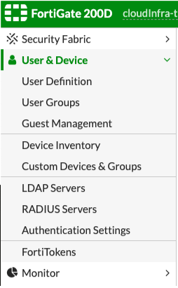
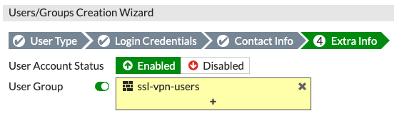
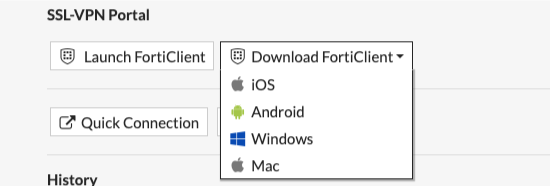
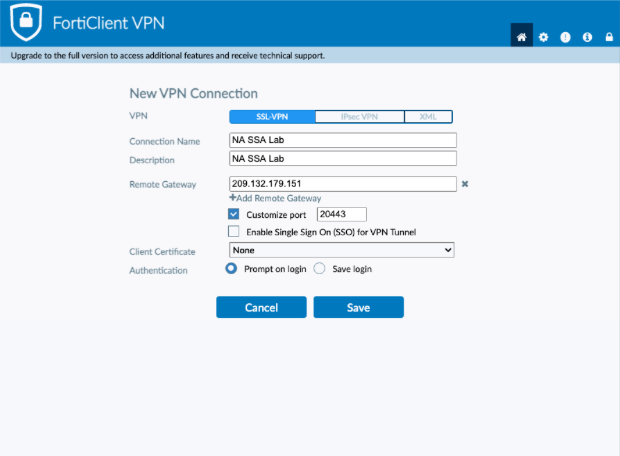
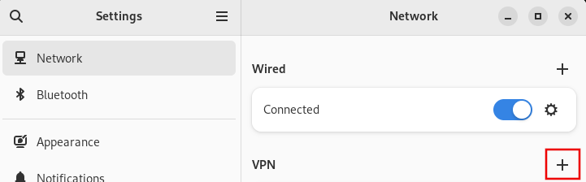
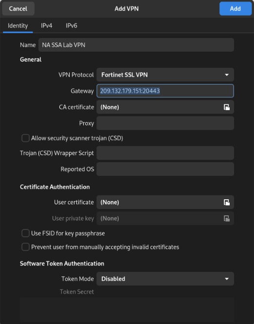

# Welcome to the Red Hat NA-SSA Lab's Documentation Site.

This site is created using MKDocs.  For full documentation visit [mkdocs.org](https://www.mkdocs.org).

## Pre-Requisites

Local client must have python and git.  After installing python, use pip to install the mkdocs and mkdocs-material packages.  It is not required, but using VS Code makes updating the documents easy and integrates with GitHub nicely.

## Update the Site or Add Documentation

Clone the site to your local repository.  Once you have a copy of the repository, update the documentation locally.  Preview your changes using *mkdocs serve*.  This will initialize a local webserver as 127.0.0.1:8000.

The site is configured to automatically publish changes to the gh-pages sites when a `push` to the master branch is executed.  Check the status of the pages build and deployment under the *Actions* menu.

## Project layout

    mkdocs.yml    # The configuration file.
    docs/
        index.md  # The documentation homepage.
        ...       # Other markdown pages.
        /images   # images that are used in docs pages

## Helpful commands

* `mkdocs new [dir-name]` - Create a new project.
* `mkdocs serve` - Start the live-reloading docs server.
* `mkdocs build` - Build the documentation site.
* `mkdocs -h` - Print help message and exit.

## Lab Environment

If you'd like to see the physical layout of the hardware in the lab, check out this diagram in <a href="https://lucid.app/lucidchart/9d8dbaa5-8a74-42f5-b0e7-5d34de9d5106/edit?invitationId=inv_27bcf624-e93e-43ef-82b7-95687fa01c0e&page=R5bDD72RxFKe# target="_blank"> Lucid Charts </a> or if you don't have access, here's a static diagram (click to open a larger version in a new tab):

   

## Lab VPN Access

* Connect to the *Red Hat* VPN
* Access the <a href="https://10.9.57.124/" target="_blank">Fortigate Administration Page</a>.
* You will need to login as the `user_mgr` account. These credentials are in the <a href="https://vault.bitwarden.com/#/login" target="_blank">BitWarden Vault</a> under *Fortigate User Management FW*.
* After logging in, navigate to the *User & Device -> User Definition* on the left:

    

* Click *Create New* 
> NOTE: If you are changing your password, click *Edit User* and change it there.
    - User Type: Local User
    - Login Credentials: Input user name and password, use your Kerberos name for consistency.
    - Contact Information: Input your Red Hat e-mail address
    - Extra Information: Select the following

    

  > NOTE> : If you accidentally create a user and you want to delete it, first edit the user, remove the group membership from it, disable group membership and then you will be able to delete it.

Once you have the new credentials configured, log out in the top right corner.  Test your new credentials by connecting to the <a href="https://209.132.179.151:20443" target="_blank"> Fortinet VPN Portal</a>

Connecting validated the credentials.  Download the Fortinet VPN Client from their <a href="https://www.fortinet.com/support/product-downloads" target="_blank">Product Downloads</a> page or in the portal, from the *Download FortiClient* dropdown list.

   

Select the appropriate client and download it from where you’re redirected to.

Install the client - this screenshot was taken from a forticlient running on a Mac. When you first start it, you will be prompted to configure the VPN.

  

Click *Save*.  You can then connect to the NA SSA Lab VPN.

You can also use OpenConnect (version 8+) to connect to the NA SSA Lab VPN from a Linux desktop running GNOME. First install OpenConnect (sudo dnf install openconnect - or debian or whatever Linux flavor you are running equivalent to), then install NetworkManager-openconnect-gnome (sudo dnf install NetworkManager-openconnect-gnome).

Open GNOME Settings, navigate to *Network* and select the plus button to add a new VPN profile:

  

Select “openconnect”.  In the properties type the following:

Name: (Whatever you like but “NA SSL Lab VPN” sounds good to me!)
Gateway: 209.132.179.151:20443

  

Save the new VPN profile and connect to the VPN. Please note that the VPN gateway uses a self signed certificate - you might be warned about that. Accept the certificate and proceed.

You can also use an alternative client that works well on headless systems. It does not have any dependencies on GNOME or dbus etc - like the network-manager method described above.

* Install openforticlient (sudo dnf install openforticlient)  
* Connect to the VPN from the command line:  
* sudo openfortivpn 209.132.179.151:20443 --username=mlecki --trusted-cert 646fd76ad8c617bfd94f3318f25e592a88fd2735949dfde0281df19de43b47ce
