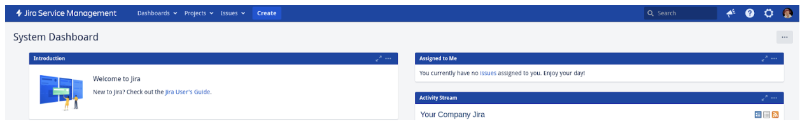
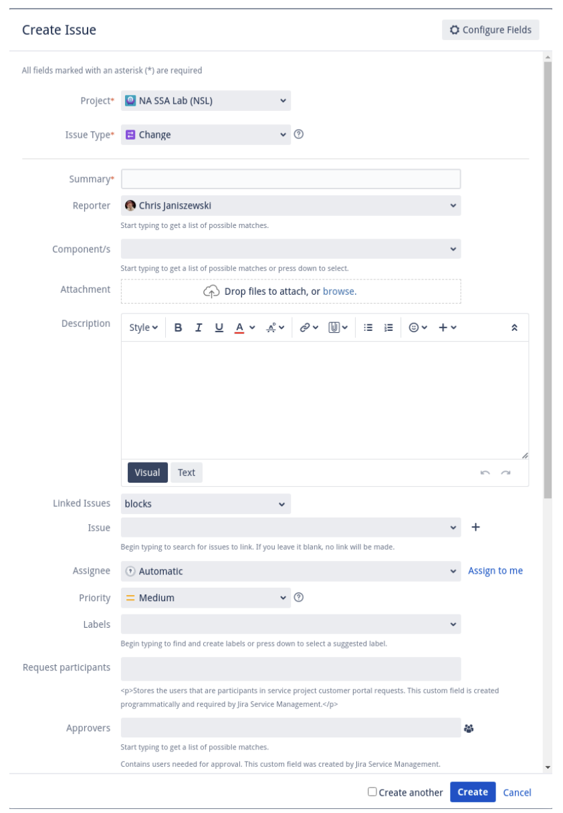

# Lab Change Requests

Use these procedures to requests a change in the NA-SSA Lab using Jira Service Management.  

1. Log in to your <a href="http://jira-sm.openinfra.lab:8080/" target="_blank">Jira Service Management</a> account.  

2. Click on the “Create” button located in the top of the screen.  

    

3. Select the “Change Request” option from the list of issue types.  

4. Fill in the required fields in the *Create Issue* form such as Project, Summary, Description, Priority, and other custom fields that may be relevant to your organization's processes.  

    

5. Assign the issue to the appropriate team member or group responsible for the change.  

6. Add any necessary comments or attachments to provide more information or context for the change request.  

7. Save the issue and wait for approval from the appropriate parties.  

    * If the change request is approved, the approving party will set the status to "Awaiting Implementation" to indicate that it is ready for implementation.  The approving party will assign the issue to the team member or group responsible for implementing the change.  
    * If the change request is declined, the approving party will set the status to "Declined" and add comments explaining why the request was declined.  
    * If the change request is no longer needed, the approving party will set the status to "Cancelled".  
    * Once the change request has been implemented, the implementation team will set the status to "Resolved" to indicate that the change has been completed.  

8. Verify that the change has been successful and meets the requirements of the change request.  

9. Finally, set the status to "Closed" to indicate that the change request is completed and closed.

That's it! These steps should help you create a change request using Jira Service Management and manage its lifecycle through various status changes.  Remember to communicate with your team members and stakeholders throughout the process to ensure everyone is aware of the status of the change request.

